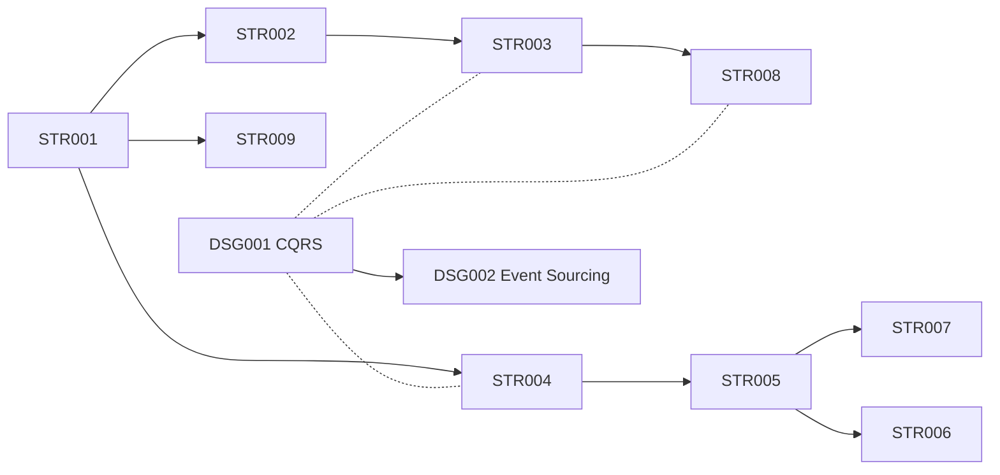

# .NET Architecture Pattern Catalogue

A reference library of solution-level architecture patterns for .NET/C# projects. Each pattern is a self-contained descriptor that an AI coding agent (or developer) can follow to scaffold and maintain a project without further guidance.

## Quick Reference

| Ref | Pattern | One-liner |
|:----------|:-------------------------------|:------|
| [`STR001`](patterns/STR001%20-%20n-tier.md) | N-Tier | Multi-project, Controllers → Services → Data Access |
| [`STR002`](patterns/STR002%20-%20clean-architecture-lite.md) | Clean Architecture Lite | Single project with domain/application/infrastructure boundaries |
| [`STR003`](patterns/STR003%20-%20full-clean-architecture.md) | Full Clean Architecture | Multi-project, compiler-enforced dependency inversion |
| [`STR004`](patterns/STR004%20-%20vertical-slice.md) | Vertical Slice | Feature-per-file, each slice owns its full stack |
| [`STR005`](patterns/STR005%20-%20modular-monolith.md) | Modular Monolith | Independent modules, own data, explicit contracts |
| [`STR006`](patterns/STR006%20-%20hexagonal.md) | Hexagonal (Ports & Adapters) | Domain at centre, ports define all external interaction |
| [`STR007`](patterns/STR007%20-%20microservices.md) | Microservices | Independent services, own databases, async messaging |
| [`STR008`](patterns/STR008%20-%20clean-vertical-slice.md) | Clean Architecture + Feature Folders | Multi-project Clean Architecture with CQRS, Application organised by feature |
| [`STR009`](patterns/STR009%20-%20minimal-api.md) | Minimal API | Endpoint-focused, no controllers, explicit route registration |
| [`STR010`](patterns/STR010%20-%20worker-service.md) | Worker Service | Background processing — queue consumers, scheduled jobs, long-running services |
| [`DSG001`](patterns/DSG001%20-%20cqrs.md) | CQRS | Separate read/write models — applies within any structural pattern |
| [`DSG002`](patterns/DSG002%20-%20event-sourcing.md) | Event Sourcing + CQRS | Events as source of truth, projections for reads — builds on DSG001 |

## Categories

- **`STR` — Structural:** How to organise a .NET solution at the project/folder level.
- **`DSG` — Design:** Cross-cutting design patterns that layer on top of structural patterns. Future additions may include `INF` (Infrastructure patterns).

## Decision Matrix

Use the first row where **all** conditions in the "When" column are true.

| Ref | Pattern | Team | Domain complexity | Deploy targets | Key signal |
|:----------|:------|:-----|:------------------|:---------------|:-----------|
| [`STR001`](patterns/STR001%20-%20n-tier.md) | N-Tier | 1–3 | Low (CRUD) | 1 | "It's basically database operations with validation" |
| [`STR002`](patterns/STR002%20-%20clean-architecture-lite.md) | Clean Lite | 2–5 | Medium | 1 | Business rules exist but don't justify multiple projects |
| [`STR003`](patterns/STR003%20-%20full-clean-architecture.md) | Full Clean | 4+ | High | 1+ | Rich domain model worth protecting with compiler enforcement |
| [`STR004`](patterns/STR004%20-%20vertical-slice.md) | Vertical Slice | 2–8 | Low–Medium | 1 | Features are independent; tired of cross-layer changes |
| [`STR005`](patterns/STR005%20-%20modular-monolith.md) | Modular Monolith | 5–20 | High | 1 | Multiple bounded contexts, want service-like autonomy without distributed overhead |
| [`STR006`](patterns/STR006%20-%20hexagonal.md) | Hexagonal | 3–10 | High | 1+ | Multiple entry points (API, queue, CLI) to the same domain |
| [`STR007`](patterns/STR007%20-%20microservices.md) | Microservices | 15+ | High | Many | Teams need independent deployment; you've outgrown a monolith |
| [`STR008`](patterns/STR008%20-%20clean-vertical-slice.md) | Clean + Feature Folders | 3–8 | Medium–High | 1+ | Want STR003's rigour with feature-level co-location of commands, queries, and DTOs |
| [`STR009`](patterns/STR009%20-%20minimal-api.md) | Minimal API | 1–4 | Low–Medium | 1 | Lightweight API, no MVC overhead, endpoint-focused |
| [`STR010`](patterns/STR010%20-%20worker-service.md) | Worker Service | 1–4 | Any | 1 | Background processing — no HTTP pipeline |

### How to read the matrix

1. **Start with team size and domain complexity.** These two factors narrow the field to 2–3 options.
2. **Check the "key signal."** This is the deciding factor when multiple patterns seem viable.
3. **When in doubt, pick the simpler pattern.** You can always graduate: [`STR001`](patterns/STR001%20-%20n-tier.md) → [`STR002`](patterns/STR002%20-%20clean-architecture-lite.md) → [`STR003`](patterns/STR003%20-%20full-clean-architecture.md), or [`STR004`](patterns/STR004%20-%20vertical-slice.md) → [`STR005`](patterns/STR005%20-%20modular-monolith.md) → [`STR007`](patterns/STR007%20-%20microservices.md). Going the other direction (simplifying) is harder.

### Common combinations

Patterns aren't always exclusive. Some compose well:

- **[STR005](patterns/STR005%20-%20modular-monolith.md) + [STR003](patterns/STR003%20-%20full-clean-architecture.md):** Modular monolith where each module internally uses Clean Architecture
- **[STR005](patterns/STR005%20-%20modular-monolith.md) + [STR004](patterns/STR004%20-%20vertical-slice.md):** Modular monolith where each module internally uses Vertical Slices
- **[STR007](patterns/STR007%20-%20microservices.md) + any:** Each microservice picks its own internal architecture based on that service's complexity
- **[STR006](patterns/STR006%20-%20hexagonal.md) + [STR005](patterns/STR005%20-%20modular-monolith.md):** Domain-centric module boundaries with hexagonal architecture inside each module

### Progression paths

## Each Pattern Covers

1. **When to use / When NOT to use** — with concrete thresholds
2. **Solution structure** — exact folder/project layout
3. **Dependency rules** — what references what, with diagrams
4. **Naming conventions** — files, classes, interfaces, methods
5. **Key abstractions** — core interfaces with C# code
6. **Data flow** — request lifecycle from HTTP to database
7. **Where business logic lives** — the single most important rule
8. **Testing strategy** — what to test, how, and project layout
9. **Common mistakes** — what developers get wrong and how to fix it
