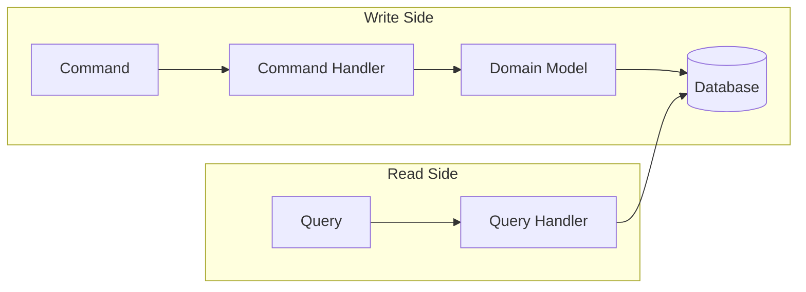
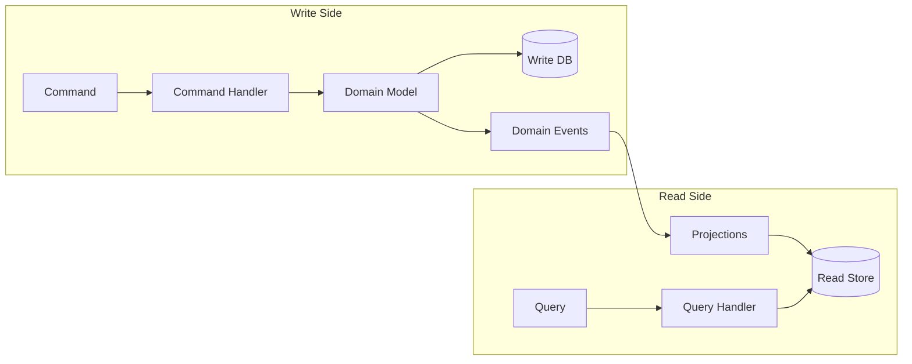

# CQRS (Command Query Responsibility Segregation)

> **Ref:** `DSG001` | **Category:** Design

Separate the read (query) and write (command) sides of the application into distinct models, each optimised for its purpose.

## When to Use

- Read and write workloads have **different shapes** — writes operate on rich domain aggregates, reads return flat, denormalised views
- Read and write workloads have **different scaling requirements** — reads outnumber writes 10:1 or more
- Query performance suffers because you're projecting complex aggregate graphs into flat DTOs on every request
- You need **different storage** for reads vs writes — e.g., normalised SQL for writes, denormalised SQL views / Elasticsearch / Redis for reads
- The domain model is rich enough that forcing queries through it adds complexity without benefit

CQRS is a **design pattern**, not a solution structure. It layers on top of any structural pattern: [STR003](STR003%20-%20full-clean-architecture.md), [STR004](STR004%20-%20vertical-slice.md), [STR008](STR008%20-%20clean-vertical-slice.md), etc.

**CQRS is not Event Sourcing.** They are orthogonal. CQRS splits reads from writes. Event Sourcing stores state as a sequence of events instead of current-state snapshots. You can use CQRS without Event Sourcing (most systems should). You can use Event Sourcing without CQRS (though it's painful). They compose well together, but treating them as a package deal is a common source of accidental complexity.

## When NOT to Use

- Simple CRUD where the read and write models are essentially the same shape — CQRS adds two models where one would do
- You don't have performance issues on the read side — don't add a read model for reads that are already fast
- The team is unfamiliar with eventual consistency and you can't invest in learning it (this only applies to Level 2 — Level 1 has no eventual consistency)
- You're using CQRS "because it's modern" — if you can't articulate which specific problem it solves in your system, you don't need it

## The Two Levels

CQRS exists on a spectrum. Pick the level that matches your problem:

### Level 1: Same Database, Separate Models

Commands go through the domain model. Queries bypass it entirely and read directly from the database using optimised queries or views.



- Write side: Command → Handler → Domain entities → Repository → DB
- Read side: Query → Handler → raw SQL / Dapper / EF projections → DTO
- **Same database**, different code paths
- No eventual consistency — reads see writes immediately
- **Start here.** This solves most CQRS use cases.

### Level 2: Separate Read Store

Commands write to the primary database — **current state is still stored as normal rows**. Domain events are raised as transient signals that trigger projections to update a dedicated read store. The events are a side effect of state changes, not the source of truth. If you want events to *be* the source of truth (no current-state tables at all), that's Event Sourcing ([DSG002](DSG002%20-%20event-sourcing.md)) — a different pattern that composes well with CQRS but is not required by it.



- Write side: Command → Handler → Domain (raises events) → Write DB → dispatch domain events
- Projection: Event handler updates Read Store (denormalised tables, Elasticsearch, Redis, etc.)
- Read side: Query → Handler → Read Store → DTO
- **Eventual consistency** — reads may lag behind writes
- Only use this when Level 1 read performance is genuinely insufficient

## Applying CQRS to Structural Patterns

### Within Clean Architecture ([STR003](STR003%20-%20full-clean-architecture.md) / [STR008](STR008%20-%20clean-vertical-slice.md))

The Application project already separates Commands and Queries:

```
MyApp.Application/
├── Orders/
│   ├── Commands/
│   │   ├── CreateOrder.cs          ← goes through domain model
│   │   └── CancelOrder.cs
│   └── Queries/
│       ├── GetOrderById.cs         ← bypasses domain, reads directly
│       └── ListOrders.cs
```

Command handler — uses domain model:

```csharp
public sealed record CreateOrder(
    string Street, string City, string PostCode,
    List<CreateOrder.LineItem> Items) : ICommand<Guid>
{
    public sealed record LineItem(Guid ProductId, int Quantity);

    internal sealed class Handler(
        IOrderRepository orders,
        IProductRepository products,
        IUnitOfWork unitOfWork) : ICommandHandler<CreateOrder, Guid>
    {
        public async Task<Guid> HandleAsync(CreateOrder command, CancellationToken ct)
        {
            var address = new Address(command.Street, command.City, command.PostCode);
            var order = new Order(address);

            foreach (var item in command.Items)
            {
                var product = await products.GetByIdAsync(item.ProductId, ct)
                    ?? throw new NotFoundException(nameof(Product), item.ProductId);
                order.AddItem(product, item.Quantity);
            }

            order.Submit();
            orders.Add(order);
            await unitOfWork.SaveChangesAsync(ct);

            return order.Id;
        }
    }
}
```

Query handler — bypasses domain, queries directly:

```csharp
public sealed record GetOrderById(Guid OrderId) : IQuery<OrderDto?>
{
    internal sealed class Handler(
        IReadDbConnection db) : IQueryHandler<GetOrderById, OrderDto?>
    {
        public async Task<OrderDto?> HandleAsync(GetOrderById query, CancellationToken ct)
        {
            return await db.QuerySingleOrDefaultAsync<OrderDto>(
                """
                SELECT o.Id, o.Status, o.Total,
                       o.Street, o.City, o.PostCode
                FROM Orders o
                WHERE o.Id = @OrderId
                """,
                new { query.OrderId },
                ct);
        }
    }
}
```

The query handler doesn't load `Order` entities, doesn't go through `IOrderRepository`, and doesn't reconstruct the aggregate. It runs a flat query and returns a DTO directly. This is the core CQRS benefit — reads are fast and simple.

### Within Vertical Slice ([STR004](STR004%20-%20vertical-slice.md))

Each feature already owns its full stack. CQRS is natural — command slices use the domain, query slices use raw queries:

```
Features/
├── Orders/
│   ├── CreateOrder.cs        ← handler uses domain entities
│   ├── CancelOrder.cs        ← handler uses domain entities
│   ├── GetOrderById.cs       ← handler uses raw SQL/Dapper
│   └── ListOrders.cs         ← handler uses raw SQL/Dapper
```

No structural change needed — just a convention about how query handlers access data.

## Key Abstractions

Separate command and query interfaces:

```csharp
public interface ICommand { }
public interface ICommand<TResult> { }
public interface IQuery<TResult> { }

public interface ICommandHandler<in TCommand> where TCommand : ICommand
{
    Task HandleAsync(TCommand command, CancellationToken ct = default);
}

public interface ICommandHandler<in TCommand, TResult> where TCommand : ICommand<TResult>
{
    Task<TResult> HandleAsync(TCommand command, CancellationToken ct = default);
}

public interface IQueryHandler<in TQuery, TResult> where TQuery : IQuery<TResult>
{
    Task<TResult> HandleAsync(TQuery query, CancellationToken ct = default);
}
```

Most commands don't need to return a value — use `ICommand` (no result) by default and `ICommand<TResult>` only when the caller genuinely needs something back (e.g., an ID for a newly created entity).

Read-side data access interface (for Level 1):

```csharp
public interface IReadDbConnection
{
    Task<T?> QuerySingleOrDefaultAsync<T>(string sql, object? param = null, CancellationToken ct = default);
    Task<IReadOnlyList<T>> QueryAsync<T>(string sql, object? param = null, CancellationToken ct = default);
}
```

Implement with Dapper, raw ADO.NET, or EF Core's `FromSqlRaw`. The point is that the read side is not forced through the same ORM configuration as the write side.

This is not the only valid approach. If your queries are simple enough, injecting a read-only `DbContext` with `AsNoTracking` projections works just as well and avoids hand-written SQL. The interface above earns its keep when you have complex queries that are painful to express in LINQ, or when you want to enforce that the read side stays ORM-free.

For Level 2, add event-driven projections:

```csharp
public interface IProjection<in TEvent>
{
    Task ProjectAsync(TEvent @event, CancellationToken ct = default);
}

public sealed class OrderSummaryProjection(ReadDbContext readDb)
    : IProjection<OrderPlacedEvent>
{
    public async Task ProjectAsync(OrderPlacedEvent @event, CancellationToken ct)
    {
        var exists = await readDb.OrderSummaries
            .AnyAsync(s => s.OrderId == @event.OrderId, ct);

        if (exists)
            return;

        readDb.OrderSummaries.Add(new OrderSummary
        {
            OrderId = @event.OrderId,
            CustomerName = @event.CustomerName,
            Total = @event.Total,
            Status = "Submitted",
            PlacedAt = @event.OccurredAt
        });
        await readDb.SaveChangesAsync(ct);
    }
}
```

Projections must be **idempotent** — events can be delivered more than once (retries, reprocessing). The check-then-insert above is a simple approach; for higher throughput, use database upserts (`INSERT ... ON CONFLICT DO NOTHING` in PostgreSQL, `MERGE` in SQL Server).

## Data Flow

**Level 1 — Command:**

```
POST /api/orders
    │
    ▼
Controller maps request → CreateOrder command
    │
    ▼
CreateOrder.Handler
    │  loads aggregates via IOrderRepository
    │  calls domain methods (order.AddItem, order.Submit)
    │  persists via repository → EF Core → Database
    ▼
Guid returned → 201 Created
```

**Level 1 — Query:**

```
GET /api/orders/{id}
    │
    ▼
Controller maps request → GetOrderById query
    │
    ▼
GetOrderById.Handler
    │  runs optimised SQL via IReadDbConnection
    │  returns flat DTO directly — no domain model involved
    ▼
OrderDto returned → 200 OK
```

**Level 2 — Write with projection:**

```
POST /api/orders
    │
    ▼
CreateOrder.Handler
    │  domain model → write DB (transaction commits)
    │  domain event raised: OrderPlacedEvent
    ▼
OrderPlacedEvent dispatched (after commit)
    │
    ▼
OrderSummaryProjection (idempotent)
    │  updates denormalised read store
    ▼
Read store eventually consistent
```

## Where Business Logic Lives

**Write side: in the domain model.** Commands flow through domain entities that enforce invariants. No change from your chosen structural pattern.

**Read side: there is no business logic.** Queries are data retrieval — they transform stored data into DTOs. If you find business rules in a query handler, either it belongs on the write side or you're computing something that should be pre-computed by a projection.

## Testing Strategy

**Domain logic** — unit tests on the domain model directly. `Order.AddItem` enforces invariants, `Order.Submit` transitions state. Test these without any handler or infrastructure involvement. This is where most of your write-side test value comes from.

**Command handler tests** — integration tests that exercise the handler through to the database. Substitute external services (payment gateways, email), but use a real database. Verifying that a mock was called does not prove the system works.

**Query handler tests** — integration tests against a real database. Seed data directly (bypassing the domain model), run the query, assert the DTO shape. These are fast because they're just SQL.

**Projection tests (Level 2)** — given an event, verify the read store is updated correctly. Test idempotency: project the same event twice, assert only one read model entry exists.

```csharp
[Fact]
public async Task GetOrderById_ReturnsFlat_Dto_Without_Loading_Aggregate()
{
    await SeedOrder(orderId: _testId, status: "Submitted", total: 59.98m);

    var result = await _handler.HandleAsync(new GetOrderById(_testId), CancellationToken.None);

    result.Should().NotBeNull();
    result!.Total.Should().Be(59.98m);
    result.Status.Should().Be("Submitted");
}
```

## Eventual Consistency (Level 2)

Level 2 introduces a propagation delay between the write and read stores. You need a strategy — not just an acknowledgment that it exists.

**For APIs**: Return `202 Accepted` for commands that trigger async projections, with a location header pointing to the resource. Clients poll or subscribe for the final state.

**For UIs**: Apply the write optimistically on the client side. When the user submits an order, update the local UI immediately with the data the client already has. Replace it with the server's view once the read model catches up. This eliminates the "I just created it but I can't see it" problem without requiring synchronous projections.

**For critical reads-after-writes**: If a specific flow cannot tolerate staleness (e.g., "place order, then immediately show order confirmation"), consider reading from the write store for that one query rather than contorting the architecture. Not every query has to go through the read store — pragmatism over purity.

**Monitoring**: Track projection lag as a metric. Alert when the read store falls more than N seconds behind the write store. If projections fail silently, you have a data consistency bug that users will find before you do.

## Common Mistakes

1. **Using CQRS for everything.** Not every entity needs separate read/write models. Apply CQRS to the parts of the system where read and write shapes genuinely differ. A simple lookup table doesn't need CQRS.

2. **Query handlers that load domain entities and then map them.** `GetOrderById` loads `Order` via `IOrderRepository`, then maps to `OrderDto`. This defeats the purpose — you're paying the cost of aggregate reconstruction for a read. Query directly from the database.

3. **Jumping straight to Level 2.** Separate read stores, event-driven projections, eventual consistency — all for an app that gets 100 requests/minute. Start with Level 1 (same database, separate code paths). Only move to Level 2 when you have evidence that Level 1 reads are too slow.

4. **No strategy for read model staleness.** In Level 2, reads lag behind writes. If the UI shows stale data and users complain, you need a strategy: optimistic updates in the UI, polling, or websocket notifications. Don't ignore this.

5. **Command handlers returning rich DTOs.** A command changes state — it should return at most an ID or a simple result (e.g., `Result<Guid>`), not a fully populated view model. If the caller needs a rich representation after a command, issue a separate query. Returning a DTO from a command couples the write path to a read shape and defeats the separation CQRS provides.

6. **Read side with write-side validation.** A query handler that throws `NotFoundException` when an entity doesn't exist. Queries return data or null — they don't enforce business rules. Return `null` and let the API layer decide whether that's a 404.

7. **Shared DTOs between commands and queries.** `OrderDto` used as both a command result and a query response. Commands and queries evolve independently. Keep their types separate.

8. **Forgetting to index the read side.** The whole point of separating reads is performance. If your query handler runs flat SQL but the table has no indexes for those queries, you've gained nothing. Design indexes for your read access patterns.

9. **Dispatching events before the transaction commits (Level 2).** If you publish domain events to a message bus before `SaveChangesAsync` completes, a projection might process the event while the write transaction is still in-flight or has rolled back. Either dispatch events *after* the transaction commits, or use the transactional outbox pattern to atomically persist events alongside state changes.

10. **Non-idempotent projections (Level 2).** Events will be delivered more than once — retries, reprocessing after failures, or replaying an event stream. Every projection must produce the same result whether it processes an event once or five times. Use upserts or existence checks, never blind inserts.
