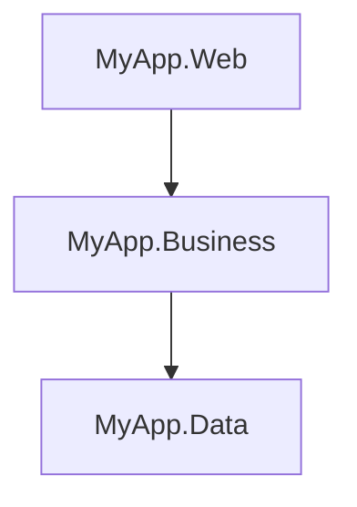

# N-Tier

> **Ref:** `STR001` | **Category:** Structural

Multi-project solution with three layers — Web, Business, and Data Access — each in its own project, connected by interfaces.

## When to Use

- **1–4 developers** working on a single codebase
- CRUD-heavy applications with straightforward business rules
- Internal tools, admin panels, simple APIs
- The domain logic fits comfortably in service methods — no complex invariants, no aggregate roots, no domain events

If you catch yourself saying "it's basically just database operations with some validation," this is your pattern.

## When NOT to Use

- Business rules are complex enough to warrant a domain model (use [STR002](STR002%20-%20clean-architecture-lite.md) or [STR003](STR003%20-%20full-clean-architecture.md))
- Multiple teams need to work on the same codebase without stepping on each other (use [STR004](STR004%20-%20vertical-slice.md) or [STR005](STR005%20-%20modular-monolith.md))
- You need to swap infrastructure (e.g., change database provider) without touching business logic — the coupling here makes that painful
- The service layer is growing beyond ~500 lines per service — that's a signal to graduate to [STR002](STR002%20-%20clean-architecture-lite.md)

## Solution Structure

```
MyApp/
├── MyApp.sln
└── src/
    ├── MyApp.Web/
    │   ├── MyApp.Web.csproj                ← references MyApp.Business
    │   ├── Program.cs
    │   ├── appsettings.json
    │   ├── Controllers/
    │   │   ├── OrdersController.cs
    │   │   └── ProductsController.cs
    │   ├── DTOs/
    │   │   ├── CreateOrderRequest.cs
    │   │   ├── OrderResponse.cs
    │   │   └── ProductResponse.cs
    │   └── Middleware/
    │       └── ExceptionHandlingMiddleware.cs
    │
    ├── MyApp.Business/
    │   ├── MyApp.Business.csproj            ← references MyApp.Data
    │   ├── DependencyInjection.cs
    │   ├── Interfaces/
    │   │   ├── IOrderService.cs
    │   │   └── IProductService.cs
    │   ├── Services/
    │   │   ├── OrderService.cs
    │   │   └── ProductService.cs
    │   └── Mapping/
    │       └── MappingExtensions.cs
    │
    └── MyApp.Data/
        ├── MyApp.Data.csproj                ← references nothing
        ├── DependencyInjection.cs
        ├── AppDbContext.cs
        ├── Entities/
        │   ├── Order.cs
        │   ├── OrderItem.cs
        │   └── Product.cs
        ├── Repositories/
        │   ├── IOrderRepository.cs
        │   ├── OrderRepository.cs
        │   ├── IProductRepository.cs
        │   └── ProductRepository.cs
        └── Configurations/
            ├── OrderConfiguration.cs
            └── ProductConfiguration.cs
```

**MyApp.Web** — ASP.NET Core host. Controllers, API DTOs, middleware. Receives HTTP requests, calls services, returns responses. No business logic.

**MyApp.Business** — Service interfaces and implementations. All business logic lives here: validation, calculations, state transitions, cross-entity coordination.

**MyApp.Data** — EF Core DbContext, entity classes, repository interfaces and implementations, Fluent API configurations. Entities live here because they are data-access concerns — they map directly to database tables.

## Dependency Rules



- `Web` references `Business` only. It calls service interfaces and handles HTTP concerns.
- `Business` references `Data` only. It calls repository interfaces and contains all business logic.
- `Data` references nothing (except EF Core NuGet packages). It owns entities, DbContext, and repository implementations.
- **Web must not** reference `Data` directly — no `AppDbContext` in controllers.
- **Services must not** call other services — if you need cross-service orchestration, create a new service that depends on the repositories it needs directly.
- **Repositories must not** contain business logic — they are query/persistence only.
- **Controllers must not** bypass services to call repositories directly.

DI wiring: each layer exposes an `AddX` extension method. `Program.cs` calls both:

```csharp
builder.Services.AddBusinessServices();
builder.Services.AddDataServices(builder.Configuration);
```

## Naming Conventions

| Element | Convention | Example |
|---------|-----------|---------|
| Controller | `{Entity}sController` | `OrdersController` |
| Service interface | `I{Entity}Service` | `IOrderService` |
| Service implementation | `{Entity}Service` | `OrderService` |
| Repository interface | `I{Entity}Repository` | `IOrderRepository` |
| Repository implementation | `{Entity}Repository` | `OrderRepository` |
| Entity | singular noun | `Order`, `OrderItem` |
| Request DTO | `{Action}{Entity}Request` | `CreateOrderRequest` |
| Response DTO | `{Entity}Response` | `OrderResponse` |
| DbContext | `AppDbContext` | `AppDbContext` |
| EF Configuration | `{Entity}Configuration` | `OrderConfiguration` |

Method names on services and repositories use **verbs**: `CreateOrder`, `GetOrderById`, `UpdateOrderStatus`. Controller actions use the same verb but return `IActionResult`.

## Key Abstractions

```csharp
public interface IOrderService
{
    Task<OrderResponse> GetByIdAsync(Guid id);
    Task<IReadOnlyList<OrderResponse>> GetAllAsync();
    Task<OrderResponse> CreateAsync(CreateOrderRequest request);
    Task UpdateStatusAsync(Guid id, OrderStatus status);
    Task DeleteAsync(Guid id);
}

public interface IOrderRepository
{
    Task<Order?> GetByIdAsync(Guid id);
    Task<IReadOnlyList<Order>> GetAllAsync();
    Task<Order> AddAsync(Order order);
    Task UpdateAsync(Order order);
    Task DeleteAsync(Order order);
}
```

DI registration — each layer registers its own services:

```csharp
// MyApp.Business/DependencyInjection.cs
public static class DependencyInjection
{
    public static IServiceCollection AddBusinessServices(this IServiceCollection services)
    {
        services.AddScoped<IOrderService, OrderService>();
        services.AddScoped<IProductService, ProductService>();
        return services;
    }
}

// MyApp.Data/DependencyInjection.cs
public static class DependencyInjection
{
    public static IServiceCollection AddDataServices(
        this IServiceCollection services, IConfiguration configuration)
    {
        services.AddDbContext<AppDbContext>(options =>
            options.UseSqlServer(configuration.GetConnectionString("Default")));
        services.AddScoped<IOrderRepository, OrderRepository>();
        services.AddScoped<IProductRepository, ProductRepository>();
        return services;
    }
}
```

## Data Flow

A `POST /api/orders` request:

```
HTTP Request
    │
    ▼
OrdersController.Create(CreateOrderRequest dto)
    │
    ▼
IOrderService.CreateAsync(dto)
    │  - validates the request
    │  - maps DTO → Order entity
    │  - applies business rules (e.g., check stock via IProductRepository)
    │  - calls repository to persist
    ▼
IOrderRepository.AddAsync(Order entity)
    │
    ▼
AppDbContext.SaveChangesAsync()
    │
    ▼
Database INSERT
    │
    ▼
Order entity returned up the stack
    │
    ▼
Service maps Order → OrderResponse DTO
    │
    ▼
Controller returns CreatedAtAction(201, dto)
```

## Where Business Logic Lives

**In the service layer.** This is the single most important rule of N-Tier.

- Controllers are thin: parse request, call service, return response. No `if` statements about business rules.
- Repositories are thin: CRUD operations and queries. No validation, no rule enforcement.
- Services own all business logic: validation, calculations, state transitions, cross-entity coordination.

If you put business logic in a controller, you can't reuse it. If you put it in a repository, you can't test it without a database. The service layer is the only place where business logic is testable and reusable.

## Testing Strategy

```
MyApp/
├── src/
│   ├── MyApp.Web/
│   ├── MyApp.Business/
│   └── MyApp.Data/
└── tests/
    ├── MyApp.Business.Tests/
    │   ├── MyApp.Business.Tests.csproj    ← references Business + Data
    │   └── Services/
    │       ├── OrderServiceTests.cs
    │       └── ProductServiceTests.cs
    └── MyApp.Web.Tests/
        ├── MyApp.Web.Tests.csproj         ← references Web
        ├── CustomWebApplicationFactory.cs
        └── Endpoints/
            ├── OrdersEndpointTests.cs
            └── ProductsEndpointTests.cs
```

**Unit tests** — test service methods with mocked repositories. This is where you verify business rules. Use xUnit + NSubstitute (or Moq).

```csharp
public class OrderServiceTests
{
    private readonly IOrderRepository _orderRepo = Substitute.For<IOrderRepository>();
    private readonly IProductRepository _productRepo = Substitute.For<IProductRepository>();
    private readonly OrderService _sut;

    public OrderServiceTests()
    {
        _sut = new OrderService(_orderRepo, _productRepo);
    }

    [Fact]
    public async Task CreateAsync_InsufficientStock_ThrowsInvalidOperation()
    {
        _productRepo.GetByIdAsync(Arg.Any<Guid>())
            .Returns(new Product { StockQuantity = 0 });

        var request = new CreateOrderRequest { ProductId = Guid.NewGuid(), Quantity = 5 };

        await Assert.ThrowsAsync<InvalidOperationException>(
            () => _sut.CreateAsync(request));
    }
}
```

**Integration tests** — test the full HTTP pipeline using `WebApplicationFactory<Program>` with a real (test) database. Use Testcontainers for SQL Server or an in-memory SQLite database.

## Common Mistakes

1. **Business logic in controllers.** A controller method that checks inventory, calculates totals, and sends emails is doing the service's job. Move all of it into the service. The controller should be one line: `return await _service.CreateAsync(request);`.

2. **Skipping repository interfaces.** "We'll never change the database" — maybe, but you need the interface to mock the repository in unit tests. Always use `IOrderRepository`, even if you think it's overkill.

3. **Services calling other services.** `OrderService` calls `InventoryService` which calls `NotificationService`. This creates a dependency chain that's hard to test and leads to circular references. If you need cross-service coordination, create an `OrderFulfillmentService` that depends on the repositories it needs directly.

4. **Fat repositories with business logic.** A repository method called `GetActiveOrdersWithDiscountApplied()` is doing too much. The repository fetches data; the service applies business rules to it.

5. **Exposing entities as API responses.** Returning `Order` directly from a controller leaks your database schema to clients and creates coupling. Always map to a response DTO.

6. **One repository per table instead of per aggregate.** You don't need `OrderItemRepository` — `OrderRepository` handles `OrderItem` because `OrderItem` doesn't exist independently of `Order`.

7. **Not validating in the service layer.** Relying solely on model validation attributes (`[Required]`) misses business rules like "order quantity must not exceed stock." Validate business rules explicitly in the service.

8. **Async-over-sync or sync-over-async.** If EF Core methods are async, the repository methods are async, the service methods are async, and the controller actions are async. Don't break the chain with `.Result` or `.Wait()`.
