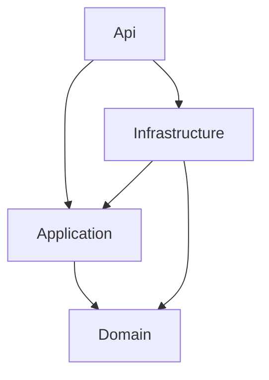

# Clean Architecture Lite

> **Ref:** `STR002` | **Category:** Structural

Single-project Clean Architecture using folders, namespaces, and interfaces to enforce layer boundaries without the ceremony of multiple projects.

## When to Use

- **2–5 developers** working on a codebase with non-trivial business logic
- The domain has real rules beyond CRUD — but not enough complexity to justify four separate projects
- You've outgrown N-Tier ([STR001](STR001%20-%20n-tier.md)): service classes are getting large, business logic is leaking into controllers or repositories
- You want the discipline of Clean Architecture without the overhead of managing multiple .csproj files
- APIs with 10–50 endpoints and a domain model worth protecting

This is the sweet spot for most line-of-business applications that aren't pure CRUD but aren't enterprise-scale domain-driven systems either.

## When NOT to Use

- Pure CRUD with no business rules — use N-Tier ([STR001](STR001%20-%20n-tier.md)), it's simpler and you won't benefit from the extra structure
- Large teams or complex domains where you need **compile-time** enforcement of layer boundaries — use Full Clean Architecture ([STR003](STR003%20-%20full-clean-architecture.md))
- Multiple deployment targets (API + worker + CLI) sharing domain logic — multiple projects ([STR003](STR003%20-%20full-clean-architecture.md)) make this cleaner
- If your `Domain/` folder only contains entities with public getters/setters and no methods, you don't need this — you have an anaemic model dressed up as Clean Architecture

## Solution Structure

```
MyApp/
├── MyApp.sln
└── src/
    └── MyApp/
        ├── MyApp.csproj
        ├── Program.cs
        ├── appsettings.json
        │
        ├── Domain/
        │   ├── Entities/
        │   │   ├── Order.cs
        │   │   ├── OrderItem.cs
        │   │   └── Product.cs
        │   ├── ValueObjects/
        │   │   ├── Money.cs
        │   │   └── Address.cs
        │   ├── Enums/
        │   │   └── OrderStatus.cs
        │   ├── Exceptions/
        │   │   └── InsufficientStockException.cs
        │   ├── Services/
        │   │   └── PricingService.cs
        │   └── Interfaces/
        │       ├── IOrderRepository.cs
        │       └── IProductRepository.cs
        │
        ├── Application/
        │   ├── Orders/
        │   │   ├── CreateOrder.cs
        │   │   ├── GetOrderById.cs
        │   │   ├── ListOrders.cs
        │   │   └── UpdateOrderStatus.cs
        │   ├── Products/
        │   │   └── GetProductById.cs
        │   └── Common/
        │       ├── IEmailSender.cs
        │       └── NotFoundException.cs
        │
        ├── Infrastructure/
        │   ├── Data/
        │   │   ├── AppDbContext.cs
        │   │   └── Configurations/
        │   │       ├── OrderConfiguration.cs
        │   │       └── ProductConfiguration.cs
        │   ├── Repositories/
        │   │   ├── OrderRepository.cs
        │   │   └── ProductRepository.cs
        │   ├── Services/
        │   │   └── SmtpEmailSender.cs
        │   └── DependencyInjection.cs
        │
        └── Api/
            ├── Controllers/
            │   ├── OrdersController.cs
            │   └── ProductsController.cs
            ├── DTOs/
            │   ├── CreateOrderRequest.cs
            │   └── OrderResponse.cs
            ├── Middleware/
            │   └── ExceptionHandlingMiddleware.cs
            └── DependencyInjection.cs
```

**Domain/** — Entities with behaviour, value objects, domain services, domain exceptions, and repository interfaces. This is the core — it defines *what* the system does without knowing *how*. Zero framework dependencies.

**Application/** — Use cases grouped by feature. Each use case is a single class with a `HandleAsync` method. Depends only on `Domain/`. Defines application-level interfaces (e.g., `IEmailSender`) that Infrastructure implements.

**Infrastructure/** — EF Core DbContext, repository implementations, external service clients. Implements interfaces defined in `Domain/` and `Application/`.

**Api/** — Controllers, DTOs, middleware. The HTTP shell. Translates HTTP into application use case calls.

## Dependency Rules



- **Domain/** references nothing. No `using MyApp.Infrastructure;`, no `using MyApp.Application;`, no `using MyApp.Api;`. Ever.
- **Application/** references only **Domain/**
- **Infrastructure/** references **Application/** (to implement its interfaces) and **Domain/** (to implement repository interfaces)
- **Api/** references **Application/** (to call use cases) and **Infrastructure/** (only in `Program.cs` for DI wiring)

**Namespace enforcement:** Since there are no project boundaries to prevent violations, use namespace discipline. If you see `using MyApp.Infrastructure;` inside a file under `Domain/` or `Application/`, that's a violation. Use an `.editorconfig` rule or an ArchUnit test to catch this:

```csharp
[Fact]
public void Domain_ShouldNotReference_ApplicationOrInfrastructureOrApi()
{
    var assembly = typeof(MyApp.Domain.Entities.Order).Assembly;

    var result = Types.InAssembly(assembly)
        .That().ResideInNamespace("MyApp.Domain")
        .ShouldNot()
        .HaveDependencyOnAny(
            "MyApp.Application",
            "MyApp.Infrastructure",
            "MyApp.Api")
        .GetResult();

    Assert.True(result.IsSuccessful,
        $"Domain references forbidden namespaces: {string.Join(", ",
            result.FailingTypeNames ?? [])}");
}

[Fact]
public void Application_ShouldNotReference_InfrastructureOrApi()
{
    var assembly = typeof(MyApp.Domain.Entities.Order).Assembly;

    var result = Types.InAssembly(assembly)
        .That().ResideInNamespace("MyApp.Application")
        .ShouldNot()
        .HaveDependencyOnAny(
            "MyApp.Infrastructure",
            "MyApp.Api")
        .GetResult();

    Assert.True(result.IsSuccessful,
        $"Application references forbidden namespaces: {string.Join(", ",
            result.FailingTypeNames ?? [])}");
}
```

> **Package:** [NetArchTest.Rules](https://www.nuget.org/packages/NetArchTest.Rules) — add it to your test project. Since this is a single-project architecture, all types share one assembly, so `Types.InAssembly()` with namespace filtering is the correct approach. These tests are cheap to run and catch violations in CI before they become habits.

## Naming Conventions

| Element | Convention | Example |
|---------|-----------|---------|
| Entity | singular noun, behaviour-rich | `Order` |
| Value Object | singular noun, immutable | `Money`, `Address` |
| Domain service | `{Noun}Service` in Domain | `PricingService` |
| Repository interface | `I{Entity}Repository` in Domain | `IOrderRepository` |
| Repository implementation | `{Entity}Repository` in Infrastructure | `OrderRepository` |
| Use case | `{Verb}{Entity}` | `CreateOrder`, `GetOrderById` |
| Use case request | nested `record` inside use case | `CreateOrder.Command` |
| Use case response | nested `record` inside use case | `GetOrderById.Response` |
| Request DTO | `{Verb}{Entity}Request` in Api | `CreateOrderRequest` |
| Response DTO | `{Entity}Response` in Api | `OrderResponse` |
| Application interface | `I{Noun}` in Application/Common | `IEmailSender` |
| Domain exception | `{Noun}Exception` in Domain | `InsufficientStockException` |
| Application exception | `{Noun}Exception` in Application/Common | `NotFoundException` |

Use case classes contain their own request/response types as nested records. This keeps each use case self-contained:

```csharp
public static class CreateOrder
{
    public sealed record Command(Guid ProductId, int Quantity, string ShippingAddress);
    public sealed record Result(Guid OrderId, decimal Total);

    public sealed class Handler(IOrderRepository orders, IProductRepository products)
    {
        public async Task<Result> HandleAsync(Command command, CancellationToken cancellationToken = default)
        {
            var product = await products.GetByIdAsync(command.ProductId, cancellationToken)
                ?? throw new NotFoundException(nameof(Product), command.ProductId);

            var order = Order.Create(command.ShippingAddress);
            order.AddItem(product, command.Quantity);

            orders.Add(order);
            await orders.SaveChangesAsync(cancellationToken);

            return new Result(order.Id, order.Total);
        }
    }
}
```

Note the handler follows the "load, act, save" pattern: it loads the product, tells the `Order` entity to do domain work (`Create`, `AddItem`), then persists. The entity enforces invariants — the handler orchestrates.

## Key Abstractions

Repository interfaces live in **Domain/**:

```csharp
public interface IOrderRepository
{
    Task<Order?> GetByIdAsync(Guid id, CancellationToken cancellationToken = default);
    Task<IReadOnlyList<Order>> ListAsync(CancellationToken cancellationToken = default);
    void Add(Order order);
    Task SaveChangesAsync(CancellationToken cancellationToken = default);
}
```

> **On `SaveChangesAsync` in the repository:** In a single-project setup, having `SaveChangesAsync` on the repository is a pragmatic choice. It keeps the Application layer free of `IUnitOfWork` or `IAppDbContext` abstractions. The implementation simply delegates to `DbContext.SaveChangesAsync()`. If you later find multiple repositories needing coordinated saves, promote this to an `IUnitOfWork` interface in Application/Common/ at that point — not before. Also note `Add` is synchronous — EF Core's `DbSet.Add()` is not async, so wrapping it in `Task` is misleading.

Application-level abstractions live in **Application/Common/**. These define infrastructure capabilities the application layer needs without referencing any framework:

```csharp
public interface IEmailSender
{
    Task SendOrderConfirmationAsync(Guid orderId, string email, CancellationToken cancellationToken = default);
}
```

> **Avoid `IAppDbContext` with `DbSet<T>` here.** `DbSet<T>` is an EF Core type — exposing it in Application/ defeats the purpose of the layer boundary. If use case handlers need data access, inject repository interfaces (defined in Domain/) instead. If you find yourself wanting `IAppDbContext` for convenience, that's a sign you may be better off with N-Tier ([STR001](STR001%20-%20n-tier.md)).

DI wiring is split per layer. Each layer has a `DependencyInjection.cs`:

```csharp
// Infrastructure/DependencyInjection.cs
public static class DependencyInjection
{
    public static IServiceCollection AddInfrastructure(
        this IServiceCollection services, IConfiguration configuration)
    {
        services.AddDbContext<AppDbContext>(options =>
            options.UseSqlServer(configuration.GetConnectionString("Default")));

        services.AddScoped<IOrderRepository, OrderRepository>();
        services.AddScoped<IProductRepository, ProductRepository>();
        services.AddScoped<IEmailSender, SmtpEmailSender>();

        return services;
    }
}
```

## Data Flow

A `POST /api/orders` request:

```
HTTP Request
    │
    ▼
OrdersController.Create(CreateOrderRequest dto)
    │  maps API DTO → CreateOrder.Command
    ▼
CreateOrder.Handler.HandleAsync(Command, CancellationToken)
    │  calls IProductRepository.GetByIdAsync()
    │  creates Order via Order.Create() (factory method)
    │  calls order.AddItem(product, quantity) — domain validates
    │  calls IOrderRepository.Add(order)
    │  calls IOrderRepository.SaveChangesAsync()
    ▼
OrderRepository (Infrastructure) executes via AppDbContext
    │
    ▼
Database INSERT
    │
    ▼
Handler maps Order → CreateOrder.Result
    │
    ▼
Controller maps Result → OrderResponse (API DTO)
    │
    ▼
HTTP 201 Created
```

The key difference from N-Tier ([STR001](STR001%20-%20n-tier.md)): the `Order` entity itself contains business logic (e.g., `order.AddItem(product, quantity)` validates stock), rather than the service doing everything.

## Where Business Logic Lives

**In the Domain entities, value objects, and domain services.** This is the fundamental shift from N-Tier.

- **Domain entities** enforce their own invariants. `Order.AddItem()` checks stock. `Order.Cancel()` validates the order is in a cancellable state. Entities are never in an invalid state.
- **Value objects** encapsulate validation and behaviour for domain concepts. `Money` prevents negative amounts. `Address` ensures required fields. Use factory methods or constructors that throw on invalid input.
- **Domain services** (classes in `Domain/`) handle business logic that doesn't naturally belong to a single entity — for example, a `PricingService` that calculates discounts based on rules spanning multiple entities. These are plain C# classes with no infrastructure dependencies. Don't reach for them prematurely; most logic belongs on entities.
- **Application use cases** orchestrate: load entities, call entity methods, persist changes. Use cases contain *application workflow* (fetch, act, save) but not *business rules*.
- **If you're writing `if` statements about business rules in a use case handler**, that logic belongs in an entity or domain service. The handler should call `order.AddItem(product, quantity)` and let the entity throw if the rules are violated.

The litmus test: can you describe what a use case handler does as "load X, tell X to do Y, save X"? If yes, you've got the split right. If your handler has branching business logic, that logic needs to move inward to the domain.

## Testing Strategy

```
MyApp/
├── src/
│   └── MyApp/
└── tests/
    ├── MyApp.UnitTests/
    │   ├── MyApp.UnitTests.csproj
    │   ├── Domain/
    │   │   ├── OrderTests.cs
    │   │   └── MoneyTests.cs
    │   ├── Application/
    │   │   ├── CreateOrderTests.cs
    │   │   └── GetOrderByIdTests.cs
    │   └── Architecture/
    │       └── LayerDependencyTests.cs
    └── MyApp.IntegrationTests/
        ├── MyApp.IntegrationTests.csproj
        ├── CustomWebApplicationFactory.cs
        └── Endpoints/
            ├── OrdersEndpointTests.cs
            └── ProductsEndpointTests.cs
```

**Domain unit tests** — test entity behaviour with plain C#. No mocks, no DI, no database. These are the most valuable tests in the system.

```csharp
[Fact]
public void AddItem_InsufficientStock_ThrowsInsufficientStockException()
{
    var product = Product.Create("Widget", stockQuantity: 2, price: 9.99m);
    var order = Order.Create("123 Main St");

    Assert.Throws<InsufficientStockException>(
        () => order.AddItem(product, quantity: 5));
}
```

**Application unit tests** — test use case handlers with mocked repositories. Verify orchestration logic.

**Architecture tests** — enforce layer dependency rules using NetArchTest (see Dependency Rules section above). These are critical in a single-project setup because there are no compile-time project boundaries to catch violations.

**Integration tests** — test the full HTTP pipeline with `WebApplicationFactory<Program>` and Testcontainers.

## Common Mistakes

1. **Anaemic domain entities.** Entities with only properties and no methods are DTOs, not domain objects. If `Order` has public setters and no behaviour methods, you're doing N-Tier with extra folders. Either add real behaviour or drop back to [STR001](STR001%20-%20n-tier.md).

2. **Business logic in use case handlers.** The handler calculates discounts, validates stock, applies tax rules. All of this belongs in domain entities or domain services. Handlers orchestrate; entities decide.

3. **Infrastructure types in Domain/.** A repository interface that returns `IQueryable<T>` has leaked EF Core into the domain. Return `Task<IReadOnlyList<T>>` or `Task<T?>`. The domain should not know it's backed by a database.

4. **Leaking EF Core into Application via `IAppDbContext`.** Defining `IAppDbContext` with `DbSet<T>` properties in Application/ pulls in `Microsoft.EntityFrameworkCore` as a dependency of your application layer — the exact coupling you're trying to avoid. Use repository interfaces in Domain/ instead. If your use cases just call `dbContext.Orders.Where(...)`, you don't have Clean Architecture — you have N-Tier with a wrapper.

5. **API DTOs reused as use case commands.** `CreateOrderRequest` (API) and `CreateOrder.Command` (Application) look similar but serve different purposes. The API DTO handles serialisation; the command represents intent. Map between them in the controller.

6. **No namespace discipline.** Without separate projects, there's nothing stopping `Domain/Entities/Order.cs` from adding `using MyApp.Infrastructure.Data;`. Use architecture tests (NetArchTest, ArchUnitNET) to enforce rules in CI.

7. **Putting interfaces in the wrong layer.** `IOrderRepository` goes in **Domain/** (it's a domain concept — persistence of aggregates). `IEmailSender` goes in **Application/** (it's an application concern). `IOrderRepository` does NOT go in Infrastructure.

8. **Over-engineering for a CRUD app.** If your entities have no behaviour methods and your use cases are all just "get from repo, map, return," you don't need this pattern. Use [STR001](STR001%20-%20n-tier.md) and save yourself the ceremony.

9. **Missing `CancellationToken` propagation.** Every async method should accept and forward a `CancellationToken`. Omitting it means long-running requests can't be cancelled when the client disconnects, wasting server resources. Thread it from the controller through the handler to the repository.

10. **Public constructors with no invariant enforcement.** Entities should use factory methods (`Order.Create(...)`) or constructors that validate all required parameters. A `new Order()` followed by a bunch of property sets is an anaemic model in disguise — the entity can exist in an invalid state between the constructor call and the last setter.
