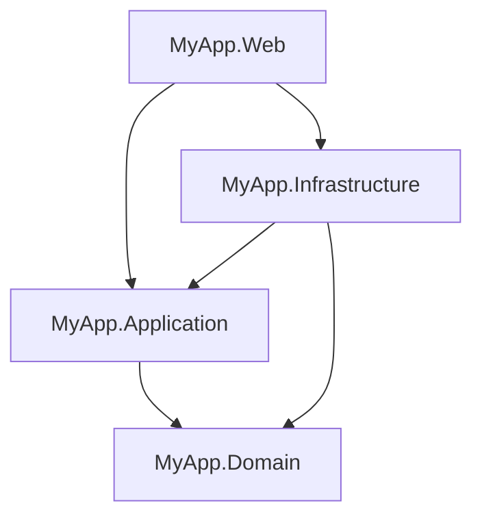

# Full Clean Architecture

> **Ref:** `STR003` | **Category:** Structural

Multi-project solution with Domain, Application, Infrastructure, and Web projects enforcing strict dependency inversion through project references and the compiler.

## When to Use

- **4+ developers**, especially multiple teams touching different layers
- Rich domain model with complex business rules, invariants, and workflows
- You need **compile-time enforcement** — convention-based boundaries ([STR002](STR002%20-%20clean-architecture-lite.md)) aren't holding up as the team grows
- Multiple deployment targets share the domain: an API, a background worker, a CLI tool
- The domain is the competitive advantage and must be protected from infrastructure leakage
- Long-lived application (5+ years) where architectural erosion is a real risk

## When NOT to Use

- CRUD-dominant applications — the four-project ceremony will slow you down for no benefit
- Solo developer or small team (1–3) — use [STR002](STR002%20-%20clean-architecture-lite.md), you don't need the compiler to enforce discipline you can see
- Rapid prototyping or MVP phase — get the product right first, refactor to this later
- If every "entity" is just a bag of properties with no methods, you have an anaemic model and four projects of indirection for nothing

## Solution Structure

```
MyApp/
├── MyApp.sln
├── src/
│   ├── MyApp.Domain/
│   │   ├── MyApp.Domain.csproj          ← references NOTHING
│   │   ├── Entities/
│   │   │   ├── Order.cs
│   │   │   ├── OrderItem.cs
│   │   │   └── Product.cs
│   │   ├── ValueObjects/
│   │   │   ├── Money.cs
│   │   │   └── Address.cs
│   │   ├── Enums/
│   │   │   └── OrderStatus.cs
│   │   ├── Events/
│   │   │   ├── IDomainEvent.cs
│   │   │   ├── OrderPlacedEvent.cs
│   │   │   └── OrderCancelledEvent.cs
│   │   ├── Exceptions/
│   │   │   ├── DomainException.cs
│   │   │   └── InsufficientStockException.cs
│   │   ├── Interfaces/
│   │   │   ├── IOrderRepository.cs
│   │   │   └── IProductRepository.cs
│   │   └── Services/
│   │       └── PricingService.cs
│   │
│   ├── MyApp.Application/
│   │   ├── MyApp.Application.csproj      ← references Domain
│   │   ├── DependencyInjection.cs
│   │   ├── Common/
│   │   │   ├── Behaviours/
│   │   │   │   ├── LoggingBehaviour.cs
│   │   │   │   └── ValidationBehaviour.cs
│   │   │   └── Interfaces/
│   │   │       ├── IDateTimeProvider.cs
│   │   │       └── ICurrentUserService.cs
│   │   ├── Orders/
│   │   │   ├── Commands/
│   │   │   │   ├── CreateOrder/
│   │   │   │   │   ├── CreateOrderCommand.cs
│   │   │   │   │   ├── CreateOrderCommandHandler.cs
│   │   │   │   │   └── CreateOrderCommandValidator.cs
│   │   │   │   └── CancelOrder/
│   │   │   │       ├── CancelOrderCommand.cs
│   │   │   │       └── CancelOrderCommandHandler.cs
│   │   │   ├── Queries/
│   │   │   │   ├── GetOrderById/
│   │   │   │   │   ├── GetOrderByIdQuery.cs
│   │   │   │   │   ├── GetOrderByIdQueryHandler.cs
│   │   │   │   │   └── OrderDto.cs
│   │   │   │   └── ListOrders/
│   │   │   │       ├── ListOrdersQuery.cs
│   │   │   │       ├── ListOrdersQueryHandler.cs
│   │   │   │       └── OrderSummaryDto.cs
│   │   │   └── EventHandlers/
│   │   │       └── OrderPlacedEventHandler.cs
│   │   └── Products/
│   │       └── Queries/
│   │           └── GetProductById/
│   │               ├── GetProductByIdQuery.cs
│   │               ├── GetProductByIdQueryHandler.cs
│   │               └── ProductDto.cs
│   │
│   ├── MyApp.Infrastructure/
│   │   ├── MyApp.Infrastructure.csproj    ← references Application, Domain
│   │   ├── DependencyInjection.cs
│   │   ├── Data/
│   │   │   ├── AppDbContext.cs
│   │   │   ├── Configurations/
│   │   │   │   ├── OrderConfiguration.cs
│   │   │   │   └── ProductConfiguration.cs
│   │   │   ├── Interceptors/
│   │   │   │   └── DomainEventDispatcherInterceptor.cs
│   │   │   └── Migrations/
│   │   ├── Repositories/
│   │   │   ├── OrderRepository.cs
│   │   │   └── ProductRepository.cs
│   │   └── Services/
│   │       ├── DateTimeProvider.cs
│   │       └── CurrentUserService.cs
│   │
│   └── MyApp.Web/
│       ├── MyApp.Web.csproj               ← references Application, Infrastructure
│       ├── Program.cs
│       ├── appsettings.json
│       ├── Controllers/
│       │   ├── OrdersController.cs
│       │   └── ProductsController.cs
│       ├── DTOs/
│       │   ├── CreateOrderRequest.cs
│       │   └── OrderResponse.cs
│       └── Middleware/
│           └── ExceptionHandlingMiddleware.cs
│
└── tests/
    ├── MyApp.Domain.Tests/
    ├── MyApp.Application.Tests/
    ├── MyApp.Infrastructure.Tests/
    └── MyApp.Web.Tests/
```

**MyApp.Domain** — Entities with behaviour, value objects, domain events, domain exceptions, repository interfaces, and domain services. Zero NuGet packages (except possibly a primitives library). This project defines the ubiquitous language.

**MyApp.Application** — Commands, queries, handlers, validators, DTOs, pipeline behaviours. Uses a mediator to dispatch commands and queries to their handlers. Defines application-level interfaces (`IDateTimeProvider`, `ICurrentUserService`). Contains no business rules — only orchestration.

**MyApp.Infrastructure** — EF Core, repository implementations, external service clients, infrastructure service implementations. Everything that talks to something outside the process.

**MyApp.Web** — ASP.NET Core host. Controllers, API DTOs, middleware, DI wiring. This is a delivery mechanism — it could be swapped for a gRPC host or a console app.

## Dependency Rules



**The iron rules:**

- `Domain` has **zero** project references. It depends on nothing.
- `Application` references **only** `Domain`.
- `Infrastructure` references `Application` and `Domain`. It implements the interfaces they define.
- `Web` references `Application` (to send commands/queries) and `Infrastructure` (only to call `AddInfrastructure()` in `Program.cs`).
- **Web MUST NOT reference Domain directly** for entity access. It works through Application DTOs.
- **Application MUST NOT reference Infrastructure.** If a handler needs to send email, it depends on `IEmailSender` (defined in Application), implemented in Infrastructure.

These rules are enforced by the compiler through `.csproj` `<ProjectReference>` entries. If a developer tries to add the wrong reference, the code review catches it. Add an ArchUnit test as a safety net.

## Naming Conventions

| Element | Convention | Location |
|---------|-----------|----------|
| Entity | `Order`, `Product` | Domain/Entities |
| Value Object | `Money`, `Address` | Domain/ValueObjects |
| Domain Event | `{Entity}{Past-tense verb}Event` | Domain/Events |
| Domain Exception | `{Noun}Exception` | Domain/Exceptions |
| Repository Interface | `I{Entity}Repository` | Domain/Interfaces |
| Domain Service | `{Noun}Service` | Domain/Services |
| Command | `{Verb}{Entity}Command` | Application/{Feature}/Commands |
| Command Handler | `{Verb}{Entity}CommandHandler` | Application/{Feature}/Commands |
| Validator | `{Verb}{Entity}CommandValidator` | Application/{Feature}/Commands |
| Query | `{Verb}{Entity}Query` | Application/{Feature}/Queries |
| Query Handler | `{Verb}{Entity}QueryHandler` | Application/{Feature}/Queries |
| Application DTO | `{Entity}Dto` | Application/{Feature}/Queries |
| Repository Impl | `{Entity}Repository` | Infrastructure/Repositories |
| API Request DTO | `{Verb}{Entity}Request` | Web/DTOs |
| API Response DTO | `{Entity}Response` | Web/DTOs |

Each command/query gets its own **folder** containing the command/query record, its handler, and its validator. This keeps related files together within the layered structure.

## Key Abstractions

Domain entity with behaviour:

```csharp
public class Order
{
    private readonly List<OrderItem> _items = [];
    private readonly List<IDomainEvent> _domainEvents = [];

    public Guid Id { get; private set; }
    public OrderStatus Status { get; private set; }
    public Address ShippingAddress { get; private set; }
    public Money Total => CalculateTotal();
    public IReadOnlyList<OrderItem> Items => _items.AsReadOnly();
    public IReadOnlyList<IDomainEvent> DomainEvents => _domainEvents.AsReadOnly();

    public Order(Address shippingAddress)
    {
        Id = Guid.NewGuid();
        Status = OrderStatus.Draft;
        ShippingAddress = shippingAddress;
    }

    public void AddItem(Product product, int quantity)
    {
        if (Status != OrderStatus.Draft)
            throw new DomainException("Cannot modify a submitted order.");
        if (!product.HasSufficientStock(quantity))
            throw new InsufficientStockException(product.Id, quantity);

        _items.Add(new OrderItem(product, quantity));
    }

    public void Submit()
    {
        if (_items.Count == 0)
            throw new DomainException("Cannot submit an empty order.");

        Status = OrderStatus.Submitted;
        _domainEvents.Add(new OrderPlacedEvent(Id));
    }

    private Money CalculateTotal() =>
        _items.Aggregate(Money.Zero, (sum, item) => sum + item.LineTotal);
}
```

Command and handler (define `ICommand<T>` / `ICommandHandler<T, TResult>` in `Application/Common/`, or use the interfaces from your chosen mediator library — MediatR, Wolverine, etc.):

```csharp
public sealed record CreateOrderCommand(
    string Street, string City, string PostCode,
    List<OrderItemDto> Items) : ICommand<Guid>;

public sealed class CreateOrderCommandHandler(
    IOrderRepository orders,
    IProductRepository products) : ICommandHandler<CreateOrderCommand, Guid>
{
    public async Task<Guid> HandleAsync(
        CreateOrderCommand command, CancellationToken cancellationToken)
    {
        var address = new Address(command.Street, command.City, command.PostCode);
        var order = new Order(address);

        foreach (var item in command.Items)
        {
            var product = await products.GetByIdAsync(item.ProductId)
                ?? throw new NotFoundException(nameof(Product), item.ProductId);
            order.AddItem(product, item.Quantity);
        }

        order.Submit();
        await orders.AddAsync(order);
        await orders.SaveChangesAsync(cancellationToken);

        return order.Id;
    }
}
```

DI registration pattern:

```csharp
// Program.cs
builder.Services
    .AddApplication()      // mediator, validators, behaviours
    .AddInfrastructure(builder.Configuration);  // DbContext, repositories, services
```

## Data Flow

**Command (write) flow — `POST /api/orders`:**

```
HTTP Request
    │
    ▼
OrdersController.Create(CreateOrderRequest dto)
    │  maps API DTO → CreateOrderCommand
    ▼
Mediator dispatches CreateOrderCommand
    │
    ▼
ValidationBehaviour<CreateOrderCommand>
    │  runs FluentValidation rules
    ▼
CreateOrderCommandHandler.Handle()
    │  loads Product entities via IProductRepository
    │  creates Order entity, calls order.AddItem(), order.Submit()
    │  persists via IOrderRepository
    ▼
OrderRepository.AddAsync() → AppDbContext.SaveChangesAsync()
    │
    ▼
DomainEventDispatcherInterceptor catches SaveChanges
    │  dispatches OrderPlacedEvent via mediator
    ▼
OrderPlacedEventHandler handles the event (e.g., sends confirmation email)
    │
    ▼
Guid returned up the stack
    │
    ▼
Controller returns CreatedAtAction(201, { orderId })
```

**Query (read) flow — `GET /api/orders/{id}`:**

```
HTTP Request
    │
    ▼
OrdersController.GetById(Guid id)
    │  creates GetOrderByIdQuery
    ▼
Mediator dispatches GetOrderByIdQuery
    │
    ▼
GetOrderByIdQueryHandler.Handle()
    │  queries via IOrderRepository or IAppDbContext directly
    │  maps entity → OrderDto
    ▼
OrderDto returned
    │
    ▼
Controller maps OrderDto → OrderResponse
    │
    ▼
HTTP 200 OK
```

Queries can bypass the repository and query the DbContext directly for read performance. This is acceptable because queries don't mutate state.

## Where Business Logic Lives

**In `MyApp.Domain`.** Full stop.

- **Domain entities** enforce invariants. `Order.AddItem()` checks stock and order status. `Order.Submit()` validates the order is non-empty. An entity should never be in an invalid state.
- **Domain services** handle logic that doesn't belong to a single entity. `PricingService` calculates cross-product discounts.
- **Value objects** encapsulate rules about values. `Money` prevents negative amounts and handles currency conversion.
- **Application handlers** orchestrate: load, call domain methods, save. If a handler contains `if (order.Status == ...)` logic, move it into the entity.

The test for correct placement: **can you describe the handler as "load → tell entity to do something → save"?** If the handler is making decisions about business rules, those decisions belong in the domain.

## Testing Strategy

```
tests/
├── MyApp.Domain.Tests/
│   ├── MyApp.Domain.Tests.csproj          ← references Domain only
│   ├── Entities/
│   │   ├── OrderTests.cs
│   │   └── ProductTests.cs
│   └── ValueObjects/
│       └── MoneyTests.cs
│
├── MyApp.Application.Tests/
│   ├── MyApp.Application.Tests.csproj     ← references Application, Domain
│   └── Orders/
│       ├── CreateOrderCommandHandlerTests.cs
│       ├── CreateOrderCommandValidatorTests.cs
│       └── GetOrderByIdQueryHandlerTests.cs
│
├── MyApp.Infrastructure.Tests/
│   ├── MyApp.Infrastructure.Tests.csproj  ← references Infrastructure, Domain
│   └── Repositories/
│       └── OrderRepositoryTests.cs
│
└── MyApp.Web.Tests/
    ├── MyApp.Web.Tests.csproj             ← references Web
    ├── CustomWebApplicationFactory.cs
    └── Endpoints/
        ├── OrdersEndpointTests.cs
        └── ProductsEndpointTests.cs
```

**Domain.Tests** — Pure unit tests. No mocks, no DI, no database. Test entity behaviour, value object equality, domain service calculations. These run in milliseconds and are the highest-value tests.

**Application.Tests** — Handler tests with mocked repositories (NSubstitute). Verify that the handler calls domain methods in the right order and returns the right result.

**Infrastructure.Tests** — Integration tests against a real database (Testcontainers with SQL Server or PostgreSQL). Test that EF Core configurations, repositories, and interceptors work correctly.

**Web.Tests** — API integration tests using `WebApplicationFactory<Program>`. Test the full HTTP pipeline including serialisation, middleware, and response codes.

## Common Mistakes

1. **Anaemic domain model.** Entities with only public properties and no methods. If `Order` has `public OrderStatus Status { get; set; }` with no `Submit()` method enforcing rules, you've built four projects of indirection around a CRUD app. Either add real behaviour or use [STR001](STR001%20-%20n-tier.md).

2. **Business logic in handlers.** The handler checks `if (product.StockQuantity < request.Quantity)` instead of calling `order.AddItem(product, quantity)` which does the check internally. Move the logic into the entity.

3. **Web project referencing Domain entities directly.** A controller returns `Order` as the response. Now the API is coupled to the domain model. Controllers work with Application DTOs and API-specific request/response types.

4. **Application referencing Infrastructure.** A handler injects `AppDbContext` directly instead of using `IOrderRepository`. This violates the dependency rule. Define an interface in Application or Domain; implement it in Infrastructure.

5. **Over-abstracting the mediator.** Wrapping your mediator library's interfaces in additional layers of abstraction. If your library provides `IRequest<T>` and `IRequestHandler<T, TResult>`, use them directly rather than wrapping them in project-specific interfaces that add no value.

6. **One handler per CRUD operation for a simple entity.** If an entity is genuinely CRUD (no business rules, no invariants), don't force it through command/query handlers. Consider a simpler approach for that entity, or accept that not every entity needs the full ceremony.

7. **Domain events dispatched before SaveChanges.** If the event handler sends an email but the save fails, you've sent an email for an order that doesn't exist. Dispatch domain events **after** `SaveChanges` succeeds, using an EF Core `SaveChangesInterceptor`.

8. **Shared DTOs between commands and queries.** `OrderDto` used in both `CreateOrderCommand` and `GetOrderByIdQuery`. Commands represent intent; queries represent views. They evolve independently. Keep them separate even if they look identical today.

9. **Circular project references.** Infrastructure needs something from Application, and Application needs something from Infrastructure. This means an interface is in the wrong place. The interface always goes in the inner layer (Domain or Application); the implementation goes in the outer layer (Infrastructure).
