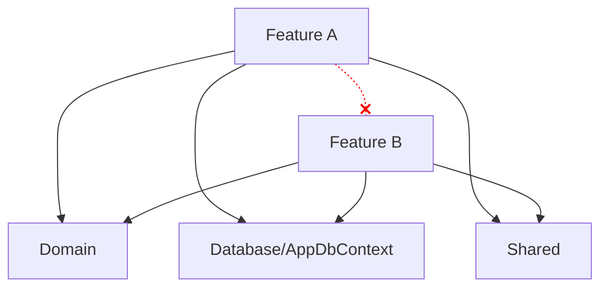

# Vertical Slice Architecture

> **Ref:** `STR004` | **Category:** Structural

Organised by feature, where each slice owns its endpoint, handler, validation, and data access — minimising cross-feature coupling.

## When to Use

- Features are largely independent — adding "order export" shouldn't require touching "order creation"
- **2–8 developers** in a feature-team model where each developer or pair owns a feature end-to-end
- The application is API-heavy with many distinct operations that don't share much logic
- You want to add new features without modifying shared abstractions or base classes
- Rapid iteration: startups, product teams, SaaS applications with frequent feature additions
- You're tired of changing five files across five folders to add one endpoint

## When NOT to Use

- The domain model is the primary asset — rich entities with shared invariants spanning multiple features need a domain-centric pattern (STR003 or [STR006](STR006%20-%20hexagonal.md))
- Heavy cross-feature business logic: if most features need to coordinate with each other, you'll end up with shared services that defeat the purpose
- Small CRUD apps — [STR001](STR001%20-%20n-tier.md) is simpler and you don't have enough features to justify the per-feature overhead
- If your "slices" all look identical (get entity, map to DTO, return), you've got a CRUD app and this pattern adds ceremony without benefit

## Solution Structure

```
MyApp/
├── MyApp.sln
└── src/
    └── MyApp/
        ├── MyApp.csproj
        ├── Program.cs
        ├── appsettings.json
        │
        ├── Features/
        │   ├── Orders/
        │   │   ├── CreateOrder.cs
        │   │   ├── GetOrderById.cs
        │   │   ├── ListOrders.cs
        │   │   ├── UpdateOrderStatus.cs
        │   │   ├── CancelOrder.cs
        │   │   └── OrderDto.cs
        │   │
        │   ├── Products/
        │   │   ├── CreateProduct.cs
        │   │   ├── GetProductById.cs
        │   │   ├── ListProducts.cs
        │   │   ├── SearchProducts.cs
        │   │   └── ProductDto.cs
        │   │
        │   └── Shipping/
        │       ├── CalculateShippingRate.cs
        │       ├── CreateShipment.cs
        │       └── TrackShipment.cs
        │
        ├── Domain/
        │   ├── Order.cs
        │   ├── OrderItem.cs
        │   ├── Product.cs
        │   └── Shipment.cs
        │
        ├── Database/
        │   ├── AppDbContext.cs
        │   └── Configurations/
        │       ├── OrderConfiguration.cs
        │       └── ProductConfiguration.cs
        │
        └── Shared/
            ├── Behaviours/
            │   ├── ValidationBehaviour.cs
            │   └── LoggingBehaviour.cs
            ├── Exceptions/
            │   ├── NotFoundException.cs
            │   └── ValidationException.cs
            └── Middleware/
                └── ExceptionHandlingMiddleware.cs
```

Each file in `Features/` is a **complete slice** — it contains the request, response, validator, and handler for one operation. A single file, a single responsibility.

**Features/{Resource}/** — one file per operation. This is where you spend 90% of your time.

**Domain/** — entity classes shared across features. Keep these lean. Not a full domain model — just the data structures and basic invariants.

**Database/** — DbContext and EF Core configurations. Shared because features query the same database.

**Shared/** — cross-cutting infrastructure only: validation pipeline, logging, exception handling. This folder should be small. If it's growing, you're recreating layers.

## Dependency Rules



- **Features never reference other features.** If `CreateOrder` needs product data, it queries the database directly — it does not call `GetProductById`.
- **Shared/ is infrastructure only.** If you're putting business logic in Shared/, stop. Either put it in the feature that owns it, or extract a domain service into Domain/.
- **Domain/ is shared data structures.** Entities live here because multiple features read/write the same tables. But domain logic that's specific to one operation stays in that feature's handler.
- **Database/ is the shared persistence layer.** All features use the same `AppDbContext`.

## Naming Conventions

| Element | Convention | Example |
|---------|-----------|---------|
| Feature folder | plural resource noun | `Orders/`, `Products/` |
| Slice file | `{Verb}{Entity}` | `CreateOrder.cs`, `ListProducts.cs` |
| Request type | nested `Command` or `Query` | `CreateOrder.Command` |
| Response type | nested `Result` | `CreateOrder.Result` |
| Validator | nested `Validator` | `CreateOrder.Validator` |
| Handler | nested `Handler` | `CreateOrder.Handler` |
| Shared DTO | `{Entity}Dto` | `OrderDto.cs` (only if multiple slices in the same feature return the same shape) |
| Endpoint mapping | `MapEndpoints` static method | `CreateOrder.MapEndpoints(app)` |

Everything for one operation nests inside a single static class. The file name matches the class name.

## Key Abstractions

A complete slice using MediatR and Minimal API:

```csharp
// Features/Orders/CreateOrder.cs
public static class CreateOrder
{
    public sealed record Command(
        Guid ProductId,
        int Quantity,
        string ShippingAddress) : IRequest<Result>;

    public sealed record Result(Guid OrderId, decimal Total);

    public sealed class Validator : AbstractValidator<Command>
    {
        public Validator()
        {
            RuleFor(x => x.ProductId).NotEmpty();
            RuleFor(x => x.Quantity).GreaterThan(0);
            RuleFor(x => x.ShippingAddress).NotEmpty().MaximumLength(500);
        }
    }

    public sealed class Handler(AppDbContext db) : IRequestHandler<Command, Result>
    {
        public async Task<Result> Handle(Command request, CancellationToken ct)
        {
            var product = await db.Products.FindAsync([request.ProductId], ct)
                ?? throw new NotFoundException(nameof(Product), request.ProductId);

            if (product.StockQuantity < request.Quantity)
                throw new ValidationException("Insufficient stock");

            var order = new Order
            {
                Id = Guid.NewGuid(),
                ProductId = product.Id,
                Quantity = request.Quantity,
                UnitPrice = product.Price,
                ShippingAddress = request.ShippingAddress,
                Status = OrderStatus.Submitted,
                CreatedAt = DateTime.UtcNow
            };

            db.Orders.Add(order);
            product.StockQuantity -= request.Quantity;
            await db.SaveChangesAsync(ct);

            return new Result(order.Id, order.Quantity * order.UnitPrice);
        }
    }

    public static void MapEndpoints(IEndpointRouteBuilder app)
    {
        app.MapPost("/api/orders", async (Command command, IMediator mediator) =>
        {
            var result = await mediator.Send(command);
            return Results.Created($"/api/orders/{result.OrderId}", result);
        });
    }
}
```

Endpoint registration in `Program.cs`:

```csharp
CreateOrder.MapEndpoints(app);
GetOrderById.MapEndpoints(app);
ListOrders.MapEndpoints(app);
```

Or use assembly scanning to register all endpoints automatically.

## Data Flow

```
HTTP POST /api/orders
    │
    ▼
Minimal API endpoint (defined in CreateOrder.MapEndpoints)
    │  deserialises body → CreateOrder.Command
    ▼
MediatR.Send(Command)
    │
    ▼
ValidationBehaviour (Shared/)
    │  runs CreateOrder.Validator
    ▼
CreateOrder.Handler.Handle()
    │  queries AppDbContext directly
    │  creates entity, modifies state
    │  saves to database
    ▼
CreateOrder.Result returned
    │
    ▼
Results.Created(url, result)
```

There are no layers to traverse. The handler is the feature. It queries what it needs, does what it needs to do, and returns the result. Compare this with [STR003](STR003%20-%20full-clean-architecture.md) where the same operation crosses Controller → MediatR → Handler → Repository → DbContext.

## Where Business Logic Lives

**In the handler for that feature.**

Each handler owns its business logic entirely. `CreateOrder.Handler` validates stock, creates the order, and decrements inventory. It doesn't delegate to a service or a domain model — it *is* the logic.

**When logic is shared across features:**

- If two features in the **same resource group** share logic (e.g., `CreateOrder` and `UpdateOrder` both validate stock), extract a private method or a small helper class within the `Orders/` folder.
- If features across **different resource groups** share logic (e.g., stock validation is needed by both Orders and Returns), extract a domain service into `Domain/`. This should be rare — if it's happening often, vertical slices may not be the right pattern.

**The escape hatch:** If you find yourself building a rich shared domain model with entities calling each other and enforcing cross-entity invariants, you've outgrown this pattern. Move to [STR003](STR003%20-%20full-clean-architecture.md) or [STR006](STR006%20-%20hexagonal.md).

## Testing Strategy

```
tests/
└── MyApp.Tests/
    ├── MyApp.Tests.csproj
    ├── CustomWebApplicationFactory.cs
    └── Features/
        ├── Orders/
        │   ├── CreateOrderTests.cs
        │   ├── GetOrderByIdTests.cs
        │   ├── ListOrdersTests.cs
        │   └── CancelOrderTests.cs
        └── Products/
            ├── CreateProductTests.cs
            └── ListProductsTests.cs
```

**Test per feature, not per layer.** Each slice gets its own test class that mirrors the feature structure.

**Integration tests are the natural fit.** Since each slice owns its full stack, test the full stack:

```csharp
public class CreateOrderTests(CustomWebApplicationFactory factory)
    : IClassFixture<CustomWebApplicationFactory>
{
    private readonly HttpClient _client = factory.CreateClient();

    [Fact]
    public async Task ValidOrder_ReturnsCreatedWithOrderId()
    {
        // Seed a product
        using var scope = factory.Services.CreateScope();
        var db = scope.ServiceProvider.GetRequiredService<AppDbContext>();
        var product = new Product { Id = Guid.NewGuid(), Price = 29.99m, StockQuantity = 100 };
        db.Products.Add(product);
        await db.SaveChangesAsync();

        var command = new CreateOrder.Command(product.Id, 2, "123 Main St");

        var response = await _client.PostAsJsonAsync("/api/orders", command);

        response.StatusCode.Should().Be(HttpStatusCode.Created);
        var result = await response.Content.ReadFromJsonAsync<CreateOrder.Result>();
        result!.OrderId.Should().NotBeEmpty();
        result.Total.Should().Be(59.98m);
    }

    [Fact]
    public async Task InsufficientStock_ReturnsBadRequest()
    {
        // Seed a product with 0 stock
        // POST order → assert 400
    }
}
```

**Unit tests for complex handlers.** If a handler has significant logic (calculations, state machines), unit test it directly with a test database or in-memory DbContext.

## Common Mistakes

1. **Feature folders that are just reorganised layers.** A feature folder containing `OrderController.cs`, `OrderService.cs`, `OrderRepository.cs` is N-Tier in a trench coat. The point is to have one file per operation, not one folder per entity with layered files inside.

2. **Shared abstractions that defeat the purpose.** Creating `ISliceHandler<TRequest, TResponse>`, `SliceHandlerBase<T>`, or a custom pipeline that every feature must inherit from. Vertical slices are about independence — shared base classes create coupling. Use MediatR and let each handler be its own thing.

3. **Features calling other features.** `CreateOrder.Handler` calls `mediator.Send(new GetProductById.Query(productId))` to get the product. Don't do this — query the database directly. Features are independent slices, not a service mesh.

4. **No shared Domain/ at all.** Every feature defines its own `Order` class. Now you have three different `Order` types mapping to the same table. Entity classes go in `Domain/` because they represent shared database structure.

5. **Giant Shared/ folder.** If `Shared/` has services, helpers, utilities, and business logic, you've built a horizontal layer and destroyed the vertical slicing. `Shared/` is for infrastructure plumbing only: validation pipeline, exception handling, logging.

6. **Not knowing when to stop.** If every new feature requires modifying shared domain logic, entities are deeply interrelated, or you're building complex invariants that span features — this pattern isn't working. Graduate to [STR003](STR003%20-%20full-clean-architecture.md) or [STR006](STR006%20-%20hexagonal.md).

7. **Mixing Minimal API endpoints and Controllers.** Pick one. This pattern pairs naturally with Minimal API endpoints (each slice registers its own endpoint). If using Controllers, group slices by controller, but keep the one-file-per-operation principle.
