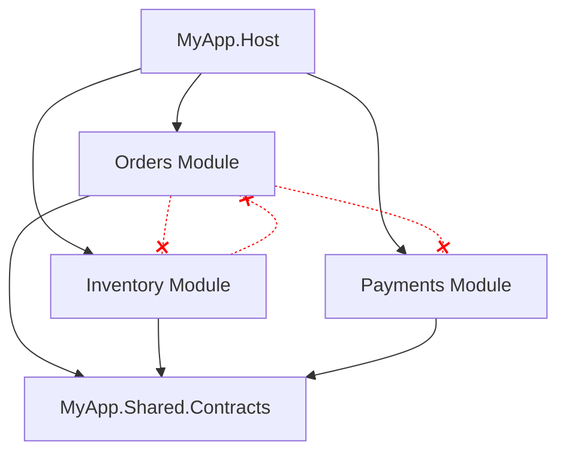

# Modular Monolith

> **Ref:** `STR005` | **Category:** Structural

Independent modules within one deployable, each with clear boundaries, own data, and explicit public contracts — a monolith that could become microservices but doesn't have to.

## When to Use

- **5–20+ developers** organised by domain area (orders team, inventory team, payments team)
- Multiple distinct business domains within one product that need to evolve independently
- You want microservice-like autonomy without the operational overhead of distributed systems
- The system is complex enough that a single codebase without boundaries would devolve into a big ball of mud
- You want the **option** to extract services later — modular monolith is the best stepping stone to microservices ([STR007](STR007%20-%20microservices.md))
- Deployment as a single unit is acceptable or even desirable

## When NOT to Use

- Small apps (under ~15 endpoints) where module boundaries add overhead without benefit — use [STR001](STR001%20-%20n-tier.md) or [STR002](STR002%20-%20clean-architecture-lite.md)
- The domain is genuinely a single cohesive thing — forced module boundaries create artificial seams
- You need independent deployment **now** — use microservices ([STR007](STR007%20-%20microservices.md))
- Teams can't agree on or enforce module boundaries — a modular monolith without discipline becomes a distributed monolith in one process

## Solution Structure

```
MyApp/
├── MyApp.sln
│
├── src/
│   ├── MyApp.Host/
│   │   ├── MyApp.Host.csproj              ← references all modules
│   │   ├── Program.cs
│   │   └── appsettings.json
│   │
│   ├── MyApp.Shared.Contracts/
│   │   ├── MyApp.Shared.Contracts.csproj   ← referenced by all modules
│   │   ├── IntegrationEvents/
│   │   │   ├── IIntegrationEvent.cs
│   │   │   ├── OrderPlacedIntegrationEvent.cs
│   │   │   └── PaymentCompletedIntegrationEvent.cs
│   │   └── Abstractions/
│   │       ├── IModule.cs
│   │       └── IEventBus.cs
│   │
│   ├── MyApp.Shared.Infrastructure/
│   │   ├── MyApp.Shared.Infrastructure.csproj
│   │   └── EventBus/
│   │       └── InMemoryEventBus.cs
│   │
│   ├── Modules/
│   │   ├── MyApp.Modules.Orders/
│   │   │   ├── MyApp.Modules.Orders.csproj ← references Shared.Contracts only
│   │   │   ├── OrdersModule.cs
│   │   │   ├── Domain/
│   │   │   │   ├── Order.cs
│   │   │   │   ├── OrderItem.cs
│   │   │   │   └── IOrderRepository.cs
│   │   │   ├── Application/
│   │   │   │   ├── CreateOrder/
│   │   │   │   │   ├── CreateOrderCommand.cs
│   │   │   │   │   └── CreateOrderCommandHandler.cs
│   │   │   │   └── GetOrderById/
│   │   │   │       ├── GetOrderByIdQuery.cs
│   │   │   │       └── GetOrderByIdQueryHandler.cs
│   │   │   ├── Infrastructure/
│   │   │   │   ├── OrdersDbContext.cs
│   │   │   │   ├── Configurations/
│   │   │   │   │   └── OrderConfiguration.cs
│   │   │   │   └── Repositories/
│   │   │   │       └── OrderRepository.cs
│   │   │   └── Api/
│   │   │       └── OrdersEndpoints.cs
│   │   │
│   │   ├── MyApp.Modules.Inventory/
│   │   │   ├── MyApp.Modules.Inventory.csproj
│   │   │   ├── InventoryModule.cs
│   │   │   ├── Domain/
│   │   │   ├── Application/
│   │   │   ├── Infrastructure/
│   │   │   └── Api/
│   │   │
│   │   └── MyApp.Modules.Payments/
│   │       ├── MyApp.Modules.Payments.csproj
│   │       ├── PaymentsModule.cs
│   │       ├── Domain/
│   │       ├── Application/
│   │       ├── Infrastructure/
│   │       └── Api/
│   │
│   └── (optional) MyApp.Modules.Notifications/
│
└── tests/
    ├── MyApp.Modules.Orders.Tests/
    ├── MyApp.Modules.Inventory.Tests/
    ├── MyApp.Modules.Payments.Tests/
    └── MyApp.IntegrationTests/
```

Each **module** is its own class library project. Internally, each module can use whatever structure fits — the Orders module shown above uses a mini Clean Architecture (Domain/Application/Infrastructure/Api), but a simpler module might use Vertical Slices ([STR004](STR004%20-%20vertical-slice.md)) internally.

**MyApp.Host** — the ASP.NET Core application. It references all modules and wires them together at startup. Contains no business logic.

**MyApp.Shared.Contracts** — integration events, module interface, and shared abstractions. This is the **only** project that all modules reference. Keep it thin.

**MyApp.Shared.Infrastructure** — shared infrastructure like the in-memory event bus. Modules don't reference this directly — the Host wires it in.

## Dependency Rules



**The iron rules:**

- Modules **NEVER** reference other modules. No `<ProjectReference>` between module projects. This is non-negotiable.
- All modules reference only `Shared.Contracts` (for integration events and shared interfaces).
- The `Host` references all modules and `Shared.Infrastructure` to wire everything together.
- Each module has its own `DbContext` and its own database schema (own tables, potentially own schema within the same database).
- Inter-module communication happens **only** through the event bus or through `Shared.Contracts` interfaces.
- Use `internal` access modifier extensively within modules. Only types needed for module registration and integration events are `public`.

## Naming Conventions

| Element | Convention | Example |
|---------|-----------|---------|
| Module project | `MyApp.Modules.{Domain}` | `MyApp.Modules.Orders` |
| Module entry point | `{Domain}Module` | `OrdersModule` |
| Module DbContext | `{Domain}DbContext` | `OrdersDbContext` |
| Integration event | `{Entity}{PastVerb}IntegrationEvent` | `OrderPlacedIntegrationEvent` |
| Module-internal classes | `internal` access | `internal class OrderRepository` |
| Module public contract | `public` in Shared.Contracts | `public record OrderPlacedIntegrationEvent` |
| DB table schema | module name as schema | `orders.Orders`, `inventory.Products` |

The `internal` keyword is your primary boundary enforcement tool. Everything inside a module is `internal` except the `IModule` implementation and any types exposed through `Shared.Contracts`.

## Key Abstractions

Module registration interface (C# 11+ / .NET 7+):

```csharp
// Shared.Contracts/Abstractions/IModule.cs
public interface IModule
{
    static abstract void ConfigureServices(IServiceCollection services, IConfiguration configuration);
    static abstract void MapEndpoints(IEndpointRouteBuilder app);
}
```

Alternative for teams that prefer instance-based registration:

```csharp
public interface IModule
{
    void ConfigureServices(IServiceCollection services, IConfiguration configuration);
    void MapEndpoints(IEndpointRouteBuilder app);
}
```

Integration event bus:

```csharp
// Shared.Contracts/Abstractions/IEventBus.cs
public interface IEventBus
{
    Task PublishAsync<T>(T @event, CancellationToken ct = default) where T : IIntegrationEvent;
}

// Shared.Contracts/IntegrationEvents/IIntegrationEvent.cs
public interface IIntegrationEvent
{
    Guid EventId { get; }
    DateTime OccurredAt { get; }
}

// Shared.Contracts/IntegrationEvents/OrderPlacedIntegrationEvent.cs
public sealed record OrderPlacedIntegrationEvent(
    Guid EventId,
    DateTime OccurredAt,
    Guid OrderId,
    decimal TotalAmount) : IIntegrationEvent;
```

Module implementation:

```csharp
// Modules/MyApp.Modules.Orders/OrdersModule.cs
public sealed class OrdersModule : IModule
{
    public static void ConfigureServices(IServiceCollection services, IConfiguration configuration)
    {
        services.AddDbContext<OrdersDbContext>(options =>
            options.UseSqlServer(configuration.GetConnectionString("Default"),
                sql => sql.MigrationsHistoryTable("__EFMigrationsHistory", "orders")));

        services.AddScoped<IOrderRepository, OrderRepository>();
        services.AddModuleMediator(typeof(OrdersModule).Assembly);
    }

    public static void MapEndpoints(IEndpointRouteBuilder app)
    {
        var group = app.MapGroup("/api/orders").WithTags("Orders");
        group.MapPost("/", OrdersEndpoints.Create);
        group.MapGet("/{id:guid}", OrdersEndpoints.GetById);
    }
}
```

Host wiring:

```csharp
// Host/Program.cs
OrdersModule.ConfigureServices(builder.Services, builder.Configuration);
InventoryModule.ConfigureServices(builder.Services, builder.Configuration);
PaymentsModule.ConfigureServices(builder.Services, builder.Configuration);

builder.Services.AddSingleton<IEventBus, InMemoryEventBus>();

var app = builder.Build();

OrdersModule.MapEndpoints(app);
InventoryModule.MapEndpoints(app);
PaymentsModule.MapEndpoints(app);
```

## Data Flow

**Intra-module (within Orders):**

```
HTTP POST /api/orders
    │
    ▼
OrdersEndpoints.Create → mediator dispatches CreateOrderCommand
    │
    ▼
CreateOrderCommandHandler
    │  uses OrdersDbContext (module's own context)
    │  creates Order entity
    │  saves to orders.Orders table
    │  publishes OrderPlacedIntegrationEvent via IEventBus
    ▼
Database INSERT (orders schema)
    │
    ▼
Result returned → HTTP 201
```

**Inter-module (Orders → Inventory):**

```
CreateOrderCommandHandler
    │  publishes OrderPlacedIntegrationEvent
    ▼
IEventBus (InMemoryEventBus in-process)
    │
    ▼
InventoryModule's OrderPlacedHandler
    │  receives event
    │  uses InventoryDbContext to decrement stock
    │  in inventory.Products table
    ▼
Database UPDATE (inventory schema)
```

The key: modules communicate **through events**, even though they're in the same process. The `InMemoryEventBus` dispatches in-process (potentially synchronously within the same request), but the programming model is event-driven — publishers don't know who consumes. This makes future extraction to microservices straightforward: swap the `InMemoryEventBus` for RabbitMQ or Azure Service Bus to get true async delivery.

## Where Business Logic Lives

**Inside each module**, following whatever internal structure that module uses.

- Each module is a self-contained bounded context. It owns its domain model, its data, and its business rules.
- **Cross-module business processes** use integration events. The Orders module doesn't know how Inventory manages stock — it publishes "order placed" and Inventory reacts.
- For complex cross-module workflows (e.g., order fulfilment spanning Orders, Inventory, and Payments), use a **saga or process manager** within a dedicated module or in the module that owns the workflow.
- **Module boundaries ARE the architecture.** Get them wrong and you have a distributed monolith in one process — all the complexity of boundaries with none of the benefits. Boundaries should align with business domains, not technical concerns.

## Testing Strategy

```
tests/
├── MyApp.Modules.Orders.Tests/
│   ├── MyApp.Modules.Orders.Tests.csproj   ← references Orders module
│   ├── Domain/
│   │   └── OrderTests.cs
│   ├── Application/
│   │   └── CreateOrderCommandHandlerTests.cs
│   └── Integration/
│       └── OrdersModuleTests.cs
│
├── MyApp.Modules.Inventory.Tests/
│   └── ...
│
├── MyApp.Modules.Payments.Tests/
│   └── ...
│
└── MyApp.IntegrationTests/
    ├── MyApp.IntegrationTests.csproj        ← references Host
    ├── CustomWebApplicationFactory.cs
    └── Workflows/
        └── OrderFulfilmentTests.cs
```

**Module-level tests:** Each module is tested in isolation. The module's test project references only that module. Mock the `IEventBus` to verify events are published without triggering other modules.

**Cross-module integration tests:** Test end-to-end workflows that span modules. Use `WebApplicationFactory<Program>` with all modules wired up and a real event bus. Verify that placing an order triggers inventory updates and payment processing.

**Module isolation test:** Verify that modules can start independently — spin up only the Orders module with its own DbContext and verify it works without the other modules present.

## Common Mistakes

1. **Shared DbContext across modules.** A single `AppDbContext` with `DbSet<Order>`, `DbSet<Product>`, and `DbSet<Payment>`. This couples all modules at the data level. Each module gets its own DbContext, potentially pointing to different schemas in the same database.

2. **Direct module-to-module project references.** `MyApp.Modules.Orders.csproj` has a `<ProjectReference>` to `MyApp.Modules.Inventory.csproj`. This defeats the entire pattern. If Orders needs inventory data, it either queries through an integration event response or uses a read model.

3. **Integration events with rich domain objects.** `OrderPlacedIntegrationEvent` contains the full `Order` entity with navigation properties. Integration events carry **flat data** — IDs, amounts, timestamps. They are contracts between modules, not internal domain objects.

4. **Modules that are just namespaces.** The project is split into module folders but everything is `public`, there are no separate DbContexts, and classes freely reference each other. These aren't modules — they're folders. Use `internal` and separate DbContexts.

5. **Too many modules.** Every entity gets its own module. A system with 3 business domains has 15 modules. Each module should represent a **bounded context** — a cohesive area of business capability. Start with fewer, larger modules and split when you have evidence of independence.

6. **Synchronous cross-module calls.** Module A calls Module B's service directly to get data. This creates temporal coupling. Use integration events for side effects and read models for queries. If you need synchronous cross-module queries, define a query interface in `Shared.Contracts`.

7. **No integration event versioning.** Changing `OrderPlacedIntegrationEvent` breaks all consuming modules at compile time. Treat integration events as public APIs — add fields, don't remove them. If you need a breaking change, version the event.

8. **Business logic in the Host project.** The Host wires modules together — it does not orchestrate business processes. If `Program.cs` contains `if/else` logic about business rules, that logic belongs in a module.
