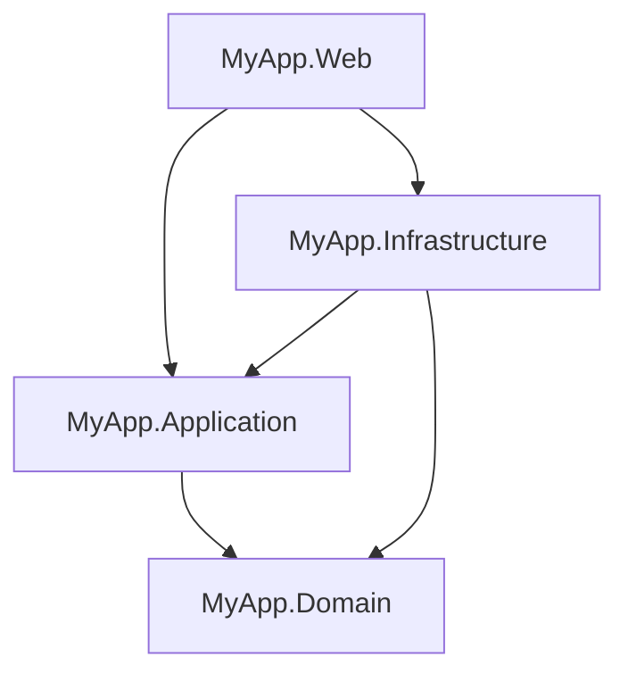

# Clean Architecture with Feature Folders

> **Ref:** `STR008` | **Category:** Structural

Multi-project Clean Architecture with CQRS, where the Application layer is organised by feature folder instead of by Commands/Queries — each feature groups its commands, queries, handlers, validators, and DTOs together.

## When to Use

- **3–8 developers** building a domain-rich application where you want compiler-enforced layer boundaries
- You like [STR003](STR003%20-%20full-clean-architecture.md)'s project separation and CQRS but find navigating `Commands/CreateOrder/`, `Queries/GetOrderById/` across separate folder trees tedious
- Features are the natural unit of work — when a developer picks up "order cancellation," they want one folder with everything in it
- 20+ endpoints where the traditional `Commands/` and `Queries/` folders become large flat lists

This is [STR003](STR003%20-%20full-clean-architecture.md) with a different folder strategy in the Application project. The Domain, Infrastructure, and Web projects are identical. The only change is how you organise Application.

## When NOT to Use

- Pure CRUD — use [STR001](STR001%20-%20n-tier.md), you don't need four projects
- Small number of endpoints (under ~15) — the [STR003](STR003%20-%20full-clean-architecture.md) Commands/Queries split is fine at that scale
- You want full vertical slices where each feature owns its own data access — use [STR004](STR004%20-%20vertical-slice.md) instead
- Single-project is sufficient — use [STR002](STR002%20-%20clean-architecture-lite.md)

## Solution Structure

Domain, Infrastructure, and Web are identical to [STR003](STR003%20-%20full-clean-architecture.md). Only the Application project differs:

```
MyApp/
├── MyApp.sln
├── src/
│   ├── MyApp.Domain/
│   │   ├── MyApp.Domain.csproj              ← references NOTHING
│   │   ├── Entities/
│   │   │   ├── Order.cs
│   │   │   ├── OrderItem.cs
│   │   │   └── Product.cs
│   │   ├── ValueObjects/
│   │   │   ├── Money.cs
│   │   │   └── Address.cs
│   │   ├── Enums/
│   │   │   └── OrderStatus.cs
│   │   ├── Events/
│   │   │   ├── IDomainEvent.cs
│   │   │   └── OrderPlacedEvent.cs
│   │   ├── Exceptions/
│   │   │   ├── DomainException.cs
│   │   │   └── InsufficientStockException.cs
│   │   ├── Interfaces/
│   │   │   ├── IOrderRepository.cs
│   │   │   └── IProductRepository.cs
│   │   └── Services/
│   │       └── PricingService.cs
│   │
│   ├── MyApp.Application/
│   │   ├── MyApp.Application.csproj          ← references Domain
│   │   ├── DependencyInjection.cs
│   │   ├── Common/
│   │   │   ├── Behaviours/
│   │   │   │   ├── LoggingBehaviour.cs
│   │   │   │   └── ValidationBehaviour.cs
│   │   │   └── Interfaces/
│   │   │       ├── IDateTimeProvider.cs
│   │   │       └── ICurrentUserService.cs
│   │   │
│   │   ├── Orders/                           ← FEATURE FOLDER
│   │   │   ├── Commands/
│   │   │   │   ├── CreateOrder.cs
│   │   │   │   ├── CreateOrderValidator.cs
│   │   │   │   ├── CancelOrder.cs
│   │   │   │   └── CancelOrderValidator.cs
│   │   │   ├── Queries/
│   │   │   │   ├── GetOrderById.cs
│   │   │   │   └── ListOrders.cs
│   │   │   ├── EventHandlers/
│   │   │   │   └── OrderPlacedEventHandler.cs
│   │   │   └── DTOs/
│   │   │       ├── OrderDto.cs
│   │   │       └── OrderSummaryDto.cs
│   │   │
│   │   └── Products/                         ← FEATURE FOLDER
│   │       ├── Queries/
│   │       │   ├── GetProductById.cs
│   │       │   └── ListProducts.cs
│   │       └── DTOs/
│   │           └── ProductDto.cs
│   │
│   ├── MyApp.Infrastructure/
│   │   ├── MyApp.Infrastructure.csproj        ← references Application, Domain
│   │   ├── DependencyInjection.cs
│   │   ├── Data/
│   │   │   ├── AppDbContext.cs
│   │   │   ├── Configurations/
│   │   │   │   ├── OrderConfiguration.cs
│   │   │   │   └── ProductConfiguration.cs
│   │   │   └── Interceptors/
│   │   │       └── DomainEventDispatcherInterceptor.cs
│   │   ├── Repositories/
│   │   │   ├── OrderRepository.cs
│   │   │   └── ProductRepository.cs
│   │   └── Services/
│   │       ├── DateTimeProvider.cs
│   │       └── CurrentUserService.cs
│   │
│   └── MyApp.Web/
│       ├── MyApp.Web.csproj                   ← references Application, Infrastructure
│       ├── Program.cs
│       ├── appsettings.json
│       ├── Controllers/
│       │   ├── OrdersController.cs
│       │   └── ProductsController.cs
│       ├── DTOs/
│       │   ├── CreateOrderRequest.cs
│       │   └── OrderResponse.cs
│       └── Middleware/
│           └── ExceptionHandlingMiddleware.cs
│
└── tests/
    ├── MyApp.Domain.Tests/
    ├── MyApp.Application.Tests/
    ├── MyApp.Infrastructure.Tests/
    └── MyApp.Web.Tests/
```

**The key difference from [STR003](STR003%20-%20full-clean-architecture.md):** In STR003, Application is organised as:

```
Application/
├── Orders/
│   ├── Commands/
│   │   ├── CreateOrder/
│   │   │   ├── CreateOrderCommand.cs
│   │   │   ├── CreateOrderCommandHandler.cs
│   │   │   └── CreateOrderCommandValidator.cs
│   │   └── CancelOrder/
│   │       └── ...
│   └── Queries/
│       └── GetOrderById/
│           └── ...
```

In STR008, each feature folder groups commands, queries, event handlers, and DTOs together:

```
Application/
├── Orders/
│   ├── Commands/
│   │   ├── CreateOrder.cs              ← command + handler in one file
│   │   ├── CreateOrderValidator.cs
│   │   ├── CancelOrder.cs
│   │   └── CancelOrderValidator.cs
│   ├── Queries/
│   │   ├── GetOrderById.cs             ← query + handler in one file
│   │   └── ListOrders.cs
│   ├── EventHandlers/
│   │   └── OrderPlacedEventHandler.cs
│   └── DTOs/
│       ├── OrderDto.cs
│       └── OrderSummaryDto.cs
```

The command/query record and its handler live in the **same file**. No separate `CreateOrderCommand.cs` + `CreateOrderCommandHandler.cs` — they're one unit. Validators stay in a separate file because they can grow large.

## Dependency Rules

Identical to [STR003](STR003%20-%20full-clean-architecture.md):



- `Domain` references nothing.
- `Application` references only `Domain`.
- `Infrastructure` references `Application` and `Domain`.
- `Web` references `Application` and `Infrastructure`.
- **Application MUST NOT reference Infrastructure.**
- **Web MUST NOT reference Domain directly** — it works through Application DTOs.

The compiler enforces these through `.csproj` `<ProjectReference>` entries.

## Naming Conventions

| Element | Convention | Location | Example |
|---------|-----------|----------|---------|
| Entity | singular noun | Domain/Entities | `Order` |
| Value Object | singular noun | Domain/ValueObjects | `Money` |
| Domain Event | `{Entity}{PastVerb}Event` | Domain/Events | `OrderPlacedEvent` |
| Repository Interface | `I{Entity}Repository` | Domain/Interfaces | `IOrderRepository` |
| Repository Impl | `{Entity}Repository` | Infrastructure/Repositories | `OrderRepository` |
| Feature folder | plural noun | Application/ | `Orders/`, `Products/` |
| Command | `{Verb}{Entity}` | Application/{Feature}/Commands | `CreateOrder` |
| Command handler | nested inside command | same file | `CreateOrder.Handler` |
| Command validator | `{Verb}{Entity}Validator` | Application/{Feature}/Commands | `CreateOrderValidator` |
| Query | `{Verb}{Entity}` | Application/{Feature}/Queries | `GetOrderById` |
| Query handler | nested inside query | same file | `GetOrderById.Handler` |
| Application DTO | `{Entity}Dto` | Application/{Feature}/DTOs | `OrderDto` |
| API Request DTO | `{Verb}{Entity}Request` | Web/DTOs | `CreateOrderRequest` |
| API Response DTO | `{Entity}Response` | Web/DTOs | `OrderResponse` |
| Event Handler | `{EventName}Handler` | Application/{Feature}/EventHandlers | `OrderPlacedEventHandler` |

Each command/query file contains both the record and its handler as a nested class. This is the core ergonomic improvement over [STR003](STR003%20-%20full-clean-architecture.md).

## Key Abstractions

Domain entity with behaviour (identical to [STR003](STR003%20-%20full-clean-architecture.md)):

```csharp
public class Order
{
    private readonly List<OrderItem> _items = [];
    private readonly List<IDomainEvent> _domainEvents = [];

    public Guid Id { get; private set; }
    public OrderStatus Status { get; private set; }
    public Address ShippingAddress { get; private set; }
    public Money Total => CalculateTotal();
    public IReadOnlyList<OrderItem> Items => _items.AsReadOnly();
    public IReadOnlyList<IDomainEvent> DomainEvents => _domainEvents.AsReadOnly();

    public Order(Address shippingAddress)
    {
        Id = Guid.NewGuid();
        Status = OrderStatus.Draft;
        ShippingAddress = shippingAddress;
    }

    public void AddItem(Product product, int quantity)
    {
        if (Status != OrderStatus.Draft)
            throw new DomainException("Cannot modify a submitted order.");
        if (!product.HasSufficientStock(quantity))
            throw new InsufficientStockException(product.Id, quantity);

        _items.Add(new OrderItem(product, quantity));
    }

    public void Submit()
    {
        if (_items.Count == 0)
            throw new DomainException("Cannot submit an empty order.");

        Status = OrderStatus.Submitted;
        _domainEvents.Add(new OrderPlacedEvent(Id));
    }

    private Money CalculateTotal() =>
        _items.Aggregate(Money.Zero, (sum, item) => sum + item.LineTotal);
}
```

Command with nested handler — the defining file pattern of this architecture:

```csharp
// Application/Orders/Commands/CreateOrder.cs
public sealed record CreateOrder(
    string Street, string City, string PostCode,
    List<CreateOrder.LineItem> Items) : IRequest<Guid>
{
    public sealed record LineItem(Guid ProductId, int Quantity);

    internal sealed class Handler(
        IOrderRepository orders,
        IProductRepository products) : IRequestHandler<CreateOrder, Guid>
    {
        public async Task<Guid> Handle(CreateOrder request, CancellationToken ct)
        {
            var address = new Address(request.Street, request.City, request.PostCode);
            var order = new Order(address);

            foreach (var item in request.Items)
            {
                var product = await products.GetByIdAsync(item.ProductId)
                    ?? throw new NotFoundException(nameof(Product), item.ProductId);
                order.AddItem(product, item.Quantity);
            }

            order.Submit();
            await orders.AddAsync(order);
            await orders.SaveChangesAsync(ct);

            return order.Id;
        }
    }
}
```

Validator in a separate file:

```csharp
// Application/Orders/Commands/CreateOrderValidator.cs
public sealed class CreateOrderValidator : AbstractValidator<CreateOrder>
{
    public CreateOrderValidator()
    {
        RuleFor(x => x.Items).NotEmpty();
        RuleFor(x => x.Street).NotEmpty();
        RuleFor(x => x.City).NotEmpty();
        RuleFor(x => x.PostCode).NotEmpty();
        RuleForEach(x => x.Items).ChildRules(item =>
        {
            item.RuleFor(x => x.ProductId).NotEmpty();
            item.RuleFor(x => x.Quantity).GreaterThan(0);
        });
    }
}
```

Query with nested handler:

```csharp
// Application/Orders/Queries/GetOrderById.cs
public sealed record GetOrderById(Guid OrderId) : IRequest<OrderDto?>
{
    internal sealed class Handler(
        IOrderRepository orders) : IRequestHandler<GetOrderById, OrderDto?>
    {
        public async Task<OrderDto?> Handle(GetOrderById request, CancellationToken ct)
        {
            var order = await orders.GetByIdAsync(request.OrderId);
            return order is null ? null : new OrderDto(
                order.Id,
                order.Status,
                order.Total.Amount,
                order.Items.Select(i => new OrderDto.LineItemDto(
                    i.ProductId, i.Quantity, i.LineTotal.Amount)).ToList());
        }
    }
}
```

DI registration:

```csharp
// Application/DependencyInjection.cs
public static class DependencyInjection
{
    public static IServiceCollection AddApplication(this IServiceCollection services)
    {
        services.AddMediatR(cfg =>
            cfg.RegisterServicesFromAssemblyContaining<CreateOrder>());
        services.AddValidatorsFromAssemblyContaining<CreateOrder>();
        return services;
    }
}

// Program.cs
builder.Services
    .AddApplication()
    .AddInfrastructure(builder.Configuration);
```

## Data Flow

**Command flow — `POST /api/orders`:**

```
HTTP Request
    │
    ▼
OrdersController.Create(CreateOrderRequest dto)
    │  maps API DTO → CreateOrder command
    ▼
MediatR.Send(CreateOrder)
    │
    ▼
ValidationBehaviour<CreateOrder>
    │  runs CreateOrderValidator
    ▼
CreateOrder.Handler.Handle()
    │  loads Product entities via IProductRepository
    │  creates Order entity, calls order.AddItem(), order.Submit()
    │  persists via IOrderRepository
    ▼
OrderRepository.AddAsync() → AppDbContext.SaveChangesAsync()
    │
    ▼
DomainEventDispatcherInterceptor
    │  dispatches OrderPlacedEvent via MediatR
    ▼
OrderPlacedEventHandler handles event
    │
    ▼
Guid returned → Controller returns 201 Created
```

**Query flow — `GET /api/orders/{id}`:**

```
HTTP Request
    │
    ▼
OrdersController.GetById(Guid id)
    │  creates GetOrderById query
    ▼
MediatR.Send(GetOrderById)
    │
    ▼
GetOrderById.Handler.Handle()
    │  queries via IOrderRepository
    │  maps to OrderDto
    ▼
OrderDto returned → Controller maps to OrderResponse → 200 OK
```

Identical data flow to [STR003](STR003%20-%20full-clean-architecture.md). The only difference is file organisation — not runtime behaviour.

## Where Business Logic Lives

**In `MyApp.Domain`.** Same rule as [STR003](STR003%20-%20full-clean-architecture.md).

- **Domain entities** enforce invariants. An entity is never in an invalid state.
- **Domain services** handle cross-entity logic.
- **Application handlers** orchestrate: load → call domain methods → save. No business rules in handlers.
- **Feature folders don't change where logic lives** — they change where you *find* things. Business logic is still in Domain, not scattered across feature folders.

## Testing Strategy

```
tests/
├── MyApp.Domain.Tests/
│   ├── MyApp.Domain.Tests.csproj          ← references Domain only
│   ├── Entities/
│   │   └── OrderTests.cs
│   └── ValueObjects/
│       └── MoneyTests.cs
│
├── MyApp.Application.Tests/
│   ├── MyApp.Application.Tests.csproj     ← references Application, Domain
│   └── Orders/                            ← mirrors feature folder structure
│       ├── Commands/
│       │   ├── CreateOrderTests.cs
│       │   └── CreateOrderValidatorTests.cs
│       └── Queries/
│           └── GetOrderByIdTests.cs
│
├── MyApp.Infrastructure.Tests/
│   ├── MyApp.Infrastructure.Tests.csproj
│   └── Repositories/
│       └── OrderRepositoryTests.cs
│
└── MyApp.Web.Tests/
    ├── MyApp.Web.Tests.csproj
    ├── CustomWebApplicationFactory.cs
    └── Endpoints/
        ├── OrdersEndpointTests.cs
        └── ProductsEndpointTests.cs
```

Test projects mirror the source structure. Application tests follow feature folder layout.

**Domain.Tests** — pure unit tests. No mocks, no database.

**Application.Tests** — handler tests with mocked repositories. Verify orchestration. Validator tests with known inputs.

```csharp
public class CreateOrderTests
{
    private readonly IOrderRepository _orders = Substitute.For<IOrderRepository>();
    private readonly IProductRepository _products = Substitute.For<IProductRepository>();
    private readonly CreateOrder.Handler _sut;

    public CreateOrderTests()
    {
        _sut = new CreateOrder.Handler(_orders, _products);
    }

    [Fact]
    public async Task ValidOrder_PersistsAndReturnsId()
    {
        var product = new Product("Widget", stockQuantity: 10, price: 9.99m);
        _products.GetByIdAsync(product.Id).Returns(product);

        var command = new CreateOrder("1 Main St", "London", "SW1A",
            [new CreateOrder.LineItem(product.Id, 2)]);

        var orderId = await _sut.Handle(command, CancellationToken.None);

        orderId.Should().NotBeEmpty();
        await _orders.Received(1).AddAsync(Arg.Any<Order>());
        await _orders.Received(1).SaveChangesAsync(Arg.Any<CancellationToken>());
    }
}
```

**Infrastructure.Tests** — integration tests with Testcontainers.

**Web.Tests** — full HTTP pipeline tests with `WebApplicationFactory`.

## Common Mistakes

1. **Splitting command and handler into separate files.** The whole point of this pattern is co-location. `CreateOrder` (record) and `CreateOrder.Handler` (nested class) live in one file. If you separate them, you've just recreated [STR003](STR003%20-%20full-clean-architecture.md) with different folder names.

2. **Business logic in handlers.** Feature folders don't change where logic lives. The handler still just orchestrates — business rules still belong in Domain entities. Don't let the feature-folder ergonomics tempt you into putting logic in the handler "because it's right there."

3. **Feature folders referencing each other.** `Orders/Commands/CreateOrder.Handler` imports a DTO from `Products/DTOs/ProductDto.cs`. Feature folders within Application should be independent. If a handler needs product data, it uses `IProductRepository` from Domain, not another feature's DTO.

4. **Mixing feature-folder and layer-first organisation.** Some features use `Orders/Commands/CreateOrder.cs`, others put everything in `Payments/CreatePaymentCommand.cs` without the Commands/Queries subfolder. Pick one structure and apply it consistently across all features.

5. **Forgetting DTOs are per-feature.** `OrderDto` lives in `Orders/DTOs/`, not in a shared `Common/DTOs/` folder. Each feature defines the shape it needs. If two features need different views of an order, they each define their own DTO.

6. **Validators that enforce business rules.** FluentValidation validators in Application should check structural validity (non-empty, correct format, within range). Business rules ("order cannot exceed credit limit") belong in Domain entities, not validators.

7. **Giant feature folders.** If `Orders/` has 30+ files, break it into sub-features: `Orders/Placement/`, `Orders/Fulfilment/`, `Orders/Returns/`. The feature folder should be scannable at a glance.

8. **Web controllers organised differently from Application features.** If Application has `Orders/`, `Products/`, `Shipping/`, the Web controllers should mirror that grouping. `OrdersController` maps to the `Orders/` feature folder. Don't reorganise at the API layer.
