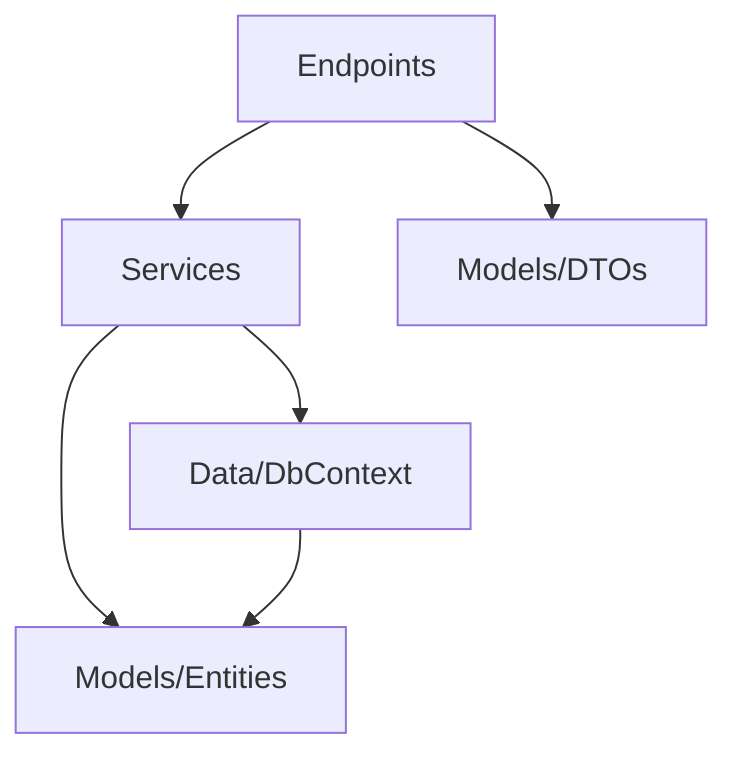

# Minimal API

> **Ref:** `STR009` | **Category:** Structural

Endpoint-focused architecture using .NET Minimal APIs, organised by endpoint classes or static methods with no controllers, no MVC overhead, and explicit route registration.

## When to Use

- **1–4 developers** building an API-first application
- You want a lightweight, low-ceremony API without the MVC pipeline
- Microservice internals where each service is small and focused
- You prefer explicit over convention-based routing
- Performance-sensitive APIs where the MVC middleware pipeline overhead matters
- New .NET projects (8+) — Minimal API is now the default project template

## When NOT to Use

- You need MVC features: model binding from complex sources, output formatters, content negotiation, view rendering
- Large APIs (50+ endpoints) without a clear organisational strategy — controllers provide natural grouping that Minimal APIs need to create explicitly
- Teams that are deeply familiar with MVC and have no reason to switch
- If you're building a Razor Pages or Blazor Server app — those use MVC internally

## Solution Structure

```
MyApp/
├── MyApp.sln
└── src/
    └── MyApp/
        ├── MyApp.csproj
        ├── Program.cs
        ├── appsettings.json
        │
        ├── Endpoints/
        │   ├── Orders/
        │   │   ├── CreateOrderEndpoint.cs
        │   │   ├── GetOrderByIdEndpoint.cs
        │   │   ├── ListOrdersEndpoint.cs
        │   │   └── UpdateOrderStatusEndpoint.cs
        │   └── Products/
        │       ├── GetProductByIdEndpoint.cs
        │       └── ListProductsEndpoint.cs
        │
        ├── Services/
        │   ├── IOrderService.cs
        │   ├── OrderService.cs
        │   ├── IProductService.cs
        │   └── ProductService.cs
        │
        ├── Models/
        │   ├── Entities/
        │   │   ├── Order.cs
        │   │   └── Product.cs
        │   └── DTOs/
        │       ├── CreateOrderRequest.cs
        │       ├── OrderResponse.cs
        │       └── ProductResponse.cs
        │
        ├── Data/
        │   ├── AppDbContext.cs
        │   └── Configurations/
        │       └── OrderConfiguration.cs
        │
        └── Filters/
            ├── ValidationFilter.cs
            └── ExceptionFilter.cs
```

**Endpoints/** — One class per endpoint, grouped by resource. Each endpoint class has a single static method that handles one HTTP operation. This is the structural replacement for controllers.

**Services/** — Business logic, same as [STR001](STR001%20-%20n-tier.md). Endpoints are thin — they call services.

**Models/** — Entities and DTOs, same as N-Tier.

**Data/** — EF Core DbContext and configurations.

**Filters/** — Endpoint filters replace MVC action filters. Validation, exception handling, logging.

## Dependency Rules



- Endpoints depend on service interfaces and DTOs
- Services depend on data access and entities
- **Endpoints must not** access `AppDbContext` directly — go through services
- **Endpoints must not** contain business logic — they map HTTP to service calls

## Naming Conventions

| Element | Convention | Example |
|---------|-----------|---------|
| Endpoint class | `{Verb}{Entity}Endpoint` | `CreateOrderEndpoint` |
| Endpoint method | `HandleAsync` | `HandleAsync` |
| Endpoint folder | plural resource noun | `Orders/`, `Products/` |
| Route group | plural, lowercase | `/api/orders` |
| Request DTO | `{Verb}{Entity}Request` | `CreateOrderRequest` |
| Response DTO | `{Entity}Response` | `OrderResponse` |
| Filter | `{Concern}Filter` | `ValidationFilter` |

## Key Abstractions

An endpoint class:

```csharp
// Endpoints/Orders/CreateOrderEndpoint.cs
public static class CreateOrderEndpoint
{
    public static void Map(IEndpointRouteBuilder app)
    {
        app.MapPost("/api/orders", HandleAsync)
            .WithName("CreateOrder")
            .WithTags("Orders")
            .Produces<OrderResponse>(StatusCodes.Status201Created)
            .ProducesValidationProblem()
            .AddEndpointFilter<ValidationFilter<CreateOrderRequest>>();
    }

    private static async Task<IResult> HandleAsync(
        CreateOrderRequest request,
        IOrderService orderService,
        CancellationToken ct)
    {
        var order = await orderService.CreateAsync(request, ct);
        return Results.Created($"/api/orders/{order.Id}", order);
    }
}
```

Route group registration in `Program.cs`:

```csharp
var app = builder.Build();

CreateOrderEndpoint.Map(app);
GetOrderByIdEndpoint.Map(app);
ListOrdersEndpoint.Map(app);
UpdateOrderStatusEndpoint.Map(app);
GetProductByIdEndpoint.Map(app);
ListProductsEndpoint.Map(app);

app.Run();
```

Or use a convention to auto-discover and register:

```csharp
public interface IEndpoint
{
    static abstract void Map(IEndpointRouteBuilder app);
}

// In Program.cs — scan and register all endpoints
var endpointTypes = typeof(Program).Assembly.GetTypes()
    .Where(t => t.GetInterfaces().Any(i => i == typeof(IEndpoint)));

foreach (var type in endpointTypes)
{
    type.GetMethod("Map")!.Invoke(null, [app]);
}
```

Route groups for shared configuration:

```csharp
var orders = app.MapGroup("/api/orders")
    .WithTags("Orders")
    .AddEndpointFilter<ExceptionFilter>();

orders.MapPost("/", CreateOrderEndpoint.HandleAsync);
orders.MapGet("/{id:guid}", GetOrderByIdEndpoint.HandleAsync);
orders.MapGet("/", ListOrdersEndpoint.HandleAsync);
```

Endpoint filter (replaces MVC action filters):

```csharp
public sealed class ValidationFilter<T>(IValidator<T> validator) : IEndpointFilter
    where T : class
{
    public async ValueTask<object?> InvokeAsync(
        EndpointFilterInvocationContext context, EndpointFilterDelegate next)
    {
        var request = context.Arguments.OfType<T>().FirstOrDefault();
        if (request is null)
            return Results.BadRequest();

        var result = await validator.ValidateAsync(request);
        if (!result.IsValid)
            return Results.ValidationProblem(result.ToDictionary());

        return await next(context);
    }
}
```

## Data Flow

```
POST /api/orders
    │
    ▼
Minimal API route match → CreateOrderEndpoint.HandleAsync
    │  DI injects IOrderService, deserialises CreateOrderRequest
    ▼
IOrderService.CreateAsync(request)
    │  validates, creates entity, persists
    ▼
AppDbContext.SaveChangesAsync()
    │
    ▼
OrderResponse returned → Results.Created(url, response) → HTTP 201
```

Compared to MVC controllers:
- No model binding pipeline — parameters are bound directly from route/query/body
- No action filter chain — endpoint filters are simpler and more explicit
- No controller base class overhead — endpoint methods are static

## Where Business Logic Lives

**In the service layer** — same as [STR001](STR001%20-%20n-tier.md).

Endpoints are the HTTP layer. They:
- Receive the request
- Call a service
- Return an `IResult`

If an endpoint method has more than 5 lines, it's probably doing too much. Business logic belongs in services, not in endpoint handlers.

## Testing Strategy

```
MyApp/
├── src/
│   └── MyApp/
└── tests/
    ├── MyApp.UnitTests/
    │   └── Services/
    │       ├── OrderServiceTests.cs
    │       └── ProductServiceTests.cs
    └── MyApp.IntegrationTests/
        ├── CustomWebApplicationFactory.cs
        └── Endpoints/
            ├── CreateOrderTests.cs
            └── ListOrdersTests.cs
```

**Unit tests** — test service methods with mocked dependencies. Same as N-Tier.

**Integration tests** — test endpoints with `WebApplicationFactory`. Minimal APIs work seamlessly with `WebApplicationFactory<Program>`:

```csharp
public class CreateOrderTests(CustomWebApplicationFactory factory)
    : IClassFixture<CustomWebApplicationFactory>
{
    private readonly HttpClient _client = factory.CreateClient();

    [Fact]
    public async Task ValidOrder_Returns201WithLocation()
    {
        var request = new CreateOrderRequest
        {
            ProductId = seededProductId,
            Quantity = 2,
            ShippingAddress = "123 Main St"
        };

        var response = await _client.PostAsJsonAsync("/api/orders", request);

        response.StatusCode.Should().Be(HttpStatusCode.Created);
        response.Headers.Location.Should().NotBeNull();
    }
}
```

## Common Mistakes

1. **All endpoints in `Program.cs`.** A `Program.cs` with 200 lines of `app.MapGet`/`app.MapPost` calls. Extract endpoints into classes or use route groups. `Program.cs` should register groups, not individual routes.

2. **Business logic in endpoint handlers.** The handler validates stock, calculates totals, sends emails. Move this to a service. The endpoint handler calls one service method and returns the result.

3. **No route grouping.** Every endpoint repeats `.WithTags("Orders").AddEndpointFilter<ExceptionFilter>()`. Use `MapGroup` to share configuration across related endpoints.

4. **Missing OpenAPI metadata.** Minimal APIs don't auto-generate Swagger schemas like MVC does. Add `.Produces<T>()`, `.WithName()`, `.WithDescription()` to every endpoint or your API documentation will be empty.

5. **Injecting too many dependencies into endpoint methods.** An endpoint method with 8 parameters. This signals the endpoint is doing too much. It should take a request DTO and one service.

6. **Not using TypedResults for compile-time safety.** `Results.Ok(dto)` returns `IResult` — the compiler can't check the response type. Use `TypedResults.Ok(dto)` which returns `Ok<T>` and enables `.Produces<T>()` to be inferred.

7. **Mixing Minimal APIs and Controllers.** Pick one approach for the project. Mixing creates confusion about where to add new endpoints and how filters/middleware are applied. If migrating from MVC, convert all endpoints or none.

8. **No global exception handling.** MVC has middleware and exception filters by default. Minimal APIs need explicit exception handling — either a global `IExceptionHandler`, a `UseExceptionHandler` middleware, or an endpoint filter.
