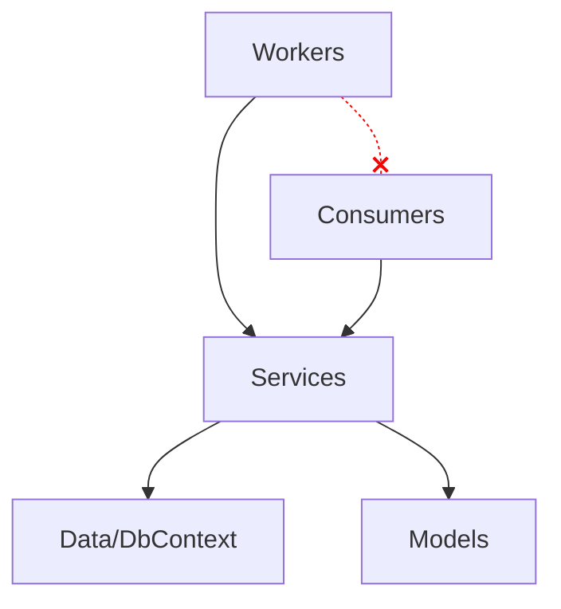

# Worker Service

> **Ref:** `STR010` | **Category:** Structural

Background processing architecture for queue consumers, scheduled jobs, and long-running services — no HTTP pipeline, hosted as a Windows Service, Linux daemon, or container.

## When to Use

- **Queue consumers** — processing messages from RabbitMQ, Azure Service Bus, SQS, Kafka
- **Scheduled jobs** — recurring tasks like report generation, data cleanup, email digests
- **Long-running processes** — file watchers, data synchronisation, polling external systems
- **Event handlers** in a microservices architecture — a service that only reacts to events and never exposes an HTTP API
- Any workload that runs continuously or on a schedule, without serving HTTP requests

## When NOT to Use

- You also need HTTP endpoints — use an API pattern ([STR001](STR001%20-%20n-tier.md), [STR009](STR009%20-%20minimal-api.md)) with `IHostedService` for background work within the same process
- The job is a one-off or ad-hoc task — use a console app
- You need a UI — this is a headless service

## Solution Structure

```
MyApp/
├── MyApp.sln
└── src/
    └── MyApp.Worker/
        ├── MyApp.Worker.csproj
        ├── Program.cs
        ├── appsettings.json
        │
        ├── Workers/
        │   ├── OrderProcessingWorker.cs
        │   ├── ReportGenerationWorker.cs
        │   └── DataCleanupWorker.cs
        │
        ├── Consumers/
        │   ├── OrderPlacedConsumer.cs
        │   └── PaymentCompletedConsumer.cs
        │
        ├── Services/
        │   ├── IOrderProcessor.cs
        │   ├── OrderProcessor.cs
        │   ├── IReportGenerator.cs
        │   └── ReportGenerator.cs
        │
        ├── Models/
        │   ├── Order.cs
        │   └── ReportConfig.cs
        │
        ├── Data/
        │   ├── WorkerDbContext.cs
        │   └── Configurations/
        │       └── OrderConfiguration.cs
        │
        └── Infrastructure/
            ├── DependencyInjection.cs
            └── HealthChecks/
                └── WorkerHealthCheck.cs
```

**Workers/** — `BackgroundService` implementations. Each worker is a long-running loop or scheduled task. One class per logical workload.

**Consumers/** — Message queue consumers. Each consumer handles one event/message type. The messaging library (MassTransit, NServiceBus, or raw client) determines the base class.

**Services/** — Business logic. Workers and consumers are thin — they receive a trigger (timer tick, message) and delegate to a service.

**Models/** — Domain entities and message contracts. If this worker is part of a microservices system, message contracts come from a shared `Contracts` package.

**Data/** — EF Core DbContext for data access, if needed.

**Infrastructure/** — DI registration, health checks, telemetry configuration.

## Dependency Rules



- Workers and consumers depend on service interfaces
- Services depend on data access
- **Workers do not call consumers and vice versa** — they are independent entry points
- **Workers and consumers must not contain business logic** — they are trigger mechanisms

## Naming Conventions

| Element | Convention | Example |
|---------|-----------|---------|
| Worker | `{Purpose}Worker` | `OrderProcessingWorker` |
| Consumer | `{EventName}Consumer` | `OrderPlacedConsumer` |
| Service interface | `I{Noun}` | `IOrderProcessor` |
| Service implementation | `{Noun}` | `OrderProcessor` |
| Health check | `{Concern}HealthCheck` | `WorkerHealthCheck` |

## Key Abstractions

A `BackgroundService` worker with a timed loop:

```csharp
// Workers/DataCleanupWorker.cs
public sealed class DataCleanupWorker(
    IServiceScopeFactory scopeFactory,
    ILogger<DataCleanupWorker> logger) : BackgroundService
{
    private static readonly TimeSpan Interval = TimeSpan.FromHours(1);

    protected override async Task ExecuteAsync(CancellationToken stoppingToken)
    {
        while (!stoppingToken.IsCancellationRequested)
        {
            try
            {
                using var scope = scopeFactory.CreateScope();
                var cleaner = scope.ServiceProvider.GetRequiredService<IDataCleaner>();
                var deleted = await cleaner.CleanExpiredRecordsAsync(stoppingToken);
                logger.LogInformation("Cleaned {Count} expired records", deleted);
            }
            catch (Exception ex) when (ex is not OperationCanceledException)
            {
                logger.LogError(ex, "Data cleanup failed");
            }

            await Task.Delay(Interval, stoppingToken);
        }
    }
}
```

A queue consumer (using MassTransit as an example — adapt for your library):

```csharp
// Consumers/OrderPlacedConsumer.cs
public sealed class OrderPlacedConsumer(
    IOrderProcessor processor,
    ILogger<OrderPlacedConsumer> logger) : IConsumer<OrderPlacedEvent>
{
    public async Task Consume(ConsumeContext<OrderPlacedEvent> context)
    {
        logger.LogInformation("Processing order {OrderId}", context.Message.OrderId);
        await processor.ProcessAsync(context.Message.OrderId, context.CancellationToken);
    }
}
```

`Program.cs` registration:

```csharp
var builder = Host.CreateApplicationBuilder(args);

builder.Services.AddHostedService<DataCleanupWorker>();
builder.Services.AddHostedService<OrderProcessingWorker>();

builder.Services.AddScoped<IOrderProcessor, OrderProcessor>();
builder.Services.AddScoped<IDataCleaner, DataCleaner>();

builder.Services.AddDbContext<WorkerDbContext>(options =>
    options.UseSqlServer(builder.Configuration.GetConnectionString("Default")));

builder.Services.AddHealthChecks()
    .AddCheck<WorkerHealthCheck>("worker");

var host = builder.Build();
host.Run();
```

**Critical: scoped services in workers.** `BackgroundService` is a singleton. EF Core's `DbContext` is scoped. You **must** create a scope manually using `IServiceScopeFactory` inside the worker loop. Injecting `DbContext` directly into a `BackgroundService` constructor will use a single instance for the lifetime of the application.

## Data Flow

**Queue consumer flow:**

```
Message arrives on queue
    │
    ▼
Messaging library deserialises → OrderPlacedEvent
    │
    ▼
OrderPlacedConsumer.Consume(context)
    │  extracts data from message
    ▼
IOrderProcessor.ProcessAsync(orderId)
    │  loads order from DB
    │  applies business logic
    │  saves result
    │  optionally publishes new events
    ▼
Message acknowledged → next message
```

**Scheduled worker flow:**

```
Timer fires (every N minutes/hours)
    │
    ▼
DataCleanupWorker.ExecuteAsync loop iteration
    │  creates DI scope
    ▼
IDataCleaner.CleanExpiredRecordsAsync()
    │  queries for expired records
    │  deletes them
    │  returns count
    ▼
Log result → await delay → loop
```

## Where Business Logic Lives

**In the service layer.** Workers and consumers are triggers — they don't contain logic.

- Workers know **when** to run (timer, condition). They don't know **what** to do — they call a service.
- Consumers know **which message** arrived. They don't know **how** to process it — they call a service.
- Services contain all business logic and are independently testable without timers or message queues.

## Testing Strategy

```
MyApp/
├── src/
│   └── MyApp.Worker/
└── tests/
    ├── MyApp.Worker.UnitTests/
    │   └── Services/
    │       ├── OrderProcessorTests.cs
    │       └── DataCleanerTests.cs
    └── MyApp.Worker.IntegrationTests/
        └── Consumers/
            └── OrderPlacedConsumerTests.cs
```

**Unit tests** — test service classes with mocked dependencies. This is where you test business logic. Don't test the `BackgroundService` directly — test the service it calls.

```csharp
[Fact]
public async Task ProcessAsync_CompletesOrder_WhenPaymentConfirmed()
{
    var order = new Order { Id = Guid.NewGuid(), Status = OrderStatus.PaymentPending };
    _orderRepo.GetByIdAsync(order.Id).Returns(order);

    await _processor.ProcessAsync(order.Id, CancellationToken.None);

    order.Status.Should().Be(OrderStatus.Processing);
    await _orderRepo.Received(1).SaveChangesAsync(Arg.Any<CancellationToken>());
}
```

**Integration tests for consumers** — test message handling end-to-end. Use an in-memory transport or Testcontainers with a real message broker. Publish a message, verify the consumer processed it correctly.

**Don't unit test `BackgroundService` timing logic.** The loop, the delay, the scope creation — these are infrastructure concerns. Test the services they call.

## Common Mistakes

1. **Business logic in workers.** A `BackgroundService.ExecuteAsync` method with 100 lines of business logic. Extract it into a service. The worker should be 10–15 lines: create scope, get service, call method, log, delay.

2. **Not creating a DI scope.** Injecting `DbContext` or other scoped services directly into a `BackgroundService` constructor. The `DbContext` will be reused across all iterations, accumulating tracked entities and eventually failing. Always use `IServiceScopeFactory.CreateScope()`.

3. **Swallowing exceptions silently.** A `catch (Exception) { }` in the worker loop. If the worker fails silently, you won't know until data stops being processed. Log the exception, increment a metric, and decide whether to retry or skip.

4. **No health checks.** The worker is running but stuck — a consumer's connection died, a timer stopped firing. Add health checks that verify the worker is actively processing. Expose them on a minimal HTTP endpoint or through the health check publisher pattern.

5. **No graceful shutdown.** Ignoring the `CancellationToken`. When the host shuts down, in-progress work should complete or be abandoned cleanly. Always pass `stoppingToken` to async methods and check `stoppingToken.IsCancellationRequested` in loops.

6. **Unbounded parallelism.** Processing messages as fast as possible without rate limiting. If the consumer processes faster than downstream systems can handle, you'll overwhelm databases or external APIs. Use concurrency limits in your messaging library.

7. **No idempotency.** A message is delivered twice (at-least-once delivery is the norm) and the consumer creates duplicate records. Consumers must be idempotent — check if the work was already done before doing it again.

8. **Mixing HTTP and background work without clear separation.** A worker service that also exposes a few HTTP endpoints for monitoring, with business logic shared between the API handlers and the workers in an ad-hoc way. If you need both HTTP and background processing, either use a proper API pattern with `IHostedService` for the background work, or keep them as separate deployables.
