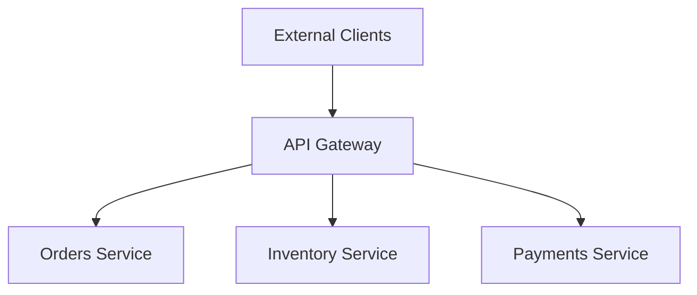

# API Gateway

> **Ref:** `NET001` | **Category:** Network

Single entry point for all client traffic. Routes requests to backend services, handles cross-cutting concerns (authentication, rate limiting, request aggregation), and shields internal service topology from external consumers.

## When to Use

- Multiple backend services ([TOP002](../topology/TOP002%20-%20service-oriented-architecture.md), [TOP003](../topology/TOP003%20-%20microservices.md)) that external clients need to reach
- You want a single URL/domain for all API operations rather than exposing individual service addresses
- Cross-cutting concerns (auth, rate limiting, CORS, request logging) should be applied consistently without duplicating them across every service
- Internal service topology should be hidden from clients — services can be reorganised, split, or merged without changing client URLs
- Request aggregation — a single client call returns data from multiple backend services

## When NOT to Use

- Monolith ([TOP001](../topology/TOP001%20-%20monolith.md)) — there's nothing to route to. Your web framework already handles routing.
- Two services where direct client-to-service communication is sufficient and a gateway would add latency without benefit
- If the gateway is accumulating business logic — it should be a dumb router, not a service

## Architecture



The gateway is a reverse proxy with optional request transformation. It receives all inbound traffic, applies cross-cutting policies, and forwards requests to the appropriate backend service.

## Responsibilities

**The gateway handles:**
- **Routing** — map external URLs to internal service addresses
- **Authentication/authorisation** — validate tokens, enforce policies before requests reach services
- **Rate limiting** — throttle by client, API key, or endpoint
- **CORS** — centralised cross-origin policy
- **Request/response transformation** — header manipulation, path rewriting
- **Load balancing** — distribute traffic across service instances
- **SSL termination** — handle TLS at the edge
- **Caching** — cache responses for read-heavy endpoints
- **Request aggregation** — compose responses from multiple services into a single response

**The gateway does NOT handle:**
- Business logic — never. If you find `if (order.Status == ...)` in the gateway, move it to a service.
- Data persistence — the gateway is stateless (except for rate limit counters and cache).
- Domain validation — services validate their own inputs.

## Solution Structure

```
MyApp/
├── src/
│   ├── MyApp.Gateway/
│   │   ├── MyApp.Gateway.csproj
│   │   ├── Program.cs
│   │   ├── appsettings.json
│   │   └── yarp.json                    ← route configuration
│   │
│   ├── MyApp.Services.Orders/
│   ├── MyApp.Services.Inventory/
│   └── MyApp.Services.Payments/
```

The gateway is its own deployable. It references no service projects — it only knows about services through configuration (URLs, routes, health checks).

## Implementation

Use a reverse proxy library. The gateway's `Program.cs` is minimal — load configuration, add middleware, run:

```csharp
var builder = WebApplication.CreateBuilder(args);

builder.Services
    .AddReverseProxy()
    .LoadFromConfig(builder.Configuration.GetSection("ReverseProxy"));

builder.Services.AddAuthentication().AddJwtBearer();
builder.Services.AddRateLimiter(options =>
{
    options.AddFixedWindowLimiter("default", config =>
    {
        config.Window = TimeSpan.FromMinutes(1);
        config.PermitLimit = 100;
    });
});

var app = builder.Build();

app.UseAuthentication();
app.UseAuthorization();
app.UseRateLimiter();
app.MapReverseProxy();

app.Run();
```

Route configuration (declarative, not code):

```json
{
  "ReverseProxy": {
    "Routes": {
      "orders": {
        "ClusterId": "orders-cluster",
        "Match": { "Path": "/api/orders/{**catch-all}" },
        "Transforms": [{ "PathRemovePrefix": "/api" }]
      },
      "inventory": {
        "ClusterId": "inventory-cluster",
        "Match": { "Path": "/api/inventory/{**catch-all}" },
        "Transforms": [{ "PathRemovePrefix": "/api" }]
      }
    },
    "Clusters": {
      "orders-cluster": {
        "Destinations": {
          "orders-1": { "Address": "https://localhost:5001" }
        }
      },
      "inventory-cluster": {
        "Destinations": {
          "inventory-1": { "Address": "https://localhost:5002" }
        }
      }
    }
  }
}
```

With .NET Aspire, service addresses are resolved automatically — the gateway references services by name, and Aspire handles discovery.

## Request Aggregation

When a client needs data from multiple services in a single call, the gateway can aggregate:

```csharp
app.MapGet("/api/orders/{id}/details", async (
    Guid id,
    IHttpClientFactory clientFactory,
    CancellationToken ct) =>
{
    var ordersClient = clientFactory.CreateClient("orders");
    var inventoryClient = clientFactory.CreateClient("inventory");

    var orderTask = ordersClient.GetFromJsonAsync<OrderDto>($"/orders/{id}", ct);
    var stockTask = inventoryClient.GetFromJsonAsync<StockDto>($"/stock/order/{id}", ct);

    await Task.WhenAll(orderTask, stockTask);

    return Results.Ok(new OrderDetailsDto(orderTask.Result!, stockTask.Result!));
});
```

Use aggregation sparingly. If most endpoints need data from multiple services, that's a signal the service boundaries are wrong, not a problem to solve in the gateway.

## Common Mistakes

1. **Business logic in the gateway.** The gateway checks inventory, calculates discounts, validates order rules. It's now a service pretending to be a gateway. The gateway routes and applies policies — nothing more.

2. **Gateway as a single point of failure.** No health checks, no horizontal scaling, no fallback. The gateway must be at least as available as the services behind it. Run multiple instances behind a load balancer.

3. **Aggregation for everything.** Every client call goes through an aggregation endpoint that fans out to 5 services. This adds latency, complexity, and coupling. Most requests should pass through to a single service. Aggregation is for the exceptions.

4. **Tight coupling to service internals.** The gateway configuration includes internal service paths, internal DTOs, or version-specific routes. The gateway should know service base URLs and route prefixes — not internal implementation details.

5. **Not using configuration-driven routing.** Hard-coding routes in C# instead of configuration files. Route changes should be a config update, not a code deployment.

## Related Packages

- **Reverse proxy:** [YARP](https://github.com/microsoft/reverse-proxy) (Yet Another Reverse Proxy)
- **Rate limiting:** [System.Threading.RateLimiting](https://www.nuget.org/packages/System.Threading.RateLimiting) (built-in .NET 7+)
- **Authentication:** [Microsoft.AspNetCore.Authentication.JwtBearer](https://www.nuget.org/packages/Microsoft.AspNetCore.Authentication.JwtBearer)
- **Service discovery:** [.NET Aspire](https://github.com/dotnet/aspire)
