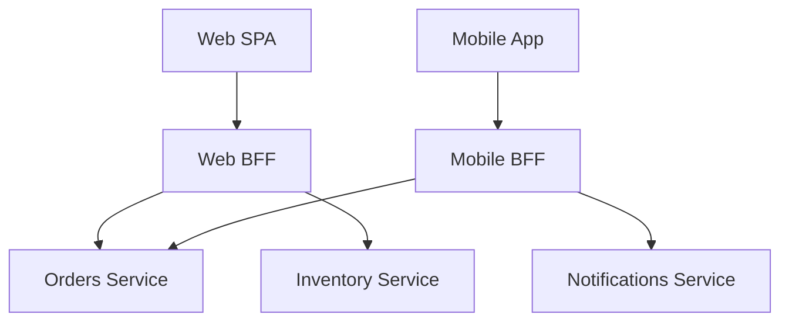
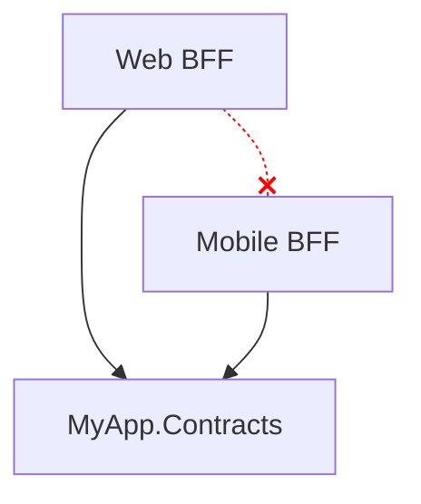

# Backend for Frontend (BFF)

> **Ref:** `NET002` | **Category:** Network

A dedicated API layer per client type (web, mobile, third-party), each tailored to that client's specific data needs, interaction patterns, and performance constraints. Instead of one general-purpose API, each frontend gets a backend that speaks its language.

## When to Use

- **Multiple client types** with genuinely different needs — a mobile app needs small payloads and offline-friendly responses, a web SPA needs richer data in fewer round trips, a third-party integration needs a stable versioned contract
- **API response shaping** — different clients need different projections of the same data. The mobile app needs 3 fields, the web dashboard needs 30. A single API either over-fetches for mobile or under-fetches for web.
- **Client-specific orchestration** — the web app's dashboard page needs data from 4 services in one call. The mobile app's home screen needs data from 2 different services. Each BFF aggregates for its client.
- **Authentication model differs by client** — the web BFF handles cookie-based auth with CSRF protection, the mobile BFF handles OAuth tokens, the third-party BFF handles API keys
- **Microservices or SOA** topology where multiple backend services exist — the BFF sits between clients and services

## When NOT to Use

- **One client type** — if you only have a web SPA, a single API is simpler. A BFF adds a deployable for no benefit.
- **All clients need the same data in the same shape** — the BFF would just be a pass-through proxy. Use an API gateway ([NET001](NET001%20-%20api-gateway.md)) instead.
- **Monolith topology** — the monolith's API already serves all clients. Add client-specific endpoints or controllers within the monolith rather than a separate BFF.

## How It Differs from an API Gateway

| | API Gateway ([NET001](NET001%20-%20api-gateway.md)) | BFF (NET002) |
|:---|:---|:---|
| Instances | One, shared by all clients | One per client type |
| Purpose | Routing, auth, rate limiting | Client-specific data shaping and orchestration |
| Business logic | None | Minimal — aggregation and transformation only |
| Owned by | Platform/infrastructure team | Frontend team (or full-stack team per client) |
| Contains | Proxy rules, middleware | Endpoints, DTOs, client-specific aggregation |

A BFF and an API gateway can coexist. The gateway handles cross-cutting infrastructure (auth, rate limiting, SSL), then routes to the appropriate BFF, which handles client-specific shaping.



A BFF and an API gateway ([NET001](NET001%20-%20api-gateway.md)) can coexist — the gateway handles cross-cutting infrastructure (auth, rate limiting), then routes to the appropriate BFF. But a gateway is not required; BFFs can face clients directly.

## Solution Structure

```
MyApp/
├── src/
│   ├── Frontends/
│   │   ├── MyApp.Bff.Web/
│   │   │   ├── MyApp.Bff.Web.csproj
│   │   │   ├── Program.cs
│   │   │   ├── Endpoints/
│   │   │   │   ├── DashboardEndpoint.cs
│   │   │   │   ├── OrdersEndpoint.cs
│   │   │   │   └── ProfileEndpoint.cs
│   │   │   ├── DTOs/
│   │   │   │   ├── DashboardResponse.cs
│   │   │   │   └── OrderDetailResponse.cs
│   │   │   └── Clients/
│   │   │       ├── OrdersClient.cs
│   │   │       └── InventoryClient.cs
│   │   │
│   │   └── MyApp.Bff.Mobile/
│   │       ├── MyApp.Bff.Mobile.csproj
│   │       ├── Program.cs
│   │       ├── Endpoints/
│   │       │   ├── HomeEndpoint.cs
│   │       │   └── OrderSummaryEndpoint.cs
│   │       ├── DTOs/
│   │       │   ├── HomeResponse.cs
│   │       │   └── OrderSummaryResponse.cs
│   │       └── Clients/
│   │           ├── OrdersClient.cs
│   │           └── NotificationsClient.cs
│   │
│   ├── Services/
│   │   ├── MyApp.Services.Orders/
│   │   ├── MyApp.Services.Inventory/
│   │   └── MyApp.Services.Notifications/
│   │
│   └── Shared/
│       └── MyApp.Contracts/
```

Each BFF is its own deployable with its own DTOs, endpoints, and typed HTTP clients. BFFs reference `Contracts` (for service communication) but never reference each other or the service projects directly.

## Key Abstractions

A BFF endpoint that aggregates data from multiple services:

```csharp
// Bff.Web/Endpoints/DashboardEndpoint.cs
public static class DashboardEndpoint
{
    public static void Map(RouteGroupBuilder group)
    {
        group.MapGet("/dashboard", HandleAsync);
    }

    private static async Task<IResult> HandleAsync(
        OrdersClient orders,
        InventoryClient inventory,
        CancellationToken ct)
    {
        var recentOrdersTask = orders.GetRecentAsync(limit: 10, ct);
        var lowStockTask = inventory.GetLowStockItemsAsync(ct);

        await Task.WhenAll(recentOrdersTask, lowStockTask);

        return TypedResults.Ok(new DashboardResponse(
            RecentOrders: recentOrdersTask.Result,
            LowStockItems: lowStockTask.Result));
    }
}
```

The mobile BFF for the same data looks different — fewer fields, smaller payloads:

```csharp
// Bff.Mobile/Endpoints/HomeEndpoint.cs
public static class HomeEndpoint
{
    public static void Map(RouteGroupBuilder group)
    {
        group.MapGet("/home", HandleAsync);
    }

    private static async Task<IResult> HandleAsync(
        OrdersClient orders,
        CancellationToken ct)
    {
        var pending = await orders.GetPendingCountAsync(ct);

        return TypedResults.Ok(new HomeResponse(
            PendingOrderCount: pending,
            LastUpdated: DateTimeOffset.UtcNow));
    }
}
```

Typed HTTP client:

```csharp
// Bff.Web/Clients/OrdersClient.cs
public sealed class OrdersClient(HttpClient http)
{
    public async Task<IReadOnlyList<RecentOrderDto>> GetRecentAsync(
        int limit, CancellationToken ct)
    {
        return await http.GetFromJsonAsync<IReadOnlyList<RecentOrderDto>>(
            $"/orders/recent?limit={limit}", ct) ?? [];
    }
}
```

## Dependency Rules



- Each BFF references `Contracts` for service communication types
- BFFs **never reference each other** — they are independent deployables owned by different teams
- BFFs **never reference service projects** — they communicate via HTTP/gRPC
- BFFs contain their own DTOs — `DashboardResponse` in the web BFF is completely independent of `HomeResponse` in the mobile BFF

## Where Business Logic Lives

**Not in the BFF.** The BFF handles:
- **Aggregation** — call multiple services, combine responses
- **Transformation** — reshape service responses into client-specific DTOs
- **Client-specific auth** — cookies for web, tokens for mobile

Business rules (validation, state transitions, calculations) stay in the backend services. If you find `if (order.Total > customer.CreditLimit)` in a BFF, move it to the Orders service.

## Testing Strategy

**Unit tests** — test aggregation logic with mocked HTTP clients. Given service A returns X and service B returns Y, assert the BFF response shape.

**Integration tests** — test the BFF against real backend services (or stubs). Use `WebApplicationFactory` with mocked typed clients or wire up to test instances of backend services.

**Contract tests** — verify that the BFF's typed clients match the backend service contracts. When a service changes its API, the BFF's contract tests catch the incompatibility.

## Common Mistakes

1. **Business logic in the BFF.** The BFF calculates discounts, validates order rules, enforces inventory constraints. This belongs in backend services. The BFF aggregates and transforms — it doesn't decide.

2. **One BFF for all clients.** A single "BFF" that serves web, mobile, and third-party consumers. That's an API gateway, not a BFF. The entire point is a separate backend per frontend.

3. **BFF as a full backend.** The BFF has its own database, its own domain model, and its own business rules. It's become a service. BFFs are stateless aggregation layers — they don't own data.

4. **Duplicating logic across BFFs.** The same validation or calculation appears in both the web and mobile BFF. Extract it into a backend service that both BFFs call. BFFs should contain only client-specific shaping.

5. **Not letting the frontend team own the BFF.** The BFF should be maintained by the team that builds the client it serves. A platform team maintaining all BFFs defeats the purpose — the web team can't iterate on their API shape without coordinating with a central team.

## Related Packages

- **Reverse proxy:** [YARP](https://github.com/microsoft/reverse-proxy)
- **HTTP clients:** [Microsoft.Extensions.Http](https://www.nuget.org/packages/Microsoft.Extensions.Http) · [Microsoft.Extensions.Http.Resilience](https://www.nuget.org/packages/Microsoft.Extensions.Http.Resilience)
- **Authentication:** [Microsoft.AspNetCore.Authentication.Cookies](https://www.nuget.org/packages/Microsoft.AspNetCore.Authentication.Cookies) (web BFF) · [Microsoft.AspNetCore.Authentication.JwtBearer](https://www.nuget.org/packages/Microsoft.AspNetCore.Authentication.JwtBearer) (mobile BFF)
- **Service discovery:** [.NET Aspire](https://github.com/dotnet/aspire)
