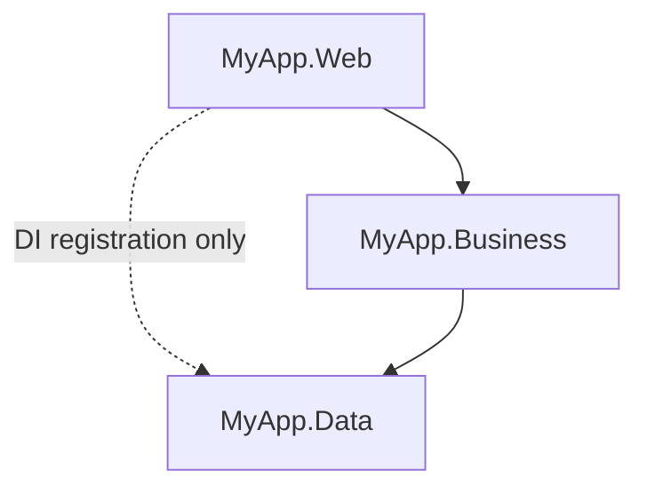

# N-Tier

> **Ref:** `STR001` | **Category:** Structural

Multi-project solution with three layers — Web, Business, and Data Access — each in its own project, connected by interfaces. Dependencies flow downward: Web → Business → Data. Business logic is centralized in the service layer.

## When to Use

- **1–4 developers** working on a single codebase
- CRUD-heavy applications with straightforward business rules
- Internal tools, admin panels, simple APIs
- The domain logic fits comfortably in service methods — no complex invariants, no aggregate roots, no domain events

If you catch yourself saying "it's basically just database operations with some validation," this is your pattern.

## When NOT to Use

- Business rules are complex enough to warrant a domain model (use [STR002](STR002%20-%20clean-architecture-lite.md) or [STR003](STR003%20-%20full-clean-architecture.md))
- Multiple teams need to work on the same codebase without stepping on each other (use [STR004](STR004%20-%20vertical-slice.md) or [STR005](STR005%20-%20modular-monolith.md))
- You need to swap infrastructure (e.g., change database provider) without touching business logic — `Business` references `Data` directly here, so entity changes ripple upward
- The service layer is growing beyond ~500 lines per service — that's a signal to graduate to [STR002](STR002%20-%20clean-architecture-lite.md)
- You have significant cross-cutting concerns (audit logging, validation pipelines, authorization policies) that would benefit from a mediator pipeline

## Solution Structure

```
MyApp/
├── MyApp.sln
├── Directory.Build.props                    ← shared build settings (TFM, nullable, implicit usings)
├── Directory.Packages.props                 ← central package version management
├── src/
│   ├── MyApp.Web/
│   │   ├── MyApp.Web.csproj                ← references MyApp.Business + MyApp.Data
│   │   ├── Program.cs
│   │   ├── appsettings.json
│   │   ├── Controllers/
│   │   │   ├── OrdersController.cs
│   │   │   └── ProductsController.cs
│   │   └── Middleware/
│   │       └── ExceptionHandlingMiddleware.cs
│   │
│   ├── MyApp.Business/
│   │   ├── MyApp.Business.csproj            ← references MyApp.Data
│   │   ├── ServiceRegistration.cs
│   │   ├── Interfaces/
│   │   │   ├── IOrderService.cs
│   │   │   └── IProductService.cs
│   │   ├── Services/
│   │   │   ├── OrderService.cs
│   │   │   └── ProductService.cs
│   │   ├── Models/
│   │   │   ├── CreateOrderRequest.cs
│   │   │   ├── UpdateOrderStatusRequest.cs
│   │   │   ├── OrderResponse.cs
│   │   │   └── ProductResponse.cs
│   │   └── Mapping/
│   │       └── MappingExtensions.cs
│   │
│   └── MyApp.Data/
│       ├── MyApp.Data.csproj                ← references nothing
│       ├── DataRegistration.cs
│       ├── AppDbContext.cs
│       ├── Entities/
│       │   ├── Order.cs
│       │   ├── OrderItem.cs
│       │   └── Product.cs
│       ├── Repositories/
│       │   ├── IOrderRepository.cs
│       │   ├── OrderRepository.cs
│       │   ├── IProductRepository.cs
│       │   └── ProductRepository.cs
│       └── Configurations/
│           ├── OrderConfiguration.cs
│           └── ProductConfiguration.cs
│
└── tests/
    ├── MyApp.Business.Tests/
    │   ├── MyApp.Business.Tests.csproj       ← references MyApp.Business
    │   └── Services/
    │       ├── OrderServiceTests.cs
    │       └── ProductServiceTests.cs
    └── MyApp.Web.Tests/
        ├── MyApp.Web.Tests.csproj            ← references MyApp.Web
        ├── CustomWebApplicationFactory.cs
        └── Endpoints/
            ├── OrdersEndpointTests.cs
            └── ProductsEndpointTests.cs
```

**MyApp.Web** — ASP.NET Core host. Controllers, middleware, `Program.cs` composition root. Receives HTTP requests, calls services, returns responses. No business logic. No DTOs — it receives and returns the models defined in `MyApp.Business`.

**MyApp.Business** — Service interfaces and implementations. All business logic lives here: validation, calculations, state transitions, cross-entity coordination. Owns request/response models (DTOs) because they define the service contract.

**MyApp.Data** — EF Core DbContext, entity classes, repository interfaces and implementations, Fluent API configurations. Entities live here because they are data-access concerns — they map directly to database tables.

## Dependency Rules



- `Web` references `Business` (for service interfaces) and `Data` (for DI registration only — `Program.cs` must call `AddDataServices` to register the DbContext and repositories).
- `Business` references `Data`. It calls repository interfaces and contains all business logic.
- `Data` references nothing (except EF Core NuGet packages). It owns entities, DbContext, and repository implementations.
- **Controllers must not** use anything from `Data` — no `AppDbContext`, no repositories, no entities in controllers. The Web → Data reference exists solely for DI wiring in `Program.cs`.
- **Services must not** call other services — if you need cross-service coordination, create a new service that depends on the repositories it needs directly.
- **Repositories must not** contain business logic — they are query/persistence only.
- **Controllers must not** bypass services to call repositories directly.

DI wiring: each layer exposes an extension method on `IServiceCollection`. `Program.cs` calls both:

```csharp
builder.Services.AddBusinessServices();
builder.Services.AddDataServices(builder.Configuration);
```

## Naming Conventions

| Element | Convention | Example |
|---------|-----------|---------|
| Controller | `{PluralEntity}Controller` | `OrdersController` |
| Service interface | `I{Entity}Service` | `IOrderService` |
| Service implementation | `{Entity}Service` | `OrderService` |
| Repository interface | `I{Entity}Repository` | `IOrderRepository` |
| Repository implementation | `{Entity}Repository` | `OrderRepository` |
| Entity | singular noun | `Order`, `OrderItem` |
| Request DTO | `{Action}{Entity}Request` | `CreateOrderRequest` |
| Response DTO | `{Entity}Response` | `OrderResponse` |
| DbContext | `AppDbContext` | `AppDbContext` |
| EF Configuration | `{Entity}Configuration` | `OrderConfiguration` |
| DI registration | `{Layer}Registration` | `ServiceRegistration`, `DataRegistration` |
| Middleware | `{Purpose}Middleware` | `ExceptionHandlingMiddleware` |
| Mapping extension | `{Entity}MappingExtensions` | `OrderMappingExtensions` |

Method names on services use **domain verbs without the entity name**: `GetByIdAsync`, `CreateAsync`, `UpdateStatusAsync` — the entity is already clear from the service type. Repository methods follow the same convention. Controller actions map to HTTP verbs and return `IActionResult` or `ActionResult<T>`.

## Key Abstractions

```csharp
public interface IOrderService
{
    Task<OrderResponse> GetByIdAsync(Guid id, CancellationToken ct = default);
    Task<PagedResult<OrderResponse>> GetAllAsync(int page, int pageSize, CancellationToken ct = default);
    Task<OrderResponse> CreateAsync(CreateOrderRequest request, CancellationToken ct = default);
    Task UpdateStatusAsync(Guid id, OrderStatus status, CancellationToken ct = default);
    Task DeleteAsync(Guid id, CancellationToken ct = default);
}

public interface IOrderRepository
{
    Task<Order?> GetByIdAsync(Guid id, CancellationToken ct = default);
    Task<(IReadOnlyList<Order> Items, int TotalCount)> GetAllAsync(
        int skip, int take, CancellationToken ct = default);
    void Add(Order order);
    void Remove(Order order);
    Task SaveChangesAsync(CancellationToken ct = default);
}
```

`PagedResult<T>` is a simple generic wrapper — define it in `MyApp.Business/Models/`:

```csharp
public sealed record PagedResult<T>(IReadOnlyList<T> Items, int TotalCount, int Page, int PageSize);
```

Note on repository design: There is no `UpdateAsync` method. EF Core tracks changes automatically — the service modifies entity properties and the repository calls `SaveChangesAsync`. `Add` and `Remove` are synchronous because `DbSet.Add` and `DbSet.Remove` do not hit the database — only `SaveChangesAsync` does.

DI registration — each layer registers its own services in a distinctly named static class:

```csharp
// MyApp.Business/ServiceRegistration.cs
public static class ServiceRegistration
{
    public static IServiceCollection AddBusinessServices(this IServiceCollection services)
    {
        services.AddScoped<IOrderService, OrderService>();
        services.AddScoped<IProductService, ProductService>();
        return services;
    }
}

// MyApp.Data/DataRegistration.cs
public static class DataRegistration
{
    public static IServiceCollection AddDataServices(
        this IServiceCollection services, IConfiguration configuration)
    {
        services.AddDbContext<AppDbContext>(options =>
            options.UseSqlServer(configuration.GetConnectionString("Default")));
        services.AddScoped<IOrderRepository, OrderRepository>();
        services.AddScoped<IProductRepository, ProductRepository>();
        return services;
    }
}
```

## Data Flow

A `POST /api/orders` request:

```
HTTP Request
    │
    ▼
OrdersController.Create(CreateOrderRequest dto, CancellationToken ct)
    │
    ▼
IOrderService.CreateAsync(dto, ct)
    │  - validates the request
    │  - applies business rules (e.g., check stock via IProductRepository)
    │  - maps DTO → Order entity
    │  - calls repository.Add(entity)  ← synchronous, no DB hit yet
    │  - calls repository.SaveChangesAsync(ct)  ← DB INSERT happens here
    ▼
Service maps Order → OrderResponse DTO
    │
    ▼
Controller returns CreatedAtAction(201, response)
```

## Where Business Logic Lives

**In the service layer.** This is the single most important rule of N-Tier.

- Controllers are thin: parse request, call service, return response. No `if` statements about business rules. A controller action body should be 1–3 lines.
- Repositories are thin: CRUD operations and queries. No validation, no rule enforcement. A repository method should do one thing — run a query or persist a change.
- Services own all business logic: validation, calculations, state transitions, cross-entity coordination.
- Request/response models are dumb data carriers — use `record` types, no behavior.

If you put business logic in a controller, you can't reuse it. If you put it in a repository, you can't test it without a database. The service layer is the only place where business logic is testable and reusable.

Example controller action (this is the target level of thinness):

```csharp
[HttpPost]
public async Task<ActionResult<OrderResponse>> Create(
    CreateOrderRequest request, CancellationToken ct)
{
    var response = await _orderService.CreateAsync(request, ct);
    return CreatedAtAction(nameof(GetById), new { id = response.Id }, response);
}
```

## Testing Strategy

The test project structure is shown in the solution structure above. Key points:

- `MyApp.Business.Tests` references `MyApp.Business` (which transitively brings in `MyApp.Data` for entity types).
- `MyApp.Web.Tests` references `MyApp.Web` (which transitively brings in everything).

**Unit tests** — test service methods with mocked repositories. This is where you verify business rules. Use a test framework with a mocking library.

```csharp
public sealed class OrderServiceTests
{
    private readonly IOrderRepository _orderRepo = Substitute.For<IOrderRepository>();
    private readonly IProductRepository _productRepo = Substitute.For<IProductRepository>();
    private readonly OrderService _sut;

    public OrderServiceTests()
    {
        _sut = new OrderService(_orderRepo, _productRepo);
    }

    [Fact]
    public async Task CreateAsync_InsufficientStock_ThrowsInvalidOperation()
    {
        _productRepo.GetByIdAsync(Arg.Any<Guid>(), Arg.Any<CancellationToken>())
            .Returns(new Product { StockQuantity = 0 });

        var request = new CreateOrderRequest { ProductId = Guid.NewGuid(), Quantity = 5 };

        await Assert.ThrowsAsync<InvalidOperationException>(
            () => _sut.CreateAsync(request));
    }

    [Fact]
    public async Task CreateAsync_ValidOrder_CallsAddAndSave()
    {
        var productId = Guid.NewGuid();
        _productRepo.GetByIdAsync(productId, Arg.Any<CancellationToken>())
            .Returns(new Product { Id = productId, StockQuantity = 10, Price = 25.00m });

        var request = new CreateOrderRequest { ProductId = productId, Quantity = 2 };

        var result = await _sut.CreateAsync(request);

        _orderRepo.Received(1).Add(Arg.Is<Order>(o => o.ProductId == productId));
        await _orderRepo.Received(1).SaveChangesAsync(Arg.Any<CancellationToken>());
    }
}
```

**Integration tests** — test the full HTTP pipeline using `WebApplicationFactory<Program>` with a real (test) database. Prefer a test container library for SQL Server over in-memory providers (SQLite and the EF in-memory provider have behavioral differences from real SQL Server that hide bugs).

```csharp
public sealed class OrdersEndpointTests : IClassFixture<CustomWebApplicationFactory>
{
    private readonly HttpClient _client;

    public OrdersEndpointTests(CustomWebApplicationFactory factory)
    {
        _client = factory.CreateClient();
    }

    [Fact]
    public async Task CreateOrder_Returns201WithLocation()
    {
        var request = new CreateOrderRequest { ProductId = Guid.NewGuid(), Quantity = 1 };
        var response = await _client.PostAsJsonAsync("/api/orders", request);

        Assert.Equal(HttpStatusCode.Created, response.StatusCode);
        Assert.NotNull(response.Headers.Location);
    }
}
```

## Common Mistakes

1. **Business logic in controllers.** A controller method that checks inventory, calculates totals, and sends emails is doing the service's job. Move all of it into the service. The controller should be one line: `return await _service.CreateAsync(request, ct);`.

2. **Skipping repository interfaces.** "We'll never change the database" — maybe, but you need the interface to mock the repository in unit tests. Always use `IOrderRepository`, even if you think it's overkill.

3. **Services calling other services.** `OrderService` calls `InventoryService` which calls `NotificationService`. This creates a dependency chain that's hard to test and leads to circular references. If you need cross-service coordination, create an `OrderFulfillmentService` that depends on the repositories it needs directly.

4. **Fat repositories with business logic.** A repository method called `GetActiveOrdersWithDiscountApplied()` is doing too much. The repository fetches data; the service applies business rules to it.

5. **Exposing entities as API responses.** Returning `Order` directly from a controller leaks your database schema to clients and creates coupling. Always map to a response DTO.

6. **One repository per table instead of per aggregate.** You don't need `OrderItemRepository` — `OrderRepository` handles `OrderItem` because `OrderItem` doesn't exist independently of `Order`.

7. **Not validating in the service layer.** Relying solely on model validation attributes (`[Required]`) misses business rules like "order quantity must not exceed stock." Validate business rules explicitly in the service.

8. **Async-over-sync or sync-over-async.** If EF Core methods are async, the repository methods are async, the service methods are async, and the controller actions are async. Don't break the chain with `.Result` or `.Wait()`.

9. **Missing CancellationToken.** Every async method from controller to repository should accept and forward a `CancellationToken`. Without it, you can't cancel long-running database queries when a client disconnects. ASP.NET Core provides one automatically on controller action parameters.

10. **Unbounded `GetAll` queries.** A `GetAllAsync()` that returns every row in a table is a production incident waiting to happen. Always support pagination — at minimum accept `skip` and `take` parameters. The service interface should look like `Task<PagedResult<OrderResponse>> GetAllAsync(int page, int pageSize, CancellationToken ct)`.

11. **Using the EF in-memory provider for integration tests.** The in-memory provider doesn't enforce constraints, doesn't support transactions, and doesn't behave like a real relational database. Use a test container library with the actual database engine.

12. **Explicit `Update` methods on repositories.** EF Core's change tracker detects modifications automatically. Having a `repository.UpdateAsync(entity)` method that calls `DbContext.Update(entity)` forces all properties to be marked as modified, generating unnecessary SQL. Let the change tracker do its job — just modify the entity and call `SaveChangesAsync`.

13. **DTOs in the Web layer.** Putting request/response models in `MyApp.Web` means the Business layer can't reference them and must accept primitive parameters or define its own duplicated models. DTOs belong in `MyApp.Business` — they are the service contract.

## Related Packages

- **Testing:** [xUnit](https://github.com/xunit/xunit), [NUnit](https://github.com/nunit/nunit) · [NSubstitute](https://github.com/nsubstitute/NSubstitute), [Moq](https://github.com/devlooped/moq) · [FluentAssertions](https://github.com/fluentassertions/fluentassertions) · [Testcontainers](https://github.com/testcontainers/testcontainers-dotnet) · [Bogus](https://github.com/bchavez/Bogus)
- **Validation:** [FluentValidation](https://github.com/FluentValidation/FluentValidation) · [System.ComponentModel.DataAnnotations](https://www.nuget.org/packages/System.ComponentModel.Annotations)
- **Architecture testing:** [NetArchTest](https://github.com/BenMorris/NetArchTest) · [ArchUnitNET](https://github.com/TNG/ArchUnitNET)
- **Mapping:** [Mapster](https://github.com/MapsterMapper/Mapster) · [AutoMapper](https://github.com/AutoMapper/AutoMapper)
