# Full Clean Architecture

> **Ref:** `STR003` | **Category:** Structural

Multi-project solution with Domain, Application, Infrastructure, and Web projects enforcing strict dependency inversion through project references and the compiler.

## When to Use

- **4+ developers**, especially multiple teams touching different layers
- Rich domain model with complex business rules, invariants, and workflows
- You need **compile-time enforcement** — convention-based boundaries ([STR002](STR002%20-%20clean-architecture-lite.md)) aren't holding up as the team grows
- Multiple deployment targets share the domain: an API, a background worker, a CLI tool
- The domain is the competitive advantage and must be protected from infrastructure leakage
- Long-lived application (5+ years) where architectural erosion is a real risk

## When NOT to Use

- CRUD-dominant applications — the four-project ceremony will slow you down for no benefit
- Solo developer or small team (1–3) — use [STR002](STR002%20-%20clean-architecture-lite.md), you don't need the compiler to enforce discipline you can see
- Rapid prototyping or MVP phase — get the product right first, refactor to this later
- If every "entity" is just a bag of properties with no methods, you have an anaemic model and four projects of indirection for nothing

## Solution Structure

```
MyApp/
├── MyApp.sln
├── src/
│   ├── MyApp.Domain/
│   │   ├── MyApp.Domain.csproj          ← references NOTHING
│   │   ├── Common/
│   │   │   ├── BaseEntity.cs
│   │   │   └── IDomainEvent.cs
│   │   ├── Entities/
│   │   │   ├── Order.cs
│   │   │   ├── OrderItem.cs
│   │   │   └── Product.cs
│   │   ├── ValueObjects/
│   │   │   ├── Money.cs
│   │   │   └── Address.cs
│   │   ├── Enums/
│   │   │   └── OrderStatus.cs
│   │   ├── Events/
│   │   │   ├── OrderPlacedEvent.cs
│   │   │   └── OrderCancelledEvent.cs
│   │   ├── Exceptions/
│   │   │   ├── DomainException.cs
│   │   │   └── InsufficientStockException.cs
│   │   └── Services/
│   │       └── PricingService.cs
│   │
│   ├── MyApp.Application/
│   │   ├── MyApp.Application.csproj      ← references Domain
│   │   ├── DependencyInjection.cs
│   │   ├── Common/
│   │   │   ├── Behaviours/
│   │   │   │   ├── LoggingBehaviour.cs
│   │   │   │   ├── UnhandledExceptionBehaviour.cs
│   │   │   │   └── ValidationBehaviour.cs
│   │   │   ├── Interfaces/
│   │   │   │   ├── ICommand.cs
│   │   │   │   ├── IQuery.cs
│   │   │   │   ├── IApplicationDbContext.cs
│   │   │   │   ├── IDateTimeProvider.cs
│   │   │   │   └── ICurrentUserService.cs
│   │   │   └── Models/
│   │   │       └── Result.cs
│   │   ├── Orders/
│   │   │   ├── Commands/
│   │   │   │   ├── CreateOrder/
│   │   │   │   │   ├── CreateOrderCommand.cs
│   │   │   │   │   ├── CreateOrderCommandHandler.cs
│   │   │   │   │   └── CreateOrderCommandValidator.cs
│   │   │   │   └── CancelOrder/
│   │   │   │       ├── CancelOrderCommand.cs
│   │   │   │       └── CancelOrderCommandHandler.cs
│   │   │   ├── Queries/
│   │   │   │   ├── GetOrderById/
│   │   │   │   │   ├── GetOrderByIdQuery.cs
│   │   │   │   │   ├── GetOrderByIdQueryHandler.cs
│   │   │   │   │   └── OrderDto.cs
│   │   │   │   └── ListOrders/
│   │   │   │       ├── ListOrdersQuery.cs
│   │   │   │       ├── ListOrdersQueryHandler.cs
│   │   │   │       └── OrderSummaryDto.cs
│   │   │   ├── EventHandlers/
│   │   │   │   └── OrderPlacedEventHandler.cs
│   │   │   └── IOrderRepository.cs
│   │   └── Products/
│   │       ├── Queries/
│   │       │   └── GetProductById/
│   │       │       ├── GetProductByIdQuery.cs
│   │       │       ├── GetProductByIdQueryHandler.cs
│   │       │       └── ProductDto.cs
│   │       └── IProductRepository.cs
│   │
│   ├── MyApp.Infrastructure/
│   │   ├── MyApp.Infrastructure.csproj    ← references Application, Domain
│   │   ├── DependencyInjection.cs
│   │   ├── Data/
│   │   │   ├── AppDbContext.cs            ← implements IApplicationDbContext
│   │   │   ├── Configurations/
│   │   │   │   ├── OrderConfiguration.cs
│   │   │   │   └── ProductConfiguration.cs
│   │   │   ├── Interceptors/
│   │   │   │   └── DomainEventDispatcherInterceptor.cs
│   │   │   └── Migrations/
│   │   ├── Repositories/
│   │   │   ├── OrderRepository.cs
│   │   │   └── ProductRepository.cs
│   │   └── Services/
│   │       ├── DateTimeProvider.cs
│   │       └── CurrentUserService.cs
│   │
│   └── MyApp.Web/
│       ├── MyApp.Web.csproj               ← references Application, Infrastructure
│       ├── Program.cs
│       ├── appsettings.json
│       ├── Controllers/
│       │   ├── OrdersController.cs
│       │   └── ProductsController.cs
│       ├── DTOs/
│       │   ├── CreateOrderRequest.cs
│       │   └── OrderResponse.cs
│       └── Middleware/
│           └── ExceptionHandlingMiddleware.cs
│
└── tests/
    ├── MyApp.Domain.Tests/
    ├── MyApp.Application.Tests/
    ├── MyApp.Infrastructure.Tests/
    └── MyApp.Web.Tests/
```

**MyApp.Domain** — Entities with behaviour, value objects, domain events, domain exceptions, and domain services. Zero NuGet packages (except possibly a primitives library). This project defines the ubiquitous language. Repository interfaces live in Application, not here — the Domain layer has no concept of persistence.

**MyApp.Application** — Commands, queries, handlers, validators, DTOs, pipeline behaviours. Uses a mediator to dispatch commands and queries to their handlers. Defines **all** interfaces that Infrastructure implements: repository interfaces (`IOrderRepository`), `IApplicationDbContext` for direct query access, and application services (`IDateTimeProvider`, `ICurrentUserService`). Contains no business rules — only orchestration.

**MyApp.Infrastructure** — EF Core, repository implementations, external service clients, infrastructure service implementations. Everything that talks to something outside the process.

**MyApp.Web** — ASP.NET Core host. Controllers, API DTOs, middleware, DI wiring. This is a delivery mechanism — it could be swapped for a gRPC host or a console app.

## Dependency Rules

```mermaid
graph TD
    Web[MyApp.Web] --> Application[MyApp.Application]
    Web --> Infrastructure[MyApp.Infrastructure]
    Application --> Domain[MyApp.Domain]
    Infrastructure --> Application
    Infrastructure --> Domain
    Web -.-x Domain
    style Domain fill:#2d5016,stroke:#4a7c23
    style Application fill:#1a3a5c,stroke:#2e6699
    style Infrastructure fill:#5c3a1a,stroke:#996633
    style Web fill:#3a1a5c,stroke:#6633cc
```



The dashed crossed arrow (`-.-x`) marks the **forbidden** reference: Web must never reference Domain directly.

**The iron rules:**

- `Domain` has **zero** project references. It depends on nothing.
- `Application` references **only** `Domain`.
- `Infrastructure` references `Application` and `Domain`. It implements the interfaces defined in Application (`IOrderRepository`, `IApplicationDbContext`, `IDateTimeProvider`, etc.).
- `Web` references `Application` (to send commands/queries) and `Infrastructure` (only to call `AddInfrastructure()` in `Program.cs`).
- **Web MUST NOT reference Domain directly** for entity access. It works through Application DTOs.
- **Application MUST NOT reference Infrastructure.** If a handler needs to send email, it depends on `IEmailSender` (defined in Application), implemented in Infrastructure.

These rules are enforced by the compiler through `.csproj` `<ProjectReference>` entries. If a developer tries to add the wrong reference, the code review catches it. Add an ArchUnit test as a safety net.

## Naming Conventions

| Element | Convention | Location |
|---------|-----------|----------|
| Entity | `Order`, `Product` | Domain/Entities |
| Value Object | `Money`, `Address` | Domain/ValueObjects |
| Domain Event | `{Entity}{Past-tense verb}Event` | Domain/Events |
| Domain Exception | `{Noun}Exception` | Domain/Exceptions |
| Domain Service | `{Noun}Service` | Domain/Services |
| Repository Interface | `I{Entity}Repository` | Application/{Feature} |
| Application DbContext | `IApplicationDbContext` | Application/Common/Interfaces |
| Command | `{Verb}{Entity}Command` | Application/{Feature}/Commands |
| Command Handler | `{Verb}{Entity}CommandHandler` | Application/{Feature}/Commands |
| Validator | `{Verb}{Entity}CommandValidator` | Application/{Feature}/Commands |
| Query | `{Verb}{Entity}Query` | Application/{Feature}/Queries |
| Query Handler | `{Verb}{Entity}QueryHandler` | Application/{Feature}/Queries |
| Application DTO | `{Entity}Dto` | Application/{Feature}/Queries |
| Repository Impl | `{Entity}Repository` | Infrastructure/Repositories |
| API Request DTO | `{Verb}{Entity}Request` | Web/DTOs |
| API Response DTO | `{Entity}Response` | Web/DTOs |

Each command/query gets its own **folder** containing the command/query record, its handler, and its validator. This keeps related files together within the layered structure.

## Key Abstractions

Base entity with domain event support (in `Domain/Common/`):

```csharp
public abstract class BaseEntity
{
    private readonly List<IDomainEvent> _domainEvents = [];

    public Guid Id { get; protected set; }
    public IReadOnlyList<IDomainEvent> DomainEvents => _domainEvents.AsReadOnly();

    public void AddDomainEvent(IDomainEvent domainEvent) =>
        _domainEvents.Add(domainEvent);

    public void ClearDomainEvents() => _domainEvents.Clear();
}
```

Domain entity with behaviour:

```csharp
public class Order : BaseEntity
{
    private readonly List<OrderItem> _items = [];

    public OrderStatus Status { get; private set; }
    public Address ShippingAddress { get; private set; } = null!;
    public Money Total => CalculateTotal();
    public IReadOnlyList<OrderItem> Items => _items.AsReadOnly();

    private Order() { }

    public static Order Create(Address shippingAddress)
    {
        return new Order
        {
            Id = Guid.NewGuid(),
            Status = OrderStatus.Draft,
            ShippingAddress = shippingAddress
        };
    }

    public void AddItem(Product product, int quantity)
    {
        if (Status != OrderStatus.Draft)
            throw new DomainException("Cannot modify a submitted order.");
        if (!product.HasSufficientStock(quantity))
            throw new InsufficientStockException(product.Id, quantity);

        _items.Add(new OrderItem(product, quantity));
    }

    public void Submit()
    {
        if (_items.Count == 0)
            throw new DomainException("Cannot submit an empty order.");

        Status = OrderStatus.Submitted;
        AddDomainEvent(new OrderPlacedEvent(Id));
    }

    private Money CalculateTotal() =>
        _items.Aggregate(Money.Zero, (sum, item) => sum + item.LineTotal);
}
```

The `private` parameterless constructor allows EF Core to materialise the entity. The static `Create` factory method enforces invariants on construction. `BaseEntity` centralises domain event tracking so the infrastructure layer can collect and dispatch events from any entity.

Command/query marker interfaces (in `Application/Common/Interfaces/`):

```csharp
public interface ICommand<out TResult> { }

public interface ICommandHandler<in TCommand, TResult>
    where TCommand : ICommand<TResult>
{
    Task<TResult> HandleAsync(TCommand command, CancellationToken cancellationToken);
}

public interface IQuery<out TResult> { }

public interface IQueryHandler<in TQuery, TResult>
    where TQuery : IQuery<TResult>
{
    Task<TResult> HandleAsync(TQuery query, CancellationToken cancellationToken);
}
```

These are your own abstractions — not MediatR's `IRequest<T>`. Your mediator implementation dispatches to these handlers. If you use MediatR or Wolverine, replace these with the library's equivalents.

Command and handler:

```csharp
public sealed record CreateOrderCommand(
    string Street, string City, string PostCode,
    List<OrderItemDto> Items) : ICommand<Guid>;

public sealed class CreateOrderCommandHandler(
    IOrderRepository orders,
    IProductRepository products,
    IApplicationDbContext dbContext) : ICommandHandler<CreateOrderCommand, Guid>
{
    public async Task<Guid> HandleAsync(
        CreateOrderCommand command, CancellationToken cancellationToken)
    {
        var address = new Address(command.Street, command.City, command.PostCode);
        var order = Order.Create(address);

        foreach (var item in command.Items)
        {
            var product = await products.GetByIdAsync(item.ProductId, cancellationToken)
                ?? throw new NotFoundException(nameof(Product), item.ProductId);
            order.AddItem(product, item.Quantity);
        }

        order.Submit();
        orders.Add(order);
        await dbContext.SaveChangesAsync(cancellationToken);

        return order.Id;
    }
}
```

`IApplicationDbContext` exposes `SaveChangesAsync` and `DbSet<T>` properties. Repositories handle query encapsulation but do **not** own `SaveChanges` — that belongs to the unit of work (`DbContext`), which the handler coordinates. This keeps the "when to persist" decision at the orchestration level where it belongs.

## Pipeline Behaviours

Pipeline behaviours are the decorator chain that wraps every command/query handler. They are the Clean Architecture equivalent of middleware — cross-cutting concerns applied consistently without polluting handler logic.

A behaviour wraps the handler call:

```csharp
public interface IPipelineBehaviour<in TRequest, TResult>
{
    Task<TResult> HandleAsync(
        TRequest request,
        Func<Task<TResult>> next,
        CancellationToken cancellationToken);
}
```

Validation behaviour (runs validation rules before the handler):

```csharp
public sealed class ValidationBehaviour<TRequest, TResult>(
    IEnumerable<IValidator<TRequest>> validators) : IPipelineBehaviour<TRequest, TResult>
{
    public async Task<TResult> HandleAsync(
        TRequest request,
        Func<Task<TResult>> next,
        CancellationToken cancellationToken)
    {
        if (!validators.Any())
            return await next();

        var context = new ValidationContext<TRequest>(request);

        var failures = (await Task.WhenAll(
                validators.Select(v => v.ValidateAsync(context, cancellationToken))))
            .SelectMany(r => r.Errors)
            .Where(f => f is not null)
            .ToList();

        if (failures.Count != 0)
            throw new ValidationException(failures);

        return await next();
    }
}
```

Unhandled exception behaviour (structured logging for any handler failure):

```csharp
public sealed class UnhandledExceptionBehaviour<TRequest, TResult>(
    ILogger<UnhandledExceptionBehaviour<TRequest, TResult>> logger)
    : IPipelineBehaviour<TRequest, TResult>
{
    public async Task<TResult> HandleAsync(
        TRequest request,
        Func<Task<TResult>> next,
        CancellationToken cancellationToken)
    {
        try
        {
            return await next();
        }
        catch (Exception ex)
        {
            logger.LogError(ex, "Unhandled exception for {RequestType}: {@Request}",
                typeof(TRequest).Name, request);
            throw;
        }
    }
}
```

Behaviours are registered in order. The outermost behaviour executes first:

```
Logging → Validation → [Handler]
```

If you use MediatR, these implement `IPipelineBehavior<TRequest, TResponse>`. The concept is identical.

## DI Registration

```csharp
builder.Services
    .AddApplication()      // mediator, validators, behaviours
    .AddInfrastructure(builder.Configuration);  // DbContext, repositories, services
```

## Data Flow

**Command (write) flow — `POST /api/orders`:**

```
HTTP Request
    │
    ▼
OrdersController.Create(CreateOrderRequest dto)
    │  maps API DTO → CreateOrderCommand
    ▼
Mediator dispatches CreateOrderCommand
    │
    ▼
UnhandledExceptionBehaviour → ValidationBehaviour
    │  pipeline behaviours execute in registration order
    ▼
CreateOrderCommandHandler.HandleAsync()
    │  loads Product entities via IProductRepository
    │  creates Order via Order.Create(), calls order.AddItem(), order.Submit()
    │  calls orders.Add(order)
    │  calls dbContext.SaveChangesAsync()
    ▼
AppDbContext.SaveChangesAsync()
    │  EF Core persists the Order to the database
    ▼
DomainEventDispatcherInterceptor (SaveChangesInterceptor)
    │  AFTER SaveChanges succeeds: collects domain events from tracked entities,
    │  clears them, then dispatches each event via the mediator
    ▼
OrderPlacedEventHandler handles the event (e.g., queues confirmation email)
    │
    ▼
Guid returned up the stack → Controller returns CreatedAtAction(201)
```

**Query (read) flow — `GET /api/orders/{id}`:**

```
HTTP Request
    │
    ▼
OrdersController.GetById(Guid id)
    │  creates GetOrderByIdQuery
    ▼
Mediator dispatches GetOrderByIdQuery
    │
    ▼
GetOrderByIdQueryHandler.HandleAsync()
    │  queries via IApplicationDbContext (DbSet + LINQ projection)
    │  projects directly to OrderDto — no entity materialisation
    ▼
OrderDto returned → Controller maps to OrderResponse → HTTP 200 OK
```

Queries should inject `IApplicationDbContext` and project directly to DTOs using `.Select()`. This avoids materialising full entity graphs and bypasses the repository entirely. This is acceptable — and encouraged — because queries don't mutate state. Repositories are for commands where you need aggregate loading and change tracking.

## Domain Event Dispatch

Domain events are dispatched **after** `SaveChanges` succeeds, never before. This prevents side effects (sending emails, publishing messages) for data that was never persisted.

The interceptor collects events from all tracked entities, clears them, and dispatches:

```csharp
public sealed class DomainEventDispatcherInterceptor(IPublisher publisher) : SaveChangesInterceptor
{
    public override async ValueTask<int> SavedChangesAsync(
        SaveChangesCompletedEventData eventData,
        int result,
        CancellationToken cancellationToken = default)
    {
        if (eventData.Context is not null)
            await DispatchDomainEventsAsync(eventData.Context, cancellationToken);

        return result;
    }

    private async Task DispatchDomainEventsAsync(
        DbContext context, CancellationToken cancellationToken)
    {
        var entities = context.ChangeTracker
            .Entries<BaseEntity>()
            .Where(e => e.Entity.DomainEvents.Count != 0)
            .Select(e => e.Entity)
            .ToList();

        var domainEvents = entities.SelectMany(e => e.DomainEvents).ToList();

        foreach (var entity in entities)
            entity.ClearDomainEvents();

        foreach (var domainEvent in domainEvents)
            await publisher.PublishAsync(domainEvent, cancellationToken);
    }
}
```

`IPublisher` is your own interface (defined in Application) or your mediator library's publish interface. The key point: the interceptor dispatches events one-by-one, not in parallel, so that handler ordering is deterministic and failures are attributable.

This uses `SavedChangesAsync` (past tense — fires after commit), not `SavingChangesAsync` (fires before). The events are cleared before dispatch to prevent re-dispatch if a handler triggers another `SaveChanges`.

Register the interceptor on the `DbContext`:

```csharp
services.AddDbContext<AppDbContext>((sp, options) =>
{
    options.AddInterceptors(sp.GetRequiredService<DomainEventDispatcherInterceptor>());
});
```

## Where Business Logic Lives

**In `MyApp.Domain`.** Full stop.

- **Domain entities** enforce invariants. `Order.AddItem()` checks stock and order status. `Order.Submit()` validates the order is non-empty. An entity should never be in an invalid state.
- **Domain services** handle logic that doesn't belong to a single entity. `PricingService` calculates cross-product discounts.
- **Value objects** encapsulate rules about values. `Money` prevents negative amounts and handles currency conversion.
- **Application handlers** orchestrate: load, call domain methods, save. If a handler contains `if (order.Status == ...)` logic, move it into the entity.

The test for correct placement: **can you describe the handler as "load → tell entity to do something → save"?** If the handler is making decisions about business rules, those decisions belong in the domain.

## Testing Strategy

```
tests/
├── MyApp.Domain.Tests/
│   ├── MyApp.Domain.Tests.csproj          ← references Domain only
│   ├── Entities/
│   │   ├── OrderTests.cs
│   │   └── ProductTests.cs
│   └── ValueObjects/
│       └── MoneyTests.cs
│
├── MyApp.Application.Tests/
│   ├── MyApp.Application.Tests.csproj     ← references Application, Domain
│   └── Orders/
│       ├── CreateOrderCommandHandlerTests.cs
│       ├── CreateOrderCommandValidatorTests.cs
│       └── GetOrderByIdQueryHandlerTests.cs
│
├── MyApp.Infrastructure.Tests/
│   ├── MyApp.Infrastructure.Tests.csproj  ← references Infrastructure, Application, Domain
│   └── Repositories/
│       └── OrderRepositoryTests.cs
│
└── MyApp.Web.Tests/
    ├── MyApp.Web.Tests.csproj             ← references Web
    ├── CustomWebApplicationFactory.cs
    └── Endpoints/
        ├── OrdersEndpointTests.cs
        └── ProductsEndpointTests.cs
```

**Domain.Tests** — Pure unit tests. No mocks, no DI, no database. Test entity behaviour, value object equality and validation, domain service calculations, and invariant enforcement. These run in milliseconds and are the highest-value tests. If you're writing mocks in a domain test, business logic has leaked out of the domain.

**Application.Tests** — Handler tests with mocked repositories and `IApplicationDbContext` (via a mocking library). Verify orchestration: does the handler load the right data, call the right domain methods, and persist correctly? Also test validators independently — each validator gets its own test class verifying valid/invalid inputs.

**Infrastructure.Tests** — Integration tests against a real database (a test container library with SQL Server or PostgreSQL). Test EF Core entity configurations (column mappings, relationships, value conversions), repository query behaviour, and the domain event dispatcher interceptor. These are slower and fewer in number.

**Web.Tests** — API integration tests using `WebApplicationFactory<Program>`. Test the full HTTP pipeline: routing, model binding, serialisation, authentication/authorisation, middleware, and response codes. Use a real database (via a test container library) or replace infrastructure with test doubles depending on what you're testing.

## Common Mistakes

1. **Anaemic domain model.** Entities with only public properties and no methods. If `Order` has `public OrderStatus Status { get; set; }` with no `Submit()` method enforcing rules, you've built four projects of indirection around a CRUD app. Either add real behaviour or use [STR001](STR001%20-%20n-tier.md).

2. **Business logic in handlers.** The handler checks `if (product.StockQuantity < request.Quantity)` instead of calling `order.AddItem(product, quantity)` which does the check internally. Move the logic into the entity.

3. **Web project referencing Domain entities directly.** A controller returns `Order` as the response. Now the API is coupled to the domain model. Controllers work with Application DTOs and API-specific request/response types.

4. **Application referencing Infrastructure.** A handler injects `AppDbContext` directly instead of using `IApplicationDbContext` or `IOrderRepository`. This violates the dependency rule. Define the interface in Application; implement it in Infrastructure.

5. **Leaking mediator library types into your domain.** If you use MediatR, your commands implement `IRequest<T>` — that's fine, it's a marker interface in the Application layer. But don't let `IMediator` or `IPublisher` creep into Domain entities or services. The domain raises events by adding them to `BaseEntity.DomainEvents`; the infrastructure dispatches them. If you define your own `ICommand<T>` / `ICommandHandler<T, TResult>` interfaces (as shown above), you're already decoupled from the library — but make sure you're not maintaining two parallel abstraction layers for the same thing.

6. **One handler per CRUD operation for a simple entity.** If an entity is genuinely CRUD (no business rules, no invariants), don't force it through command/query handlers. Consider a simpler approach for that entity, or accept that not every entity needs the full ceremony.

7. **Domain events dispatched before SaveChanges.** If the event handler sends an email but the save fails, you've sent an email for an order that doesn't exist. Dispatch domain events **after** `SaveChanges` succeeds, using an EF Core `SaveChangesInterceptor`.

8. **Shared DTOs between commands and queries.** `OrderDto` used in both `CreateOrderCommand` and `GetOrderByIdQuery`. Commands represent intent; queries represent views. They evolve independently. Keep them separate even if they look identical today.

9. **Circular project references.** Infrastructure needs something from Application, and Application needs something from Infrastructure. This means an interface is in the wrong place. The interface always goes in the inner layer (Application); the implementation goes in the outer layer (Infrastructure).

10. **SaveChanges buried in repositories.** If `IOrderRepository` exposes `SaveChangesAsync()`, you've scattered the unit of work boundary. A handler that calls two repositories now has ambiguous save semantics. `SaveChanges` belongs on `IApplicationDbContext` — the handler calls it once at the end, making the transaction boundary explicit.

11. **Forgetting CancellationToken propagation.** Every async method from the controller down to the repository should accept and forward `CancellationToken`. If a client disconnects, you want the entire pipeline to stop — not continue running a database query for a response nobody will receive.

12. **Putting repository interfaces in Domain.** This is a common alternative, but in Full Clean Architecture the Domain has no concept of persistence. Repository interfaces belong in Application — they define the data access the application layer needs. The Domain layer contains only business concepts: entities, value objects, events, and domain services.

## Related Packages

- **Testing:** xUnit, NUnit · NSubstitute, Moq · FluentAssertions · Testcontainers · Bogus
- **Validation:** FluentValidation · System.ComponentModel.DataAnnotations
- **Architecture testing:** NetArchTest · ArchUnitNET
- **Mapping:** Mapster · AutoMapper
