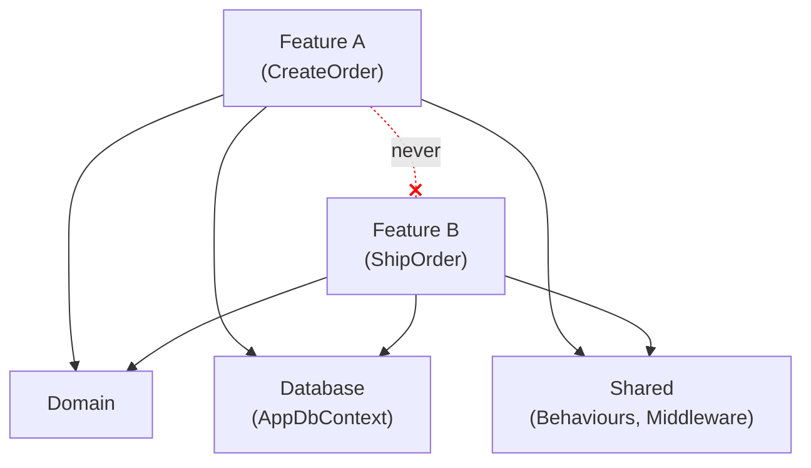

# Vertical Slice Architecture

> **Ref:** `STR004` | **Category:** Structural

Organised by feature, where each slice owns its endpoint, handler, validation, and data access — minimising cross-feature coupling. Each operation is a self-contained vertical cut through all technical concerns rather than a horizontal layer shared across operations.

## When to Use

- Features are largely independent — adding "order export" shouldn't require touching "order creation"
- **2–8 developers** in a feature-team model where each developer or pair owns a feature end-to-end — merge conflicts drop dramatically because developers work in separate files
- The application is API-heavy with many distinct operations that don't share much logic
- You want to add new features without modifying shared abstractions or base classes
- Rapid iteration: startups, product teams, SaaS applications with frequent feature additions
- You're tired of changing five files across five folders to add one endpoint

## When NOT to Use

- The domain model is the primary asset — rich entities with shared invariants spanning multiple features need a domain-centric pattern (STR003 or [STR006](STR006%20-%20hexagonal.md))
- Heavy cross-feature business logic: if most features need to coordinate with each other, you'll end up with shared services that defeat the purpose
- Small CRUD apps — [STR001](STR001%20-%20n-tier.md) is simpler and you don't have enough features to justify the per-feature overhead
- If your "slices" all look identical (get entity, map to DTO, return), you've got a CRUD app and this pattern adds ceremony without benefit
- Strong transactional consistency requirements across multiple aggregates — slices optimise for independence, not coordination

## Solution Structure

```
MyApp/
├── MyApp.sln
└── src/
    └── MyApp/
        ├── MyApp.csproj
        ├── Program.cs
        ├── appsettings.json
        │
        ├── Features/
        │   ├── Orders/
        │   │   ├── CreateOrder.cs
        │   │   ├── GetOrderById.cs
        │   │   ├── ListOrders.cs
        │   │   ├── UpdateOrderStatus.cs
        │   │   ├── CancelOrder.cs
        │   │   └── OrderDto.cs
        │   │
        │   ├── Products/
        │   │   ├── CreateProduct.cs
        │   │   ├── GetProductById.cs
        │   │   ├── ListProducts.cs
        │   │   ├── SearchProducts.cs
        │   │   └── ProductDto.cs
        │   │
        │   └── Shipping/
        │       ├── CalculateShippingRate.cs
        │       ├── CreateShipment.cs
        │       └── TrackShipment.cs
        │
        ├── Domain/
        │   ├── Order.cs
        │   ├── OrderItem.cs
        │   ├── OrderStatus.cs
        │   ├── Product.cs
        │   ├── Shipment.cs
        │   └── Address.cs
        │
        ├── Database/
        │   ├── AppDbContext.cs
        │   └── Configurations/
        │       ├── OrderConfiguration.cs
        │       └── ProductConfiguration.cs
        │
        └── Shared/
            ├── Behaviours/
            │   ├── ValidationBehaviour.cs
            │   └── LoggingBehaviour.cs
            ├── Exceptions/
            │   ├── NotFoundException.cs
            │   └── ValidationException.cs
            └── Middleware/
                └── ExceptionHandlingMiddleware.cs
```

Each file in `Features/` is a **complete slice** — it contains the request, response, validator, and handler for one operation. A single file, a single responsibility.

**Features/{Resource}/** — one file per operation. This is where you spend 90% of your time.

**Domain/** — entity classes and value objects shared across features. Keep these lean. Not a full domain model — entities, enums, and value objects with self-validation (e.g., `Money`, `Address`). No domain services, no aggregate roots with complex behaviour. If you need those, you're in STR003 territory.

**Database/** — DbContext and EF Core configurations. Shared because features query the same database.

**Shared/** — cross-cutting infrastructure only: validation pipeline, logging, exception handling. This folder should be small. If it's growing, you're recreating layers.

## Dependency Rules



- **Features never reference other features.** This is the fundamental rule. If `CreateOrder` needs product data, it queries the database directly — it does not call `GetProductById` through the mediator or reference its handler. Features communicate through the database (shared state) or through messaging (events), never through direct invocation.
- **Shared/ is infrastructure only.** If you're putting business logic in Shared/, stop. Either put it in the feature that owns it, or extract a domain service into Domain/.
- **Domain/ is shared data structures.** Entities live here because multiple features read/write the same tables. But domain logic that's specific to one operation stays in that feature's handler.
- **Database/ is the shared persistence layer.** All features use the same `AppDbContext`. This is intentional — the database is the integration point between features, and that's fine.

## Naming Conventions

| Element | Convention | Example |
|---------|-----------|---------|
| Feature folder | plural resource noun | `Orders/`, `Products/` |
| Slice file | `{Verb}{Entity}` | `CreateOrder.cs`, `ListProducts.cs` |
| Request type | nested `Command` or `Query` | `CreateOrder.Command` (implements `IRequest<Result>`) |
| Response type | nested `Result` | `CreateOrder.Result` |
| Validator | nested `Validator` | `CreateOrder.Validator` |
| Handler | nested `Handler` | `CreateOrder.Handler` (implements `IRequestHandler<Command, Result>`) |
| Shared DTO | `{Entity}Dto` | `OrderDto.cs` (only if multiple slices in the same feature group return the same shape) |
| Endpoint mapping | `MapEndpoints` static method | `CreateOrder.MapEndpoints(app)` |

Everything for one operation nests inside a single static class. The file name matches the class name. Use `Command` for operations with side effects and `Query` for read operations — this makes the intent immediately clear when scanning a feature folder.

## Key Abstractions

A complete slice using a mediator (Wolverine, Mediator, or hand-rolled — not MediatR-specific) and Minimal API. The handler implements a generic `IRequestHandler<TRequest, TResponse>` interface so the mediator can discover and dispatch it. The `Command` implements a corresponding `IRequest<TResponse>` marker.

```csharp
public static class CreateOrder
{
    public sealed record Command(
        Guid ProductId,
        int Quantity,
        string ShippingAddress) : IRequest<Result>;

    public sealed record Result(Guid OrderId, decimal Total);

    public sealed class Validator : AbstractValidator<Command>
    {
        public Validator()
        {
            RuleFor(x => x.ProductId).NotEmpty();
            RuleFor(x => x.Quantity).GreaterThan(0);
            RuleFor(x => x.ShippingAddress).NotEmpty().MaximumLength(500);
        }
    }

    internal sealed class Handler(AppDbContext db, TimeProvider clock)
        : IRequestHandler<Command, Result>
    {
        public async ValueTask<Result> Handle(
            Command command, CancellationToken ct)
        {
            var product = await db.Products.FindAsync([command.ProductId], ct)
                ?? throw new NotFoundException(nameof(Product), command.ProductId);

            if (product.StockQuantity < command.Quantity)
                throw new ValidationException("Insufficient stock");

            var order = new Order
            {
                Id = Guid.NewGuid(),
                ProductId = product.Id,
                Quantity = command.Quantity,
                UnitPrice = product.Price,
                ShippingAddress = command.ShippingAddress,
                Status = OrderStatus.Submitted,
                CreatedAt = clock.GetUtcNow()
            };

            db.Orders.Add(order);
            product.StockQuantity -= command.Quantity;
            await db.SaveChangesAsync(ct);

            return new Result(order.Id, order.Quantity * order.UnitPrice);
        }
    }

    public static void MapEndpoints(IEndpointRouteBuilder app)
    {
        app.MapPost("/api/orders", async (Command command, ISender sender) =>
        {
            var result = await sender.Send(command);
            return TypedResults.Created($"/api/orders/{result.OrderId}", result);
        });
    }
}
```

Key details in this example:

- **`IRequest<Result>` on the command** — the mediator uses this marker to route the message to the correct handler. The specific interface name varies by library.
- **`IRequestHandler<Command, Result>` on the handler** — this is how the mediator discovers handlers. Source-generated mediators resolve this at compile time.
- **`internal sealed` handler** — nothing outside the assembly should reference handlers directly. The mediator dispatches to them.
- **`TimeProvider`** — injected instead of `DateTime.UtcNow` so tests can control time. This is a BCL abstraction since .NET 8.
- **`ValueTask<T>`** — preferred for handlers since many mediator implementations use `ValueTask`.
- **`TypedResults`** — gives you strongly-typed `IResult` implementations with proper OpenAPI metadata, unlike `Results` which returns `IResult` and loses type info for Swagger/OpenAPI generation.

Endpoint registration in `Program.cs`:

```csharp
CreateOrder.MapEndpoints(app);
GetOrderById.MapEndpoints(app);
ListOrders.MapEndpoints(app);
```

For projects with many slices, define a marker interface and scan for it:

```csharp
public interface IEndpointMapper
{
    static abstract void MapEndpoints(IEndpointRouteBuilder app);
}

public static class EndpointExtensions
{
    public static IEndpointRouteBuilder MapEndpoints(
        this IEndpointRouteBuilder app)
    {
        var mappers = typeof(Program).Assembly.GetTypes()
            .Where(t => t.GetInterfaces().Contains(typeof(IEndpointMapper))
                && t is { IsAbstract: false, IsInterface: false });

        foreach (var mapper in mappers)
        {
            var method = mapper.GetMethod(
                nameof(IEndpointMapper.MapEndpoints),
                BindingFlags.Public | BindingFlags.Static)!;
            method.Invoke(null, [app]);
        }

        return app;
    }
}
```

Then `Program.cs` becomes a single `app.MapEndpoints();` call. Note: static classes cannot implement interfaces, so slices using `IEndpointMapper` would be declared as `public sealed class CreateOrder : IEndpointMapper` (with a private constructor) instead of `public static class CreateOrder`. Alternatively, keep slices as static classes and use a convention-based approach that scans for a `MapEndpoints` method by name — the interface just makes it explicit.

## Data Flow

```
HTTP POST /api/orders
    │
    ▼
Minimal API endpoint (defined in CreateOrder.MapEndpoints)
    │  deserialises body → CreateOrder.Command
    ▼
ISender.Send(command)
    │
    ▼
Pipeline behaviours (Shared/)
    │  ValidationBehaviour runs CreateOrder.Validator
    │  LoggingBehaviour captures timing
    ▼
CreateOrder.Handler.Handle()
    │  queries AppDbContext directly
    │  applies business rules
    │  creates entity, modifies state
    │  saves to database
    ▼
CreateOrder.Result returned
    │
    ▼
TypedResults.Created(url, result)
```

There are no layers to traverse. The handler **is** the feature. It queries what it needs, does what it needs to do, and returns the result. Compare this with [STR003](STR003%20-%20full-clean-architecture.md) where the same operation crosses Controller → Mediator → Handler → Repository → DbContext → back through each layer.

## Where Business Logic Lives

**In the handler for that feature.** This is the core insight of vertical slices.

Each handler owns its business logic entirely. `CreateOrder.Handler` validates stock, creates the order, and decrements inventory. It doesn't delegate to an `OrderService` or call through a repository — it *is* the logic for that operation.

This feels wrong if you're coming from layered architecture. "Where's the separation of concerns?" The separation is between **features**, not between **technical layers**. Each slice is a cohesive unit — changing how orders are created means changing one file, not tracing through a controller, service, repository, and domain model.

**When logic is shared across features:**

1. **Same feature group** — if `CreateOrder` and `UpdateOrder` both validate stock, extract a `StockValidator` class or a static helper method within the `Orders/` folder. It's private to that feature group.
2. **Cross-feature, pure logic** — if stock validation is needed by both Orders and Returns, extract it into `Domain/` as a value object method or a small domain service. Keep it focused — a single method, not a "StockService" with twelve responsibilities.
3. **Cross-feature, data access** — if multiple features need the same complex query (e.g., "get product with current pricing and availability"), consider a shared read model or a query helper in `Database/`. This is infrastructure, not business logic.

**The hierarchy of sharing:** feature-private → feature-group-private → `Domain/` shared logic. Each step up in sharing should require more justification. If you're constantly pulling things into `Domain/`, you have a domain-centric problem and should use a domain-centric pattern.

**The escape hatch:** If you find yourself building a rich shared domain model with entities calling each other and enforcing cross-entity invariants, you've outgrown this pattern. Move to [STR003](STR003%20-%20full-clean-architecture.md) or [STR006](STR006%20-%20hexagonal.md).

## Testing Strategy

```
tests/
└── MyApp.Tests/
    ├── MyApp.Tests.csproj
    ├── CustomWebApplicationFactory.cs
    └── Features/
        ├── Orders/
        │   ├── CreateOrderTests.cs
        │   ├── GetOrderByIdTests.cs
        │   ├── ListOrdersTests.cs
        │   └── CancelOrderTests.cs
        └── Products/
            ├── CreateProductTests.cs
            └── ListProductsTests.cs
```

**Test per feature, not per layer.** Each slice gets its own test class that mirrors the feature structure.

**Integration tests are the primary testing strategy.** Since each slice owns its full stack — endpoint, validation, handler, data access — the most valuable test exercises the full stack. This is where vertical slices pay off in testing: there are no mocked layers to set up because there are no layers.

Use `WebApplicationFactory` with a real database (a test container library for PostgreSQL/SQL Server, or SQLite for simpler cases). Avoid EF Core's in-memory provider — it doesn't enforce constraints, relationships, or SQL-specific behaviour, so your tests pass but production breaks.

```csharp
public sealed class CreateOrderTests(CustomWebApplicationFactory factory)
    : IClassFixture<CustomWebApplicationFactory>
{
    private readonly HttpClient _client = factory.CreateClient();

    [Fact]
    public async Task ValidOrder_ReturnsCreatedWithOrderId()
    {
        using var scope = factory.Services.CreateScope();
        var db = scope.ServiceProvider.GetRequiredService<AppDbContext>();
        var product = new Product
        {
            Id = Guid.NewGuid(),
            Price = 29.99m,
            StockQuantity = 100
        };
        db.Products.Add(product);
        await db.SaveChangesAsync();

        var command = new CreateOrder.Command(product.Id, 2, "123 Main St");

        var response = await _client.PostAsJsonAsync("/api/orders", command);

        response.StatusCode.Should().Be(HttpStatusCode.Created);
        var result = await response.Content
            .ReadFromJsonAsync<CreateOrder.Result>();
        result!.OrderId.Should().NotBeEmpty();
        result.Total.Should().Be(59.98m);

        var saved = await db.Orders.FindAsync(result.OrderId);
        saved.Should().NotBeNull();
        saved!.Status.Should().Be(OrderStatus.Submitted);
    }

    [Fact]
    public async Task InsufficientStock_ReturnsBadRequest()
    {
        using var scope = factory.Services.CreateScope();
        var db = scope.ServiceProvider.GetRequiredService<AppDbContext>();
        var product = new Product
        {
            Id = Guid.NewGuid(),
            Price = 10m,
            StockQuantity = 0
        };
        db.Products.Add(product);
        await db.SaveChangesAsync();

        var command = new CreateOrder.Command(product.Id, 1, "456 Oak Ave");

        var response = await _client.PostAsJsonAsync("/api/orders", command);

        response.StatusCode.Should().Be(HttpStatusCode.BadRequest);
    }

    [Fact]
    public async Task InvalidCommand_ReturnsValidationErrors()
    {
        var command = new CreateOrder.Command(Guid.Empty, -1, "");

        var response = await _client.PostAsJsonAsync("/api/orders", command);

        response.StatusCode.Should().Be(HttpStatusCode.BadRequest);
    }
}
```

**Unit tests are the exception, not the rule.** Only unit-test a handler directly when it contains complex pure logic (pricing calculations, state machine transitions, rule evaluation). In those cases, instantiate the handler with a real database (a test container library or SQLite) and a `FakeTimeProvider` — don't mock `DbContext`.

## Common Mistakes

1. **Feature folders that are just reorganised layers.** A feature folder containing `OrderController.cs`, `OrderService.cs`, `OrderRepository.cs` is N-Tier in a trench coat. The point is to have one file per operation, not one folder per entity with layered files inside.

2. **Shared abstractions that defeat the purpose.** Creating `ISliceHandler<TRequest, TResponse>`, `SliceHandlerBase<T>`, or a custom pipeline that every feature must inherit from. Vertical slices are about independence — shared base classes create coupling. The handler implements the mediator's interface and nothing else.

3. **Features calling other features.** `CreateOrder.Handler` dispatches `new GetProductById.Query(productId)` via the mediator to get the product. This is the single most common mistake. Query the database directly. Features are independent slices, not a service mesh. The mediator is for dispatching from the endpoint to the handler, not for inter-handler communication.

4. **No shared Domain/ at all.** Every feature defines its own `Order` class. Now you have three different `Order` types mapping to the same table. Entity classes go in `Domain/` because they represent shared database structure.

5. **Giant Shared/ folder.** If `Shared/` has services, helpers, utilities, and business logic, you've built a horizontal layer and destroyed the vertical slicing. `Shared/` is for infrastructure plumbing only: validation pipeline, exception handling, logging. A good heuristic: if `Shared/` has more files than any single feature folder, investigate.

6. **Not knowing when to stop.** If every new feature requires modifying shared domain logic, entities are deeply interrelated, or you're building complex invariants that span features — this pattern isn't working. Graduate to [STR003](STR003%20-%20full-clean-architecture.md) or [STR006](STR006%20-%20hexagonal.md).

7. **Mixing Minimal API endpoints and Controllers.** Pick one. This pattern pairs naturally with Minimal API endpoints (each slice registers its own endpoint). Controllers force you to group endpoints by resource, which fights the one-file-per-operation structure.

8. **Wrapping DbContext in a repository.** Each handler queries `AppDbContext` directly. Adding `IOrderRepository` reintroduces a horizontal layer between the handler and the database. The handler knows exactly what query it needs — let it express that directly with LINQ. If you want to share a complex query, use an extension method on `IQueryable<T>` or `DbSet<T>`.

9. **Premature DTO duplication.** Two features return the same shape? Share the DTO within the feature folder (e.g., `OrderDto.cs` in `Orders/`). Two features in different folders return a similar shape? Let them each define their own response record. Coupling DTOs across feature groups creates ripple effects — the same problem vertical slices are designed to avoid.

10. **Testing handlers in isolation by mocking DbContext.** The whole point of a slice is that it's self-contained. Test it end-to-end through `WebApplicationFactory` with a real (or real-enough) database. Mocking `DbContext` means you're testing whether your handler calls the right mock methods, not whether it actually works.

## Related Packages

- **Mediator:** [MediatR](https://github.com/jbogard/MediatR) · [Wolverine](https://github.com/JasperFx/wolverine) · [Mediator](https://github.com/martinothamar/Mediator) (source-generated)
- **Validation:** [FluentValidation](https://github.com/FluentValidation/FluentValidation) · [System.ComponentModel.DataAnnotations](https://www.nuget.org/packages/System.ComponentModel.Annotations)
- **Testing:** [xUnit](https://github.com/xunit/xunit), [NUnit](https://github.com/nunit/nunit) · [NSubstitute](https://github.com/nsubstitute/NSubstitute), [Moq](https://github.com/devlooped/moq) · [FluentAssertions](https://github.com/fluentassertions/fluentassertions) · [Testcontainers](https://github.com/testcontainers/testcontainers-dotnet) · [Bogus](https://github.com/bchavez/Bogus)
- **Architecture testing:** [NetArchTest](https://github.com/BenMorris/NetArchTest) · [ArchUnitNET](https://github.com/TNG/ArchUnitNET)
