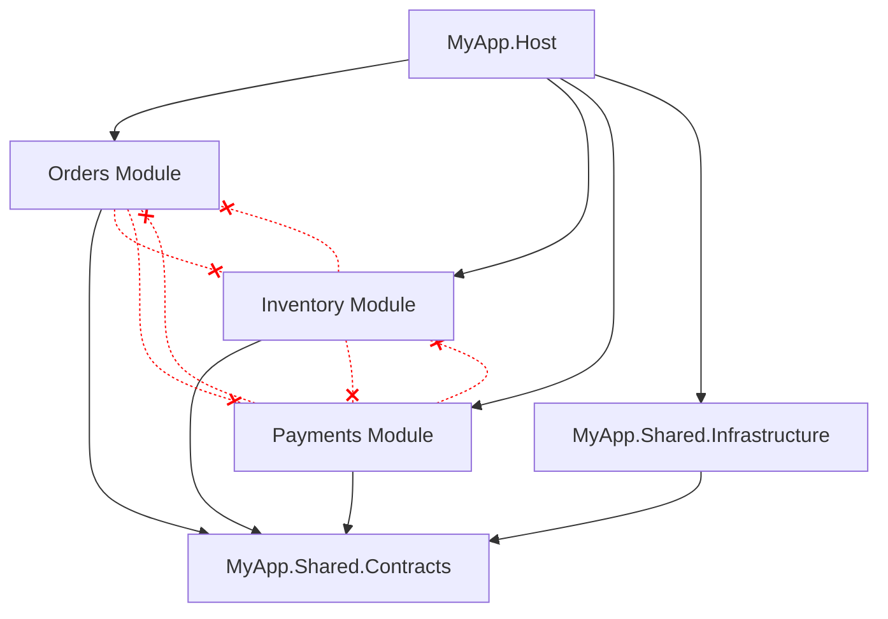

# Modular Monolith

> **Ref:** `STR005` | **Category:** Structural

Independent modules within one deployable, each with clear boundaries, own data, and explicit public contracts — a monolith that could become microservices but doesn't have to.

## When to Use

- **5–20+ developers** organised by domain area (orders team, inventory team, payments team)
- Multiple distinct business domains within one product that need to evolve independently
- You want microservice-like autonomy without the operational overhead of distributed systems
- The system is complex enough that a single codebase without boundaries would devolve into a big ball of mud
- You want the **option** to extract services later — modular monolith is the best stepping stone to microservices ([STR007](../structural/STR007%20-%20microservices.md))
- Deployment as a single unit is acceptable or even desirable

## When NOT to Use

- Small apps (under ~15 endpoints) where module boundaries add overhead without benefit — use [STR001](../structural/STR001%20-%20n-tier.md) or [STR002](../structural/STR002%20-%20clean-architecture-lite.md)
- The domain is genuinely a single cohesive thing — forced module boundaries create artificial seams
- You need independent deployment **now** — use microservices ([STR007](../structural/STR007%20-%20microservices.md))
- Teams can't agree on or enforce module boundaries — a modular monolith without discipline becomes a distributed monolith in one process

## Solution Structure

```
MyApp/
├── MyApp.sln
│
├── src/
│   ├── MyApp.Host/
│   │   ├── MyApp.Host.csproj              ← references all modules
│   │   ├── Program.cs
│   │   └── appsettings.json
│   │
│   ├── MyApp.Shared.Contracts/
│   │   ├── MyApp.Shared.Contracts.csproj   ← referenced by all modules
│   │   ├── IntegrationEvents/
│   │   │   ├── IIntegrationEvent.cs
│   │   │   ├── OrderPlacedIntegrationEvent.cs
│   │   │   └── PaymentCompletedIntegrationEvent.cs
│   │   ├── Abstractions/
│   │   │   ├── IModule.cs
│   │   │   ├── IEventBus.cs
│   │   │   └── IIntegrationEventHandler.cs
│   │   └── ModuleContracts/
│   │       └── IInventoryQueryService.cs
│   │
│   ├── MyApp.Shared.Infrastructure/
│   │   ├── MyApp.Shared.Infrastructure.csproj
│   │   └── EventBus/
│   │       └── InMemoryEventBus.cs
│   │
│   ├── Modules/
│   │   ├── MyApp.Modules.Orders/
│   │   │   ├── MyApp.Modules.Orders.csproj ← references Shared.Contracts only
│   │   │   ├── OrdersModule.cs
│   │   │   ├── Domain/
│   │   │   │   ├── Order.cs
│   │   │   │   ├── OrderItem.cs
│   │   │   │   └── IOrderRepository.cs
│   │   │   ├── Application/
│   │   │   │   ├── CreateOrder/
│   │   │   │   │   ├── CreateOrderCommand.cs
│   │   │   │   │   └── CreateOrderCommandHandler.cs
│   │   │   │   └── GetOrderById/
│   │   │   │       ├── GetOrderByIdQuery.cs
│   │   │   │       └── GetOrderByIdQueryHandler.cs
│   │   │   ├── Infrastructure/
│   │   │   │   ├── OrdersDbContext.cs
│   │   │   │   ├── Configurations/
│   │   │   │   │   └── OrderConfiguration.cs
│   │   │   │   └── Repositories/
│   │   │   │       └── OrderRepository.cs
│   │   │   └── Api/
│   │   │       └── OrdersEndpoints.cs
│   │   │
│   │   ├── MyApp.Modules.Inventory/
│   │   │   ├── MyApp.Modules.Inventory.csproj
│   │   │   ├── InventoryModule.cs
│   │   │   ├── Domain/
│   │   │   ├── Application/
│   │   │   ├── Infrastructure/
│   │   │   └── Api/
│   │   │
│   │   └── MyApp.Modules.Payments/
│   │       ├── MyApp.Modules.Payments.csproj
│   │       ├── PaymentsModule.cs
│   │       ├── Domain/
│   │       ├── Application/
│   │       ├── Infrastructure/
│   │       └── Api/
│   │
│   └── (optional) MyApp.Modules.Notifications/
│
└── tests/
    ├── MyApp.Modules.Orders.Tests/
    ├── MyApp.Modules.Inventory.Tests/
    ├── MyApp.Modules.Payments.Tests/
    └── MyApp.IntegrationTests/
```

Each **module** is its own class library project. Internally, each module can use whatever structure fits — the Orders module shown above uses a mini Clean Architecture (Domain/Application/Infrastructure/Api), but a simpler module might use Vertical Slices ([STR004](../structural/STR004%20-%20vertical-slice.md)) internally.

**MyApp.Host** — the ASP.NET Core application. It references all modules and wires them together at startup. Contains no business logic.

**MyApp.Shared.Contracts** — integration events, module interface, and shared abstractions. This is the **only** project that all modules reference. Keep it thin.

**MyApp.Shared.Infrastructure** — shared infrastructure like the in-memory event bus. References `Shared.Contracts` (it implements `IEventBus`). Modules don't reference this directly — only the Host does.

## Dependency Rules



**The iron rules:**

- Modules **NEVER** reference other modules. No `<ProjectReference>` between module projects. This is non-negotiable.
- All modules reference only `Shared.Contracts` (for integration events and shared interfaces).
- The `Host` references all modules and `Shared.Infrastructure` to wire everything together.
- Each module has its own `DbContext` and its own database schema. Use PostgreSQL schemas (`orders`, `inventory`, `payments`) or SQL Server schemas to isolate tables within a single database. Separate databases per module is also valid but adds operational overhead that usually isn't justified until extraction.
- Inter-module communication happens **only** through the event bus or through `Shared.Contracts` interfaces.
- Use `internal` access modifier extensively within modules. Only types needed for module registration and integration events are `public`.

## Naming Conventions

| Element | Convention | Example |
|---------|-----------|---------|
| Module project | `MyApp.Modules.{Domain}` | `MyApp.Modules.Orders` |
| Module entry point | `{Domain}Module` | `OrdersModule` |
| Module DbContext | `{Domain}DbContext` | `OrdersDbContext` |
| Integration event | `{Entity}{PastVerb}IntegrationEvent` | `OrderPlacedIntegrationEvent` |
| Event handler | `{EventName}Handler` | `OrderPlacedHandler` |
| Module-internal classes | `internal` access | `internal class OrderRepository` |
| Module public contract | `public` in Shared.Contracts | `public record OrderPlacedIntegrationEvent` |
| DB table schema | module name as schema | `orders.Orders`, `inventory.Products` |

The `internal` keyword is your primary boundary enforcement tool. Everything inside a module is `internal` except the `IModule` implementation and any types exposed through `Shared.Contracts`.

**`InternalsVisibleTo` for tests:** Each module's `.csproj` should expose internals to its test project so tests can exercise internal handlers, repositories, and domain types directly:

```xml
<!-- MyApp.Modules.Orders.csproj -->
<ItemGroup>
    <InternalsVisibleTo Include="MyApp.Modules.Orders.Tests" />
</ItemGroup>
```

Never add `InternalsVisibleTo` from one module to another module — that defeats the boundary.

## Key Abstractions

Module registration interface:

```csharp
// Shared.Contracts/Abstractions/IModule.cs
public interface IModule
{
    void ConfigureServices(IServiceCollection services, IConfiguration configuration);
    void MapEndpoints(IEndpointRouteBuilder app);
}
```

Each module exposes a single `public sealed class` implementing `IModule`. Using an instance-based interface (not `static abstract`) lets the Host auto-discover and iterate modules at startup — no need to explicitly name every module in `Program.cs`.

> **Why not `static abstract`?** Static abstract interface members prevent polymorphic iteration (`foreach (var module in modules)`). You'd have to hard-code every module call in `Program.cs`, losing the auto-discovery benefit. The static approach looks clean in slides but forces manual wiring in practice.

Integration event bus:

```csharp
// Shared.Contracts/Abstractions/IEventBus.cs
public interface IEventBus
{
    Task PublishAsync<T>(T @event, CancellationToken ct = default) where T : IIntegrationEvent;
}

// Shared.Contracts/Abstractions/IIntegrationEventHandler.cs
public interface IIntegrationEventHandler<in T> where T : IIntegrationEvent
{
    Task HandleAsync(T @event, CancellationToken ct = default);
}

// Shared.Contracts/IntegrationEvents/IIntegrationEvent.cs
public interface IIntegrationEvent
{
    Guid EventId { get; }
    DateTimeOffset OccurredAt { get; }
}

// Shared.Contracts/IntegrationEvents/OrderPlacedIntegrationEvent.cs
public sealed record OrderPlacedIntegrationEvent(
    Guid EventId,
    DateTimeOffset OccurredAt,
    Guid OrderId,
    decimal TotalAmount) : IIntegrationEvent;
```

Each module registers its handlers as `IIntegrationEventHandler<T>` in its `ConfigureServices`. The event bus resolves all handlers for a given event type from the DI container. This means handlers are scoped — they can depend on `DbContext` and other scoped services.

Module implementation:

```csharp
// Modules/MyApp.Modules.Orders/OrdersModule.cs
public sealed class OrdersModule : IModule
{
    public void ConfigureServices(IServiceCollection services, IConfiguration configuration)
    {
        services.AddDbContext<OrdersDbContext>(options =>
            options.UseSqlServer(configuration.GetConnectionString("Default"),
                sql => sql.MigrationsHistoryTable("__EFMigrationsHistory", "orders")));

        services.AddScoped<IOrderRepository, OrderRepository>();

        services.AddScoped<IIntegrationEventHandler<PaymentCompletedIntegrationEvent>,
            PaymentCompletedHandler>();
    }

    public void MapEndpoints(IEndpointRouteBuilder app)
    {
        var group = app.MapGroup("/api/orders").WithTags("Orders");
        group.MapPost("/", OrdersEndpoints.Create);
        group.MapGet("/{id:guid}", OrdersEndpoints.GetById);
    }
}
```

Host wiring:

```csharp
// Host/Program.cs
IModule[] modules =
[
    new OrdersModule(),
    new InventoryModule(),
    new PaymentsModule(),
];

foreach (var module in modules)
    module.ConfigureServices(builder.Services, builder.Configuration);

builder.Services.AddSingleton<IEventBus, InMemoryEventBus>();

var app = builder.Build();

foreach (var module in modules)
    module.MapEndpoints(app);
```

The event bus is registered as a **singleton** because it creates its own DI scope per `PublishAsync` call. This is critical — handlers depend on scoped services like `DbContext`, so the event bus must not resolve them from the root provider. Each publish gets a fresh scope, meaning handlers get their own `DbContext` instances, independent of the caller's scope:

```csharp
// Shared.Infrastructure/EventBus/InMemoryEventBus.cs
internal sealed class InMemoryEventBus(IServiceProvider serviceProvider) : IEventBus
{
    public async Task PublishAsync<T>(T @event, CancellationToken ct = default)
        where T : IIntegrationEvent
    {
        using var scope = serviceProvider.CreateScope();
        var handlers = scope.ServiceProvider.GetServices<IIntegrationEventHandler<T>>();

        foreach (var handler in handlers)
            await handler.HandleAsync(@event, ct);
    }
}
```

> **Why `CreateScope` inside publish?** Each handler may use a different module's `DbContext`. Creating a scope ensures each handler gets its own scoped dependencies. If you want handlers to participate in the caller's transaction (same request scope), inject `IServiceScopeFactory` instead and let the caller decide.

## Data Flow

**Intra-module (within Orders):**

```
HTTP POST /api/orders
    │
    ▼
OrdersEndpoints.Create → mediator dispatches CreateOrderCommand
    │
    ▼
CreateOrderCommandHandler
    │  uses OrdersDbContext (module's own context)
    │  creates Order entity
    │  saves to orders.Orders table
    │  publishes OrderPlacedIntegrationEvent via IEventBus
    ▼
Database INSERT (orders schema)
    │
    ▼
Result returned → HTTP 201
```

**Inter-module (Orders → Inventory):**

```
CreateOrderCommandHandler
    │  publishes OrderPlacedIntegrationEvent
    ▼
IEventBus (InMemoryEventBus in-process)
    │
    ▼
InventoryModule's OrderPlacedHandler
    │  receives event
    │  uses InventoryDbContext to decrement stock
    │  in inventory.Products table
    ▼
Database UPDATE (inventory schema)
```

The key: modules communicate **through events**, even though they're in the same process. The `InMemoryEventBus` dispatches in-process within the same request, but the programming model is event-driven — publishers don't know who consumes.

**Be aware of the consistency model.** With an in-memory event bus, event handling happens synchronously in the same request pipeline. If the Inventory handler throws, the Orders API call fails — you get strong consistency but tight failure coupling. This is fine initially, but understand the tradeoff. When you later swap to an async message broker, failures become independent (eventual consistency) and you'll need idempotent handlers and retry policies.

## Where Business Logic Lives

**Inside each module**, following whatever internal structure that module uses.

- Each module is a self-contained bounded context. It owns its domain model, its data, and its business rules.
- **Cross-module business processes** use integration events. The Orders module doesn't know how Inventory manages stock — it publishes "order placed" and Inventory reacts.
- For complex cross-module workflows (e.g., order fulfilment spanning Orders, Inventory, and Payments), use a **saga or process manager** within a dedicated module or in the module that owns the workflow.
- **Module boundaries ARE the architecture.** Get them wrong and you have a distributed monolith in one process — all the complexity of boundaries with none of the benefits. Boundaries should align with business domains, not technical concerns.

## Testing Strategy

```
tests/
├── MyApp.Modules.Orders.Tests/
│   ├── MyApp.Modules.Orders.Tests.csproj   ← references Orders module
│   ├── Domain/
│   │   └── OrderTests.cs
│   ├── Application/
│   │   └── CreateOrderCommandHandlerTests.cs
│   └── Integration/
│       └── OrdersModuleTests.cs
│
├── MyApp.Modules.Inventory.Tests/
│   └── ...
│
├── MyApp.Modules.Payments.Tests/
│   └── ...
│
└── MyApp.IntegrationTests/
    ├── MyApp.IntegrationTests.csproj        ← references Host
    ├── CustomWebApplicationFactory.cs
    └── Workflows/
        └── OrderFulfilmentTests.cs
```

**Module-level tests:** Each module is tested in isolation. The module's test project references only that module. Mock the `IEventBus` to verify events are published without triggering other modules.

**Cross-module integration tests:** Test end-to-end workflows that span modules. Use `WebApplicationFactory<Program>` with all modules wired up and a real event bus. Verify that placing an order triggers inventory updates and payment processing.

**Module isolation test:** Verify that modules can start independently — spin up only the Orders module with its own DbContext and verify it works without the other modules present.

## Migration Path to Microservices (→ STR007)

A well-structured modular monolith is the **best starting point** for microservice extraction. The path:

1. **Module already has its own DbContext and schema** — no shared tables to untangle.
2. **Swap the `InMemoryEventBus` for a real message broker** (RabbitMQ, Azure Service Bus) for the module being extracted. `IEventBus` and `IIntegrationEventHandler<T>` don't change — only the infrastructure implementation does.
3. **Extract the module into its own deployable** — the module project becomes its own service. Its `IModule.ConfigureServices` becomes its `Program.cs`. Its endpoints become its own API.
4. **Replace query interfaces** (`IInventoryQueryService`) **with HTTP/gRPC clients** that call the extracted service's API.

What makes this work: the module boundaries you enforced (no cross-module project references, `internal` by default, integration events as contracts, separate `DbContext` per module) mean there are **zero compile-time dependencies** to break during extraction.

What blocks this in practice: shared database tables, `TransactionScope` spanning modules, direct method calls between modules, or `public` domain types leaking across boundaries. If any of these exist, fix them in the monolith first.

## Common Mistakes

1. **Shared DbContext across modules.** A single `AppDbContext` with `DbSet<Order>`, `DbSet<Product>`, and `DbSet<Payment>`. This couples all modules at the data level. Each module gets its own DbContext, potentially pointing to different schemas in the same database.

2. **Direct module-to-module project references.** `MyApp.Modules.Orders.csproj` has a `<ProjectReference>` to `MyApp.Modules.Inventory.csproj`. This defeats the entire pattern. If Orders needs inventory data, it either queries through an integration event response or uses a read model.

3. **Integration events with rich domain objects.** `OrderPlacedIntegrationEvent` contains the full `Order` entity with navigation properties. Integration events carry **flat data** — IDs, amounts, timestamps. They are contracts between modules, not internal domain objects.

4. **Modules that are just namespaces.** The project is split into module folders but everything is `public`, there are no separate DbContexts, and classes freely reference each other. These aren't modules — they're folders. Use `internal` and separate DbContexts.

5. **Too many modules.** Every entity gets its own module. A system with 3 business domains has 15 modules. Each module should represent a **bounded context** — a cohesive area of business capability. Start with fewer, larger modules and split when you have evidence of independence.

6. **Synchronous cross-module calls disguised as abstractions.** Module A injects Module B's service directly (or via an interface that Module B implements). This creates tight coupling — A cannot function without B. For **side effects** (things that happened), use integration events. For **queries** (data another module owns), define a query interface in `Shared.Contracts` that the owning module implements:

    ```csharp
    // Shared.Contracts/ModuleContracts/IInventoryQueryService.cs
    public interface IInventoryQueryService
    {
        Task<int> GetAvailableStockAsync(Guid productId, CancellationToken ct = default);
    }
    ```

    The Inventory module provides the `internal` implementation and registers it in DI. The Orders module depends on the interface, never the implementation. This keeps the dependency rule intact — both modules depend on `Shared.Contracts`, not on each other.

7. **No integration event versioning.** Changing `OrderPlacedIntegrationEvent` breaks all consuming modules at compile time. Treat integration events as public APIs — add fields, don't remove them. If you need a breaking change, version the event.

8. **Business logic in the Host project.** The Host wires modules together — it does not orchestrate business processes. If `Program.cs` contains `if/else` logic about business rules, that logic belongs in a module.

9. **No automated boundary enforcement.** Module boundaries erode silently. A developer adds `using MyApp.Modules.Inventory.Domain;` in the Orders module and no one notices. Use an architecture testing library to assert module isolation at build time:

    ```csharp
    [Fact]
    public void OrdersModule_ShouldNotReference_OtherModules()
    {
        Types.InAssembly(typeof(OrdersModule).Assembly)
            .ShouldNot()
            .HaveDependencyOnAny(
                "MyApp.Modules.Inventory",
                "MyApp.Modules.Payments")
            .GetResult()
            .IsSuccessful
            .ShouldBeTrue();
    }
    ```

    These tests catch boundary violations in CI before they reach main.

10. **Cross-module transactions.** Wrapping two module operations in a single `TransactionScope` and expecting atomicity. Each module owns its own `DbContext` and its own data. If the Orders handler publishes an event and the Inventory handler fails, you have an inconsistency. Solve this with the **outbox pattern** — persist the event in the publishing module's database within the same transaction, then dispatch it asynchronously. This is the single biggest thing people get wrong when moving from a shared `DbContext` to per-module contexts.

## Related Packages

- **Mediator:** MediatR · Wolverine · Mediator (source-generated)
- **Messaging / Event bus:** MassTransit · NServiceBus · Wolverine · Brighter
- **Validation:** FluentValidation
- **Testing:** xUnit, NUnit · NSubstitute, Moq · FluentAssertions · Testcontainers · Bogus
- **Architecture testing:** NetArchTest · ArchUnitNET
