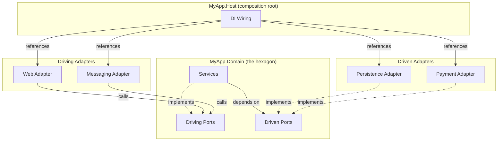

# Hexagonal Architecture (Ports & Adapters)

> **Ref:** `STR006` | **Category:** Structural

Domain at the centre, with ports (interfaces) defining how the domain interacts with the outside world and adapters providing concrete implementations.

## When to Use

- The **domain model is the most valuable part** of the system — complex business rules, rich invariants, and evolving logic that represents a competitive advantage
- Multiple entry points: the same domain logic is accessed via REST API, gRPC, message queue consumers, CLI tools, or scheduled jobs
- You need to swap or add infrastructure without touching business logic — changing from SQL Server to PostgreSQL, adding a Redis cache, switching payment providers
- The system will live for years and the domain must be insulated from infrastructure churn
- **3–10+ developers** with a dedicated domain expert or a team that invests in understanding the business deeply

## When NOT to Use

- CRUD applications with thin business logic — you'll create ports and adapters for operations that are just pass-through to the database
- You don't actually have multiple entry points or any plan to swap infrastructure — the abstraction cost isn't justified
- Small, short-lived applications where the overhead of defining ports and adapters exceeds the value of the separation
- If you'd use the same pattern as Full Clean Architecture ([STR003](STR003%20-%20full-clean-architecture.md)) — hexagonal and clean architecture solve the same problem with different vocabulary. Hexagonal thinks in **ports and adapters** with a single hexagon at the centre. Clean Architecture thinks in **concentric layers** (Domain → Application → Infrastructure → Presentation) with explicit dependency rules between them. In practice, the project structures converge once you split the hexagon into Domain + Application. Choose one mental model, not both — mixing terminology confuses the team without adding value.

## Solution Structure

```
MyApp/
├── MyApp.sln
│
├── src/
│   ├── MyApp.Domain/                          ← THE HEXAGON
│   │   ├── MyApp.Domain.csproj                 (zero external references)
│   │   ├── Model/
│   │   │   ├── Order.cs
│   │   │   ├── OrderItem.cs
│   │   │   ├── Product.cs
│   │   │   └── Money.cs
│   │   ├── Ports/
│   │   │   ├── Driving/
│   │   │   │   ├── IPlaceOrderUseCase.cs
│   │   │   │   ├── ICancelOrderUseCase.cs
│   │   │   │   └── IGetOrderQuery.cs
│   │   │   └── Driven/
│   │   │       ├── IOrderRepository.cs
│   │   │       ├── IProductRepository.cs
│   │   │       ├── IPaymentGateway.cs
│   │   │       └── IEventPublisher.cs
│   │   ├── Services/
│   │   │   ├── PlaceOrderService.cs
│   │   │   ├── CancelOrderService.cs
│   │   │   └── GetOrderQueryService.cs
│   │   └── Exceptions/
│   │       ├── DomainException.cs
│   │       └── InsufficientStockException.cs
│   │
│   ├── MyApp.Adapters.Web/                    ← DRIVING ADAPTER
│   │   ├── MyApp.Adapters.Web.csproj           (references Domain)
│   │   ├── Controllers/
│   │   │   └── OrdersController.cs
│   │   └── DTOs/
│   │       ├── CreateOrderRequest.cs
│   │       └── OrderResponse.cs
│   │
│   ├── MyApp.Adapters.Messaging/              ← DRIVING ADAPTER
│   │   ├── MyApp.Adapters.Messaging.csproj     (references Domain)
│   │   └── Consumers/
│   │       └── PlaceOrderMessageConsumer.cs
│   │
│   ├── MyApp.Adapters.Persistence/            ← DRIVEN ADAPTER
│   │   ├── MyApp.Adapters.Persistence.csproj   (references Domain)
│   │   ├── DependencyInjection.cs
│   │   ├── AppDbContext.cs
│   │   ├── Configurations/
│   │   │   ├── OrderConfiguration.cs
│   │   │   └── ProductConfiguration.cs
│   │   └── Repositories/
│   │       ├── SqlOrderRepository.cs
│   │       └── SqlProductRepository.cs
│   │
│   ├── MyApp.Adapters.Payment/               ← DRIVEN ADAPTER
│   │   ├── MyApp.Adapters.Payment.csproj       (references Domain)
│   │   └── StripePaymentGateway.cs
│   │
│   └── MyApp.Host/
│       ├── MyApp.Host.csproj                   (references Domain + all adapters)
│       └── Program.cs
│
└── tests/
    ├── MyApp.Domain.Tests/
    ├── MyApp.Adapters.Persistence.Tests/
    └── MyApp.Host.Tests/
```

**MyApp.Domain** — the hexagon. Contains the domain model, business rules, **driving ports** (what the outside world can ask the domain to do), **driven ports** (what the domain needs from the outside world), and domain services that implement driving ports. Zero NuGet packages.

> **Pure hexagonal vs common .NET adaptation:** In Cockburn's original definition, everything inside the hexagon is one unit — the application. There is no distinction between "domain" and "application" layers. This document follows that model: orchestration services and ports live together in one project. Many .NET teams split this into `MyApp.Domain` (entities, value objects, domain logic) and `MyApp.Application` (use-case orchestration, driving ports, DTOs), converging with [STR003](STR003%20-%20full-clean-architecture.md). That's a valid adaptation when the domain model is large enough to warrant isolation from orchestration concerns, but it is no longer pure hexagonal — it's clean architecture with hexagonal terminology. If you find yourself adding an Application project, you're probably better served by [STR003](STR003%20-%20full-clean-architecture.md) directly.

**Driving adapters** (Web, Messaging) — translate external input into calls on driving ports. A REST controller receives an HTTP request and calls `IPlaceOrderUseCase`. A message consumer receives a queue message and calls the same port. The domain doesn't know which adapter triggered it.

**Driven adapters** (Persistence, Payment) — implement driven ports. The domain calls `IOrderRepository.SaveAsync(order)` and the persistence adapter translates that into EF Core operations. The domain doesn't know it's using a database.

**MyApp.Host** — wires adapters to ports via DI. Contains no logic.

## Dependency Rules



**The fundamental rule:** All arrows point inward. The domain references nothing. Everything else references the domain.

- **Driving adapters** reference the Domain to call driving ports
- **Driven adapters** reference the Domain to implement driven ports
- **Adapters never reference other adapters**
- The domain defines **both** types of ports as interfaces:
  - **Driving ports** = what the domain offers (use cases). Domain services implement these.
  - **Driven ports** = what the domain needs (infrastructure). Adapters implement these.

## Naming Conventions

| Element | Convention | Example |
|---------|-----------|---------|
| Driving port | `I{Verb}{Entity}UseCase` or `I{Verb}{Entity}Query` | `IPlaceOrderUseCase`, `IGetOrderQuery` |
| Driven port | `I{Entity}Repository`, `I{Noun}Gateway`, `I{Noun}Publisher` | `IOrderRepository`, `IPaymentGateway` |
| Domain service | `{Verb}{Entity}Service` | `PlaceOrderService` |
| Domain entity | singular noun | `Order`, `Product` |
| Value object | singular noun | `Money`, `Address` |
| Adapter project | `MyApp.Adapters.{Concern}` | `MyApp.Adapters.Persistence` |
| Adapter implementation | `{Technology}{DomainConcept}{PortSuffix}` | `SqlOrderRepository`, `StripePaymentGateway` |
| Driving adapter handler | `{Entity}sController`, `{Action}MessageConsumer` | `OrdersController`, `PlaceOrderMessageConsumer` |

## Key Abstractions

Driving port (what the world can ask the domain):

```csharp
// Domain/Ports/Driving/IPlaceOrderUseCase.cs
public interface IPlaceOrderUseCase
{
    Task<OrderResult> ExecuteAsync(PlaceOrderCommand command, CancellationToken ct = default);
}

public sealed record PlaceOrderCommand(
    Guid CustomerId,
    Address ShippingAddress,
    IReadOnlyList<OrderLineItem> Items);

public sealed record OrderLineItem(Guid ProductId, int Quantity);

public sealed record OrderResult(Guid OrderId, Money Total);
```

`PlaceOrderCommand` and `OrderResult` live in the Domain alongside the port that uses them — they are part of the hexagon's API surface. This differs from Clean Architecture where these would live in an Application layer. In hexagonal, there is no Application layer; the port interface and its input/output types together define the contract.

Driven port (what the domain needs from the outside):

```csharp
// Domain/Ports/Driven/IOrderRepository.cs
public interface IOrderRepository
{
    Task<Order?> GetByIdAsync(Guid id, CancellationToken ct = default);
    Task SaveAsync(Order order, CancellationToken ct = default);
}

// Domain/Ports/Driven/IProductRepository.cs
public interface IProductRepository
{
    Task<IReadOnlyDictionary<Guid, Product>> GetByIdsAsync(
        IReadOnlyList<Guid> ids, CancellationToken ct = default);
}

// Domain/Ports/Driven/IPaymentGateway.cs
public interface IPaymentGateway
{
    Task<PaymentResult> ChargeAsync(Guid customerId, Money amount, CancellationToken ct = default);
}
```

Domain service implementing a driving port:

```csharp
// Domain/Services/PlaceOrderService.cs
public sealed class PlaceOrderService(
    IOrderRepository orders,
    IProductRepository products,
    IPaymentGateway payments) : IPlaceOrderUseCase
{
    public async Task<OrderResult> ExecuteAsync(PlaceOrderCommand command, CancellationToken ct = default)
    {
        var productIds = command.Items.Select(i => i.ProductId).ToList();
        var loadedProducts = await products.GetByIdsAsync(productIds, ct);

        var order = new Order(command.CustomerId, command.ShippingAddress);

        foreach (var item in command.Items)
        {
            if (!loadedProducts.TryGetValue(item.ProductId, out var product))
                throw new DomainException($"Product {item.ProductId} not found");

            order.AddItem(product, item.Quantity);
        }

        var payment = await payments.ChargeAsync(command.CustomerId, order.Total, ct);
        order.ConfirmPayment(payment.TransactionId);

        await orders.SaveAsync(order, ct);

        return new OrderResult(order.Id, order.Total);
    }
}
```

Driving adapter calling the port:

```csharp
// Adapters.Web/Controllers/OrdersController.cs
[ApiController]
[Route("api/orders")]
public sealed class OrdersController(IPlaceOrderUseCase placeOrder) : ControllerBase
{
    [HttpPost]
    public async Task<IActionResult> Create(CreateOrderRequest request, CancellationToken ct)
    {
        var command = request.ToCommand();
        var result = await placeOrder.ExecuteAsync(command, ct);
        return CreatedAtAction(nameof(GetById), new { id = result.OrderId }, result);
    }
}
```

DI wiring in Host — each adapter project exposes an extension method so the Host doesn't need to know adapter internals:

```csharp
// Adapters.Persistence/DependencyInjection.cs
public static class DependencyInjection
{
    public static IServiceCollection AddPersistenceAdapters(
        this IServiceCollection services, IConfiguration configuration)
    {
        services.AddDbContext<AppDbContext>(o =>
            o.UseNpgsql(configuration.GetConnectionString("Default")));

        services.AddScoped<IOrderRepository, SqlOrderRepository>();
        services.AddScoped<IProductRepository, SqlProductRepository>();

        return services;
    }
}

// Host/Program.cs
builder.Services.AddScoped<IPlaceOrderUseCase, PlaceOrderService>();
builder.Services.AddScoped<ICancelOrderUseCase, CancelOrderService>();
builder.Services.AddScoped<IGetOrderQuery, GetOrderQueryService>();

builder.Services.AddPersistenceAdapters(builder.Configuration);
builder.Services.AddPaymentAdapters(builder.Configuration);
```

Domain services (driving port implementations) are registered in the Host because they live in the Domain project which has no DI dependency. Driven adapter registrations live in each adapter project's own extension method.

## Data Flow

**API request — placing an order:**

```
HTTP POST /api/orders
    │
    ▼
OrdersController (DRIVING ADAPTER)
    │  maps CreateOrderRequest → PlaceOrderCommand
    │  calls IPlaceOrderUseCase.ExecuteAsync()
    ▼
PlaceOrderService (DOMAIN SERVICE)
    │  loads products via IProductRepository.GetByIdsAsync() — DRIVEN PORT
    │  creates Order entity
    │  calls order.AddItem() — domain logic validates stock
    │  calls IPaymentGateway.ChargeAsync() — DRIVEN PORT
    │  calls order.ConfirmPayment()
    │  calls IOrderRepository.SaveAsync() — DRIVEN PORT
    ▼
StripePaymentGateway (DRIVEN ADAPTER)
    │  translates domain Money → Stripe API call
    │  returns PaymentResult
    ▼
SqlOrderRepository (DRIVEN ADAPTER)
    │  translates Order entity → EF Core operations
    │  calls DbContext.SaveChangesAsync()
    ▼
Result flows back up: SqlOrderRepository → PlaceOrderService → OrdersController → HTTP 201
```

**Message queue entry point — same domain logic, different adapter:**

```
RabbitMQ message received
    │
    ▼
PlaceOrderMessageConsumer (DRIVING ADAPTER)
    │  deserialises message → PlaceOrderCommand
    │  calls IPlaceOrderUseCase.ExecuteAsync()
    ▼
PlaceOrderService (SAME DOMAIN SERVICE)
    │  exact same business logic executes
    │  domain doesn't know it was triggered by a message instead of HTTP
    ▼
...same driven adapter flow...
```

This is the power of hexagonal: the domain is entry-point agnostic.

## Where Business Logic Lives

**Inside the hexagon. Every rule, every calculation, every invariant.**

- **Domain entities** enforce their own invariants: `order.AddItem()` checks stock, `order.Cancel()` validates state transitions. An entity is never in an invalid state.
- **Domain services** implement driving ports and orchestrate multi-entity operations: `PlaceOrderService` coordinates Order creation, stock checking, and payment in one workflow.
- **Value objects** encapsulate value-level rules: `Money` prevents negative amounts, `Address` validates format.
- **Adapters are pure translation.** They convert between external formats (HTTP requests, database rows, message payloads) and domain types. If you see an `if` statement about a business rule in an adapter, move it into the domain.

The test: **can you describe an adapter as "receive input, translate to domain type, call port, translate result back"?** If the adapter is making decisions, those decisions belong in the domain.

## Testing Strategy

```
tests/
├── MyApp.Domain.Tests/
│   ├── MyApp.Domain.Tests.csproj           ← references Domain only
│   ├── Model/
│   │   ├── OrderTests.cs
│   │   ├── MoneyTests.cs
│   │   └── AddressTests.cs
│   └── Services/
│       ├── PlaceOrderServiceTests.cs
│       └── CancelOrderServiceTests.cs
│
├── MyApp.Adapters.Persistence.Tests/
│   ├── MyApp.Adapters.Persistence.Tests.csproj
│   └── Repositories/
│       └── OrderRepositoryTests.cs
│
└── MyApp.Host.Tests/
    ├── MyApp.Host.Tests.csproj
    ├── CustomWebApplicationFactory.cs
    └── Endpoints/
        └── OrdersEndpointTests.cs
```

**Domain tests** — the most important tests. Pure unit tests with driven ports mocked. Test that `PlaceOrderService` calls entity methods in the right order, validates correctly, and calls driven ports appropriately. No database, no HTTP, no external services.

```csharp
public sealed class PlaceOrderServiceTests
{
    private readonly IOrderRepository _orders = Substitute.For<IOrderRepository>();
    private readonly IProductRepository _products = Substitute.For<IProductRepository>();
    private readonly IPaymentGateway _payments = Substitute.For<IPaymentGateway>();
    private readonly PlaceOrderService _sut;

    public PlaceOrderServiceTests()
    {
        _sut = new PlaceOrderService(_orders, _products, _payments);
    }

    [Fact]
    public async Task InsufficientStock_ThrowsDomainException()
    {
        var productId = Guid.NewGuid();
        var product = new Product("Widget", stockQuantity: 0, price: Money.From(10));

        _products.GetByIdsAsync(Arg.Any<IReadOnlyList<Guid>>(), Arg.Any<CancellationToken>())
            .Returns(new Dictionary<Guid, Product> { [productId] = product });

        var command = new PlaceOrderCommand(
            Guid.NewGuid(),
            new Address("123 Main St", "London", "SW1A 1AA"),
            [new OrderLineItem(productId, Quantity: 5)]);

        await Assert.ThrowsAsync<InsufficientStockException>(
            () => _sut.ExecuteAsync(command));
    }
}
```

Notice the driven ports are substituted — the domain service has no idea whether it's running against a real database or test doubles. This is the hexagonal payoff: you test business logic in isolation by swapping the driven side.

**Adapter tests** — integration tests per adapter. Test driven adapters against real infrastructure (a test container library for databases, a HTTP mock server for HTTP APIs). Each adapter test verifies that the adapter correctly translates between domain types and external formats:

```csharp
public sealed class SqlOrderRepositoryTests : IAsyncLifetime
{
    private readonly PostgreSqlContainer _postgres = new PostgreSqlBuilder().Build();

    public async ValueTask InitializeAsync() => await _postgres.StartAsync();
    public async ValueTask DisposeAsync() => await _postgres.DisposeAsync();

    [Fact]
    public async Task SaveAndRetrieve_RoundTrips()
    {
        await using var context = CreateContext();
        var sut = new SqlOrderRepository(context);

        var order = new Order(Guid.NewGuid(), new Address("123 Main St", "London", "SW1A 1AA"));
        await sut.SaveAsync(order);

        var loaded = await sut.GetByIdAsync(order.Id);

        Assert.NotNull(loaded);
        Assert.Equal(order.Id, loaded.Id);
    }
}
```

**Host tests** — end-to-end API tests with `WebApplicationFactory`. These test the full wiring from HTTP through domain to infrastructure and back. You can swap individual driven adapters to isolate what you're testing:

```csharp
public sealed class OrdersEndpointTests(CustomWebApplicationFactory factory)
    : IClassFixture<CustomWebApplicationFactory>
{
    [Fact]
    public async Task PlaceOrder_ReturnsCreated()
    {
        var client = factory.CreateClient();
        var response = await client.PostAsJsonAsync("/api/orders", new { ... });
        Assert.Equal(HttpStatusCode.Created, response.StatusCode);
    }
}
```

The hexagonal shape makes testing natural: swap driven adapters at any level. Domain tests mock driven ports. Host tests can swap real adapters for in-memory ones. The domain never knows the difference.

## Common Mistakes

1. **Domain referencing infrastructure types.** An entity has a `[Column]` attribute, a port returns `IQueryable<T>`, or a domain model depends on `JsonProperty`. The domain must have zero infrastructure dependencies. Note on `ILogger<T>`: in a pure hexagonal model, domain services shouldn't reference `Microsoft.Extensions.Logging` either — define a domain port if you need to emit auditable business events. In practice, many .NET teams pragmatically allow `ILogger<T>` in domain services (not entities) because creating a logging port adds ceremony for negligible benefit. Know the tradeoff and be consistent.

2. **Business logic in adapters.** The controller calculates a discount. The repository applies a filter based on business rules. The message consumer validates state transitions. All of this belongs in the domain. Adapters translate; they don't decide.

3. **Confusing driving and driven ports.** A driving port is what the outside world asks the domain to do — the domain **provides** the implementation. A driven port is what the domain needs — the adapter **provides** the implementation. If you mix these up, the dependency arrows point the wrong way.

4. **Creating ports for everything.** `IDateTimePort`, `IGuidPort`, `IStringFormatterPort`. Only create ports where you need genuine substitutability. For `DateTime.UtcNow`, use `TimeProvider` (built into .NET 8). Not everything needs a port.

5. **Adapters that know about each other.** The web adapter directly uses the persistence adapter's `AppDbContext`. Adapters communicate only through the domain — they implement or call ports, never each other.

6. **One giant domain service.** `OrderService` with 30 methods. Each driving port should represent a single use case. `IPlaceOrderUseCase`, `ICancelOrderUseCase`, `IGetOrderQuery` — small, focused interfaces.

7. **Treating hexagonal and Clean Architecture as different patterns to combine.** They're different emphases on the same idea. Hexagonal says "domain at the centre with explicit ports." Clean Architecture says "dependencies point inward." Don't create a project structure that tries to be both hexagonal AND clean with separate layers and separate port/adapter projects. Pick the mental model that resonates with your team.

8. **Leaky port interfaces.** `IOrderRepository` has a method `Task<List<Order>> GetByCustomerIdWithItemsAndProductsIncluded(Guid customerId)`. Ports should express domain intent, not infrastructure mechanics. Use `GetByCustomerIdAsync(Guid customerId)` and let the adapter decide how to load the data.

9. **Anemic hexagon.** The most common mistake. Every domain service is a one-liner that forwards calls to a repository. Entities are property bags. Value objects are just records with no validation. If your "hexagon" has no meaningful logic — no invariants, no calculations, no state transitions — you don't need hexagonal architecture. Use a simpler pattern ([STR001](STR001%20-%20n-tier.md) or [STR009](STR009%20-%20minimal-api.md)) and save yourself the abstraction cost.

10. **Exposing domain types in API contracts.** Returning `Order` or `Money` directly from a controller response. Domain types represent internal state and invariants — they should never be serialised directly to clients. Driving adapters must map domain types to response DTOs. This also prevents API contract breakage when the domain model evolves.

11. **N+1 port calls in a loop.** Calling a driven port inside a `foreach` — e.g., `await repository.GetByIdAsync(id)` per item. Design port methods that accept batches: `GetByIdsAsync(IReadOnlyList<Guid> ids)`. The adapter can then optimise the query.

## Related Packages

- **Testing:** xUnit, NUnit · NSubstitute, Moq · FluentAssertions · Testcontainers · Bogus
- **HTTP mocking:** WireMock.Net
- **Mapping:** Mapster · AutoMapper
