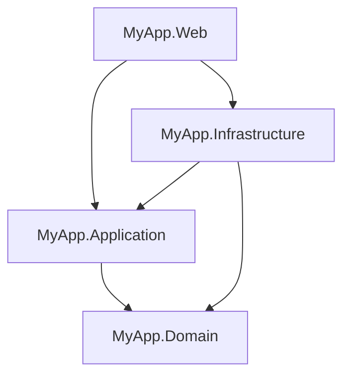

# Clean Architecture with Feature Folders

> **Ref:** `STR008` | **Category:** Structural

Multi-project Clean Architecture with CQRS, where the Application layer groups operations directly under feature folders — removing the `Commands/` and `Queries/` intermediate layer from [STR003](STR003%20-%20full-clean-architecture.md) while keeping folder-per-operation, separate files, and identical project separation.

## When to Use

- **3–8 developers** building a domain-rich application where you want compiler-enforced layer boundaries
- You like [STR003](STR003%20-%20full-clean-architecture.md)'s project separation and CQRS but find the `Commands/` and `Queries/` intermediate folders add depth without value — `Orders/Commands/CreateOrder/` is three levels deep before you reach a file
- Features are the natural unit of work — when a developer picks up "order cancellation," they want to look in `Orders/CancelOrder/`, not navigate `Orders/Commands/CancelOrder/`
- 20+ endpoints where the extra nesting in STR003 makes the tree harder to scan

This is [STR003](STR003%20-%20full-clean-architecture.md) with one change in the Application project: operations sit directly under the feature folder instead of under `Commands/` or `Queries/` subfolders. Same folder-per-operation, same separate files, same suffixes. Domain, Infrastructure, and Web are identical.

## When NOT to Use

- Pure CRUD — use [STR001](STR001%20-%20n-tier.md), you don't need four projects
- Small number of endpoints (under ~15) — [STR003](STR003%20-%20full-clean-architecture.md)'s structure is fine at that scale
- You want full vertical slices where each feature owns its own data access — use [STR004](STR004%20-%20vertical-slice.md) instead
- Single-project is sufficient — use [STR002](STR002%20-%20clean-architecture-lite.md)

## Solution Structure

Domain, Infrastructure, and Web are identical to [STR003](STR003%20-%20full-clean-architecture.md). Only the Application project differs:

```
MyApp/
├── MyApp.sln
├── src/
│   ├── MyApp.Domain/
│   │   ├── MyApp.Domain.csproj              ← references NOTHING
│   │   ├── Entities/
│   │   │   ├── Order.cs
│   │   │   ├── OrderItem.cs
│   │   │   └── Product.cs
│   │   ├── ValueObjects/
│   │   │   ├── Money.cs
│   │   │   └── Address.cs
│   │   ├── Enums/
│   │   │   └── OrderStatus.cs
│   │   ├── Events/
│   │   │   ├── IDomainEvent.cs
│   │   │   └── OrderPlacedEvent.cs
│   │   ├── Exceptions/
│   │   │   ├── DomainException.cs
│   │   │   └── InsufficientStockException.cs
│   │   ├── Interfaces/
│   │   │   ├── IOrderRepository.cs
│   │   │   └── IProductRepository.cs
│   │   └── Services/
│   │       └── PricingService.cs
│   │
│   ├── MyApp.Application/
│   │   ├── MyApp.Application.csproj          ← references Domain
│   │   ├── DependencyInjection.cs
│   │   ├── Common/
│   │   │   ├── Behaviours/
│   │   │   │   ├── LoggingBehaviour.cs
│   │   │   │   └── ValidationBehaviour.cs
│   │   │   ├── Interfaces/
│   │   │   │   ├── ICommand.cs
│   │   │   │   ├── IQuery.cs
│   │   │   │   ├── IDateTimeProvider.cs
│   │   │   │   └── ICurrentUserService.cs
│   │   │   └── Models/
│   │   │       └── PagedResult.cs
│   │   │
│   │   ├── Orders/                           ← FEATURE FOLDER
│   │   │   ├── CreateOrder/
│   │   │   │   ├── CreateOrderCommand.cs
│   │   │   │   ├── CreateOrderCommandHandler.cs
│   │   │   │   └── CreateOrderCommandValidator.cs
│   │   │   ├── CancelOrder/
│   │   │   │   ├── CancelOrderCommand.cs
│   │   │   │   └── CancelOrderCommandHandler.cs
│   │   │   ├── GetOrderById/
│   │   │   │   ├── GetOrderByIdQuery.cs
│   │   │   │   ├── GetOrderByIdQueryHandler.cs
│   │   │   │   └── OrderDto.cs
│   │   │   ├── ListOrders/
│   │   │   │   ├── ListOrdersQuery.cs
│   │   │   │   ├── ListOrdersQueryHandler.cs
│   │   │   │   └── OrderSummaryDto.cs
│   │   │   └── EventHandlers/
│   │   │       └── OrderPlacedEventHandler.cs
│   │   │
│   │   └── Products/                         ← FEATURE FOLDER
│   │       ├── GetProductById/
│   │       │   ├── GetProductByIdQuery.cs
│   │       │   └── GetProductByIdQueryHandler.cs
│   │       └── ListProducts/
│   │           ├── ListProductsQuery.cs
│   │           └── ListProductsQueryHandler.cs
│   │
│   ├── MyApp.Infrastructure/
│   │   ├── MyApp.Infrastructure.csproj        ← references Application, Domain
│   │   ├── DependencyInjection.cs
│   │   ├── Data/
│   │   │   ├── AppDbContext.cs
│   │   │   ├── Configurations/
│   │   │   │   ├── OrderConfiguration.cs
│   │   │   │   └── ProductConfiguration.cs
│   │   │   └── Interceptors/
│   │   │       └── DomainEventDispatcherInterceptor.cs
│   │   ├── Repositories/
│   │   │   ├── OrderRepository.cs
│   │   │   └── ProductRepository.cs
│   │   └── Services/
│   │       ├── DateTimeProvider.cs
│   │       └── CurrentUserService.cs
│   │
│   └── MyApp.Web/
│       ├── MyApp.Web.csproj                   ← references Application, Infrastructure
│       ├── Program.cs
│       ├── appsettings.json
│       ├── Controllers/
│       │   ├── OrdersController.cs
│       │   └── ProductsController.cs
│       ├── DTOs/
│       │   ├── CreateOrderRequest.cs
│       │   └── OrderResponse.cs
│       └── Middleware/
│           └── ExceptionHandlingMiddleware.cs
│
└── tests/
    ├── MyApp.Domain.Tests/
    ├── MyApp.Application.Tests/
    ├── MyApp.Infrastructure.Tests/
    └── MyApp.Web.Tests/
```

**The key difference from [STR003](STR003%20-%20full-clean-architecture.md):** Both patterns group by feature and use folder-per-operation with separate files. The difference is one level of nesting.

In STR003, operations are grouped under `Commands/` and `Queries/` within each feature:

```
Application/Orders/
├── Commands/
│   ├── CreateOrder/
│   │   ├── CreateOrderCommand.cs
│   │   ├── CreateOrderCommandHandler.cs
│   │   └── CreateOrderCommandValidator.cs
│   └── CancelOrder/
│       ├── CancelOrderCommand.cs
│       └── CancelOrderCommandHandler.cs
├── Queries/
│   └── GetOrderById/
│       ├── GetOrderByIdQuery.cs
│       ├── GetOrderByIdQueryHandler.cs
│       └── OrderDto.cs
└── EventHandlers/
    └── OrderPlacedEventHandler.cs
```

In STR008, operations sit directly under the feature — no `Commands/` or `Queries/` intermediate layer:

```
Application/Orders/
├── CreateOrder/
│   ├── CreateOrderCommand.cs
│   ├── CreateOrderCommandHandler.cs
│   └── CreateOrderCommandValidator.cs
├── CancelOrder/
│   ├── CancelOrderCommand.cs
│   └── CancelOrderCommandHandler.cs
├── GetOrderById/
│   ├── GetOrderByIdQuery.cs
│   ├── GetOrderByIdQueryHandler.cs
│   └── OrderDto.cs
└── EventHandlers/
    └── OrderPlacedEventHandler.cs
```

One change: the `Commands/` and `Queries/` folders are removed. The `Command`/`Query` suffix on the type names already tells you what it is. Everything else — separate files, folder-per-operation, suffixes — stays the same as STR003.

## Dependency Rules

Identical to [STR003](STR003%20-%20full-clean-architecture.md):



- `Domain` references nothing.
- `Application` references only `Domain`.
- `Infrastructure` references `Application` and `Domain`.
- `Web` references `Application` and `Infrastructure`.
- **Application MUST NOT reference Infrastructure.**
- **Web should not use Domain types in API contracts** — controllers send commands/queries and return Application DTOs. Web has a transitive reference to Domain through Application, but controllers should not accept or return domain entities.

The compiler enforces the hard boundaries (`Application` → `Domain` only, no reverse) through `.csproj` `<ProjectReference>` entries. The "don't use Domain types in controllers" rule is enforced by code review.

## Naming Conventions

| Element | Convention | Location | Example |
|---------|-----------|----------|---------|
| Entity | singular noun | Domain/Entities | `Order` |
| Value Object | singular noun | Domain/ValueObjects | `Money` |
| Domain Event | `{Entity}{PastVerb}Event` | Domain/Events | `OrderPlacedEvent` |
| Repository Interface | `I{Entity}Repository` | Domain/Interfaces | `IOrderRepository` |
| Repository Impl | `{Entity}Repository` | Infrastructure/Repositories | `OrderRepository` |
| Feature folder | plural noun | Application/ | `Orders/`, `Products/` |
| Command | `{Verb}{Entity}Command` | Application/{Feature}/{Operation}/ | `CreateOrderCommand` |
| Command handler | `{Verb}{Entity}CommandHandler` | Application/{Feature}/{Operation}/ | `CreateOrderCommandHandler` |
| Command validator | `{Verb}{Entity}CommandValidator` | Application/{Feature}/{Operation}/ | `CreateOrderCommandValidator` |
| Query | `{Verb}{Entity}Query` | Application/{Feature}/{Operation}/ | `GetOrderByIdQuery` |
| Query handler | `{Verb}{Entity}QueryHandler` | Application/{Feature}/{Operation}/ | `GetOrderByIdQueryHandler` |
| Application DTO | `{Entity}Dto` | Application/{Feature}/{Operation}/ | `OrderDto` |
| API Request DTO | `{Verb}{Entity}Request` | Web/DTOs | `CreateOrderRequest` |
| API Response DTO | `{Entity}Response` | Web/DTOs | `OrderResponse` |
| Event Handler | `{EventName}Handler` | Application/{Feature}/EventHandlers | `OrderPlacedEventHandler` |

Same naming conventions as [STR003](STR003%20-%20full-clean-architecture.md). The only difference is folder depth — operations sit under the feature, not under `Commands/` or `Queries/`.

## Key Abstractions

Domain entity with behaviour (identical to [STR003](STR003%20-%20full-clean-architecture.md)):

```csharp
public class Order
{
    private readonly List<OrderItem> _items = [];
    private readonly List<IDomainEvent> _domainEvents = [];

    public Guid Id { get; private set; }
    public OrderStatus Status { get; private set; }
    public Address ShippingAddress { get; private set; }
    public Money Total => CalculateTotal();
    public IReadOnlyList<OrderItem> Items => _items.AsReadOnly();
    public IReadOnlyList<IDomainEvent> DomainEvents => _domainEvents.AsReadOnly();

    public Order(Address shippingAddress)
    {
        Id = Guid.NewGuid();
        Status = OrderStatus.Draft;
        ShippingAddress = shippingAddress;
    }

    public void AddItem(Product product, int quantity)
    {
        if (Status != OrderStatus.Draft)
            throw new DomainException("Cannot modify a submitted order.");
        if (!product.HasSufficientStock(quantity))
            throw new InsufficientStockException(product.Id, quantity);

        _items.Add(new OrderItem(product, quantity));
    }

    public void Submit()
    {
        if (_items.Count == 0)
            throw new DomainException("Cannot submit an empty order.");

        Status = OrderStatus.Submitted;
        _domainEvents.Add(new OrderPlacedEvent(Id));
    }

    private Money CalculateTotal() =>
        _items.Aggregate(Money.Zero, (sum, item) => sum + item.LineTotal);
}
```

Command and handler — identical to [STR003](STR003%20-%20full-clean-architecture.md), just in a flatter folder. Define `ICommand<T>` / `ICommandHandler` in `Application/Common/Interfaces/`, or use the interfaces from your chosen mediator library:

```csharp
// Application/Orders/CreateOrder/CreateOrderCommand.cs
public sealed record CreateOrderCommand(
    string Street, string City, string PostCode,
    IReadOnlyList<CreateOrderLineItem> Items) : ICommand<Guid>;

public sealed record CreateOrderLineItem(Guid ProductId, int Quantity);
```

```csharp
// Application/Orders/CreateOrder/CreateOrderCommandHandler.cs
public sealed class CreateOrderCommandHandler(
    IOrderRepository orders,
    IProductRepository products) : ICommandHandler<CreateOrderCommand, Guid>
{
    public async Task<Guid> HandleAsync(CreateOrderCommand command, CancellationToken ct)
    {
        var address = new Address(command.Street, command.City, command.PostCode);
        var order = new Order(address);

        foreach (var item in command.Items)
        {
            var product = await products.GetByIdAsync(item.ProductId, ct)
                ?? throw new NotFoundException(nameof(Product), item.ProductId);
            order.AddItem(product, item.Quantity);
        }

        order.Submit();
        await orders.AddAsync(order, ct);
        await orders.SaveChangesAsync(ct);

        return order.Id;
    }
}
```

```csharp
// Application/Orders/CreateOrder/CreateOrderCommandValidator.cs
public sealed class CreateOrderCommandValidator : AbstractValidator<CreateOrderCommand>
{
    public CreateOrderCommandValidator()
    {
        RuleFor(x => x.Items).NotEmpty();
        RuleFor(x => x.Street).NotEmpty();
        RuleFor(x => x.City).NotEmpty();
        RuleFor(x => x.PostCode).NotEmpty();
        RuleForEach(x => x.Items).ChildRules(item =>
        {
            item.RuleFor(x => x.ProductId).NotEmpty();
            item.RuleFor(x => x.Quantity).GreaterThan(0);
        });
    }
}
```

Query, handler, and DTO co-located in the same operation folder:

```csharp
// Application/Orders/GetOrderById/GetOrderByIdQuery.cs
public sealed record GetOrderByIdQuery(Guid OrderId) : IQuery<OrderDto?>;

// Application/Orders/GetOrderById/GetOrderByIdQueryHandler.cs
public sealed class GetOrderByIdQueryHandler(
    IOrderRepository orders) : IQueryHandler<GetOrderByIdQuery, OrderDto?>
{
    public async Task<OrderDto?> HandleAsync(GetOrderByIdQuery query, CancellationToken ct)
    {
        var order = await orders.GetByIdAsync(query.OrderId, ct);
        return order is null ? null : new OrderDto(
            order.Id,
            order.Status,
            order.Total.Amount,
            order.Items.Select(i => new OrderLineItemDto(
                i.ProductId, i.Quantity, i.LineTotal.Amount)).ToList());
    }
}

// Application/Orders/GetOrderById/OrderDto.cs
public sealed record OrderDto(Guid Id, OrderStatus Status, decimal Total,
    IReadOnlyList<OrderLineItemDto> Items);

public sealed record OrderLineItemDto(Guid ProductId, int Quantity, decimal LineTotal);
```

DI registration — standard assembly scanning:

```csharp
// Application/DependencyInjection.cs
public static class DependencyInjection
{
    public static IServiceCollection AddApplication(this IServiceCollection services)
    {
        var assembly = typeof(DependencyInjection).Assembly;
        services.AddMediator(assembly);
        services.AddValidatorsFromAssembly(assembly);
        return services;
    }
}

// Program.cs
builder.Services
    .AddApplication()
    .AddInfrastructure(builder.Configuration);
```

## Data Flow

**Command flow — `POST /api/orders`:**

```
HTTP Request
    │
    ▼
OrdersController.Create(CreateOrderRequest dto)
    │  maps API DTO → CreateOrder command
    ▼
Mediator dispatches CreateOrderCommand
    │
    ▼
ValidationBehaviour<CreateOrderCommand>
    │  runs CreateOrderCommandValidator
    ▼
CreateOrderCommandHandler.HandleAsync()
    │  loads Product entities via IProductRepository
    │  creates Order entity, calls order.AddItem(), order.Submit()
    │  persists via IOrderRepository
    ▼
OrderRepository.AddAsync() → OrderRepository.SaveChangesAsync()
    │  delegates to AppDbContext.SaveChangesAsync()
    ▼
DomainEventDispatcherInterceptor (SaveChanges interceptor)
    │  collects domain events from tracked entities
    │  dispatches OrderPlacedEvent via mediator
    ▼
OrderPlacedEventHandler handles event (same transaction)
    │
    ▼
Guid returned → Controller returns 201 Created
```

**Query flow — `GET /api/orders/{id}`:**

```
HTTP Request
    │
    ▼
OrdersController.GetById(Guid id)
    │  creates GetOrderById query
    ▼
Mediator dispatches GetOrderByIdQuery
    │
    ▼
GetOrderByIdQueryHandler.HandleAsync()
    │  queries via IOrderRepository
    │  maps to OrderDto
    ▼
OrderDto returned → Controller maps to OrderResponse → 200 OK
```

Identical data flow to [STR003](STR003%20-%20full-clean-architecture.md). The only difference is file organisation — not runtime behaviour.

## Where Business Logic Lives

**In `MyApp.Domain`.** Same rule as [STR003](STR003%20-%20full-clean-architecture.md).

- **Domain entities** enforce invariants. An entity is never in an invalid state.
- **Domain services** handle cross-entity logic.
- **Application handlers** orchestrate: load → call domain methods → save. No business rules in handlers.
- **Feature folders don't change where logic lives** — they change where you *find* things. Business logic is still in Domain, not scattered across feature folders.

## Testing Strategy

```
tests/
├── MyApp.Domain.Tests/
│   ├── MyApp.Domain.Tests.csproj          ← references Domain only
│   ├── Entities/
│   │   └── OrderTests.cs
│   └── ValueObjects/
│       └── MoneyTests.cs
│
├── MyApp.Application.Tests/
│   ├── MyApp.Application.Tests.csproj     ← references Application, Domain
│   └── Orders/                            ← mirrors feature folder structure
│       ├── CreateOrder/
│       │   ├── CreateOrderCommandHandlerTests.cs
│       │   └── CreateOrderCommandValidatorTests.cs
│       └── GetOrderById/
│           └── GetOrderByIdQueryHandlerTests.cs
│
├── MyApp.Infrastructure.Tests/
│   ├── MyApp.Infrastructure.Tests.csproj
│   └── Repositories/
│       └── OrderRepositoryTests.cs
│
└── MyApp.Web.Tests/
    ├── MyApp.Web.Tests.csproj
    ├── CustomWebApplicationFactory.cs
    └── Endpoints/
        ├── OrdersEndpointTests.cs
        └── ProductsEndpointTests.cs
```

Test projects mirror the source structure. Application tests follow the feature folder layout — `Orders/CreateOrder/CreateOrderCommandHandlerTests.cs` maps to `Orders/CreateOrder/CreateOrderCommandHandler.cs`.

**Domain.Tests** — pure unit tests. No mocks, no database. Test entity invariants and value object behaviour.

**Application.Tests** — handler tests with mocked repositories. Verify orchestration, not business rules (those are covered by Domain.Tests). Validator tests with known inputs.

```csharp
public sealed class CreateOrderCommandHandlerTests
{
    private readonly IOrderRepository _orders = Substitute.For<IOrderRepository>();
    private readonly IProductRepository _products = Substitute.For<IProductRepository>();
    private readonly CreateOrderCommandHandler _sut;

    public CreateOrderCommandHandlerTests()
    {
        _sut = new CreateOrderCommandHandler(_orders, _products);
    }

    [Fact]
    public async Task ValidOrder_SubmitsAndPersists()
    {
        var product = new Product("Widget", stockQuantity: 10, price: 9.99m);
        _products.GetByIdAsync(product.Id, Arg.Any<CancellationToken>())
            .Returns(product);

        var command = new CreateOrderCommand("1 Main St", "London", "SW1A",
            [new CreateOrderLineItem(product.Id, 2)]);

        var orderId = await _sut.HandleAsync(command, CancellationToken.None);

        orderId.Should().NotBeEmpty();
        await _orders.Received(1).AddAsync(
            Arg.Is<Order>(o => o.Status == OrderStatus.Submitted && o.Items.Count == 1),
            Arg.Any<CancellationToken>());
    }
}
```

**Infrastructure.Tests** — integration tests with a test container library.

**Web.Tests** — full HTTP pipeline tests with `WebApplicationFactory`.

## Common Mistakes

1. **Re-adding `Commands/` and `Queries/` folders.** The whole point is that operations sit directly under the feature. `Orders/CreateOrder/` not `Orders/Commands/CreateOrder/`. The `Command`/`Query` suffix on the type name already provides that context.

2. **Business logic in handlers.** Feature folders don't change where logic lives. The handler still just orchestrates — business rules still belong in Domain entities.

3. **Feature folders referencing each other's DTOs.** `CreateOrderCommandHandler` imports a DTO from `Products/`. Feature folders within Application should be independent. If a handler needs product data, it uses `IProductRepository` from Domain, not another feature's DTO. Cross-feature types that genuinely need sharing (pagination, sorting) belong in `Common/`.

4. **Inconsistent structure across features.** Some features use folder-per-operation, others dump everything in the feature root. Pick one structure and apply it consistently.

5. **DTOs in a shared folder.** `OrderDto` lives in the operation folder that produces it (`GetOrderById/OrderDto.cs`), not in a shared `DTOs/` folder. Each operation defines the shape it needs. If two operations return different views of an order, they each define their own DTO.

6. **Validators that enforce business rules.** Validators in Application should check structural validity (non-empty, correct format, within range). Business rules ("order cannot exceed credit limit") belong in Domain entities, not validators.

7. **Giant feature folders.** If `Orders/` has 30+ operation folders, break it into sub-features: `Orders/Placement/`, `Orders/Fulfilment/`, `Orders/Returns/`.

8. **Web controllers organised differently from Application features.** If Application has `Orders/`, `Products/`, `Shipping/`, the Web controllers should mirror that grouping. `OrdersController` maps to the `Orders/` feature folder.

9. **Missing CancellationToken propagation.** Every `async` method in the handler chain should accept and forward a `CancellationToken`. Repository interfaces should include it in their signatures.

## Related Packages

- **Mediator:** [MediatR](https://github.com/jbogard/MediatR) · [Wolverine](https://github.com/JasperFx/wolverine) · [Mediator](https://github.com/martinothamar/Mediator) (source-generated)
- **Validation:** [FluentValidation](https://github.com/FluentValidation/FluentValidation) · [System.ComponentModel.DataAnnotations](https://www.nuget.org/packages/System.ComponentModel.Annotations)
- **Testing:** [xUnit](https://github.com/xunit/xunit), [NUnit](https://github.com/nunit/nunit) · [NSubstitute](https://github.com/nsubstitute/NSubstitute), [Moq](https://github.com/devlooped/moq) · [FluentAssertions](https://github.com/fluentassertions/fluentassertions) · [Testcontainers](https://github.com/testcontainers/testcontainers-dotnet) · [Bogus](https://github.com/bchavez/Bogus)
- **Architecture testing:** [NetArchTest](https://github.com/BenMorris/NetArchTest) · [ArchUnitNET](https://github.com/TNG/ArchUnitNET)
