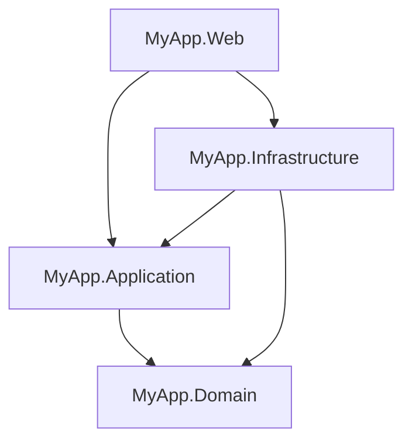

# Clean Architecture with Feature Folders

> **Ref:** `STR008` | **Category:** Structural

Multi-project Clean Architecture with CQRS, where the Application layer co-locates each command/query record with its handler in a single file — reducing the per-operation folder and file ceremony of [STR003](STR003%20-%20full-clean-architecture.md) while keeping identical project separation and dependency rules.

## When to Use

- **3–8 developers** building a domain-rich application where you want compiler-enforced layer boundaries
- You like [STR003](STR003%20-%20full-clean-architecture.md)'s project separation and CQRS but find the per-operation subfolders verbose — `Orders/Commands/CreateOrder/CreateOrderCommand.cs`, `Orders/Commands/CreateOrder/CreateOrderCommandHandler.cs`, `Orders/Commands/CreateOrder/CreateOrderCommandValidator.cs` for a single operation is a lot of ceremony
- Features are the natural unit of work — when a developer picks up "order cancellation," they want one file with the command and its handler, not three files in a dedicated subfolder
- 20+ endpoints where STR003's one-subfolder-per-operation approach creates deeply nested structures that are hard to scan

This is [STR003](STR003%20-%20full-clean-architecture.md) with two changes in the Application project: (1) commands/queries don't get their own subfolders — the record and handler live in one file, and (2) the `Command`/`Query` suffix is dropped from type names in favour of verb-noun (`CreateOrder` not `CreateOrderCommand`). Domain, Infrastructure, and Web are identical.

## When NOT to Use

- Pure CRUD — use [STR001](STR001%20-%20n-tier.md), you don't need four projects
- Small number of endpoints (under ~15) — STR003's per-operation subfolders are fine at that scale and give you more explicit structure
- You want full vertical slices where each feature owns its own data access — use [STR004](STR004%20-%20vertical-slice.md) instead
- Single-project is sufficient — use [STR002](STR002%20-%20clean-architecture-lite.md)
- Your team finds nested classes confusing or your mediator library doesn't discover nested handler types — stick with [STR003](STR003%20-%20full-clean-architecture.md)

## Solution Structure

Domain, Infrastructure, and Web are identical to [STR003](STR003%20-%20full-clean-architecture.md). Only the Application project differs:

```
MyApp/
├── MyApp.sln
├── src/
│   ├── MyApp.Domain/
│   │   ├── MyApp.Domain.csproj              ← references NOTHING
│   │   ├── Entities/
│   │   │   ├── Order.cs
│   │   │   ├── OrderItem.cs
│   │   │   └── Product.cs
│   │   ├── ValueObjects/
│   │   │   ├── Money.cs
│   │   │   └── Address.cs
│   │   ├── Enums/
│   │   │   └── OrderStatus.cs
│   │   ├── Events/
│   │   │   ├── IDomainEvent.cs
│   │   │   └── OrderPlacedEvent.cs
│   │   ├── Exceptions/
│   │   │   ├── DomainException.cs
│   │   │   └── InsufficientStockException.cs
│   │   ├── Interfaces/
│   │   │   ├── IOrderRepository.cs
│   │   │   └── IProductRepository.cs
│   │   └── Services/
│   │       └── PricingService.cs
│   │
│   ├── MyApp.Application/
│   │   ├── MyApp.Application.csproj          ← references Domain
│   │   ├── DependencyInjection.cs
│   │   ├── Common/
│   │   │   ├── Behaviours/
│   │   │   │   ├── LoggingBehaviour.cs
│   │   │   │   └── ValidationBehaviour.cs
│   │   │   ├── Interfaces/
│   │   │   │   ├── ICommand.cs
│   │   │   │   ├── IQuery.cs
│   │   │   │   ├── IDateTimeProvider.cs
│   │   │   │   └── ICurrentUserService.cs
│   │   │   └── Models/
│   │   │       └── PagedResult.cs
│   │   │
│   │   ├── Orders/                           ← FEATURE FOLDER
│   │   │   ├── Commands/
│   │   │   │   ├── CreateOrder.cs
│   │   │   │   ├── CreateOrderValidator.cs
│   │   │   │   ├── CancelOrder.cs
│   │   │   │   └── CancelOrderValidator.cs
│   │   │   ├── Queries/
│   │   │   │   ├── GetOrderById.cs
│   │   │   │   └── ListOrders.cs
│   │   │   ├── EventHandlers/
│   │   │   │   └── OrderPlacedEventHandler.cs
│   │   │   └── DTOs/
│   │   │       ├── OrderDto.cs
│   │   │       └── OrderSummaryDto.cs
│   │   │
│   │   └── Products/                         ← FEATURE FOLDER
│   │       ├── Queries/
│   │       │   ├── GetProductById.cs
│   │       │   └── ListProducts.cs
│   │       └── DTOs/
│   │           └── ProductDto.cs
│   │
│   ├── MyApp.Infrastructure/
│   │   ├── MyApp.Infrastructure.csproj        ← references Application, Domain
│   │   ├── DependencyInjection.cs
│   │   ├── Data/
│   │   │   ├── AppDbContext.cs
│   │   │   ├── Configurations/
│   │   │   │   ├── OrderConfiguration.cs
│   │   │   │   └── ProductConfiguration.cs
│   │   │   └── Interceptors/
│   │   │       └── DomainEventDispatcherInterceptor.cs
│   │   ├── Repositories/
│   │   │   ├── OrderRepository.cs
│   │   │   └── ProductRepository.cs
│   │   └── Services/
│   │       ├── DateTimeProvider.cs
│   │       └── CurrentUserService.cs
│   │
│   └── MyApp.Web/
│       ├── MyApp.Web.csproj                   ← references Application, Infrastructure
│       ├── Program.cs
│       ├── appsettings.json
│       ├── Controllers/
│       │   ├── OrdersController.cs
│       │   └── ProductsController.cs
│       ├── DTOs/
│       │   ├── CreateOrderRequest.cs
│       │   └── OrderResponse.cs
│       └── Middleware/
│           └── ExceptionHandlingMiddleware.cs
│
└── tests/
    ├── MyApp.Domain.Tests/
    ├── MyApp.Application.Tests/
    ├── MyApp.Infrastructure.Tests/
    └── MyApp.Web.Tests/
```

**The key difference from [STR003](STR003%20-%20full-clean-architecture.md):** Both patterns group by feature (Orders/, Products/). The difference is what happens inside each feature folder.

In STR003, each operation gets its own **subfolder** with separate files. Types use explicit `Command`/`Query` suffixes:

```
Application/Orders/
├── Commands/
│   ├── CreateOrder/                        ← subfolder per operation
│   │   ├── CreateOrderCommand.cs           ← record in its own file
│   │   ├── CreateOrderCommandHandler.cs    ← handler in its own file
│   │   └── CreateOrderCommandValidator.cs
│   └── CancelOrder/
│       ├── CancelOrderCommand.cs
│       └── CancelOrderCommandHandler.cs
├── Queries/
│   └── GetOrderById/
│       ├── GetOrderByIdQuery.cs
│       ├── GetOrderByIdQueryHandler.cs
│       └── OrderDto.cs                     ← DTO co-located with its query
└── EventHandlers/
    └── OrderPlacedEventHandler.cs
```

In STR008, operations are **single files** with the handler nested inside. Suffixes are dropped. DTOs get their own subfolder per feature:

```
Application/Orders/
├── Commands/
│   ├── CreateOrder.cs              ← record + nested handler in one file
│   ├── CreateOrderValidator.cs
│   ├── CancelOrder.cs
│   └── CancelOrderValidator.cs
├── Queries/
│   ├── GetOrderById.cs             ← record + nested handler in one file
│   └── ListOrders.cs
├── EventHandlers/
│   └── OrderPlacedEventHandler.cs
└── DTOs/
    ├── OrderDto.cs                 ← shared across all queries in this feature
    └── OrderSummaryDto.cs
```

Two concrete changes:
1. **One file per operation.** The command/query record and its handler live in the **same file** as a nested class. No `CreateOrderCommand.cs` + `CreateOrderCommandHandler.cs` — just `CreateOrder.cs`. Validators stay in a separate file because they can grow large.
2. **No `Command`/`Query` suffix.** Types are named `CreateOrder` not `CreateOrderCommand`, `GetOrderById` not `GetOrderByIdQuery`. The folder they're in (`Commands/` or `Queries/`) provides that context.

## Dependency Rules

Identical to [STR003](STR003%20-%20full-clean-architecture.md):



- `Domain` references nothing.
- `Application` references only `Domain`.
- `Infrastructure` references `Application` and `Domain`.
- `Web` references `Application` and `Infrastructure`.
- **Application MUST NOT reference Infrastructure.**
- **Web should not use Domain types in API contracts** — controllers send commands/queries and return Application DTOs. Web has a transitive reference to Domain through Application, but controllers should not accept or return domain entities.

The compiler enforces the hard boundaries (`Application` → `Domain` only, no reverse) through `.csproj` `<ProjectReference>` entries. The "don't use Domain types in controllers" rule is enforced by code review.

## Naming Conventions

| Element | Convention | Location | Example |
|---------|-----------|----------|---------|
| Entity | singular noun | Domain/Entities | `Order` |
| Value Object | singular noun | Domain/ValueObjects | `Money` |
| Domain Event | `{Entity}{PastVerb}Event` | Domain/Events | `OrderPlacedEvent` |
| Repository Interface | `I{Entity}Repository` | Domain/Interfaces | `IOrderRepository` |
| Repository Impl | `{Entity}Repository` | Infrastructure/Repositories | `OrderRepository` |
| Feature folder | plural noun | Application/ | `Orders/`, `Products/` |
| Command | `{Verb}{Entity}` | Application/{Feature}/Commands | `CreateOrder` |
| Command handler | nested inside command | same file | `CreateOrder.Handler` |
| Command validator | `{Verb}{Entity}Validator` | Application/{Feature}/Commands | `CreateOrderValidator` |
| Query | `{Verb}{Entity}` | Application/{Feature}/Queries | `GetOrderById` |
| Query handler | nested inside query | same file | `GetOrderById.Handler` |
| Application DTO | `{Entity}Dto` | Application/{Feature}/DTOs | `OrderDto` |
| API Request DTO | `{Verb}{Entity}Request` | Web/DTOs | `CreateOrderRequest` |
| API Response DTO | `{Entity}Response` | Web/DTOs | `OrderResponse` |
| Event Handler | `{EventName}Handler` | Application/{Feature}/EventHandlers | `OrderPlacedEventHandler` |

Each command/query file contains both the record and its handler as a nested class. This is the core ergonomic improvement over [STR003](STR003%20-%20full-clean-architecture.md).

## Key Abstractions

Domain entity with behaviour (identical to [STR003](STR003%20-%20full-clean-architecture.md)):

```csharp
public class Order
{
    private readonly List<OrderItem> _items = [];
    private readonly List<IDomainEvent> _domainEvents = [];

    public Guid Id { get; private set; }
    public OrderStatus Status { get; private set; }
    public Address ShippingAddress { get; private set; }
    public Money Total => CalculateTotal();
    public IReadOnlyList<OrderItem> Items => _items.AsReadOnly();
    public IReadOnlyList<IDomainEvent> DomainEvents => _domainEvents.AsReadOnly();

    public Order(Address shippingAddress)
    {
        Id = Guid.NewGuid();
        Status = OrderStatus.Draft;
        ShippingAddress = shippingAddress;
    }

    public void AddItem(Product product, int quantity)
    {
        if (Status != OrderStatus.Draft)
            throw new DomainException("Cannot modify a submitted order.");
        if (!product.HasSufficientStock(quantity))
            throw new InsufficientStockException(product.Id, quantity);

        _items.Add(new OrderItem(product, quantity));
    }

    public void Submit()
    {
        if (_items.Count == 0)
            throw new DomainException("Cannot submit an empty order.");

        Status = OrderStatus.Submitted;
        _domainEvents.Add(new OrderPlacedEvent(Id));
    }

    private Money CalculateTotal() =>
        _items.Aggregate(Money.Zero, (sum, item) => sum + item.LineTotal);
}
```

Command with nested handler — the defining file pattern of this architecture. Define `ICommand<T>` / `ICommandHandler` in `Application/Common/Interfaces/`, or use the interfaces from your chosen mediator library (MediatR, Wolverine, Mediator, etc.):

```csharp
// Application/Orders/Commands/CreateOrder.cs
public sealed record CreateOrder(
    string Street, string City, string PostCode,
    IReadOnlyList<CreateOrder.LineItem> Items) : ICommand<Guid>
{
    public sealed record LineItem(Guid ProductId, int Quantity);

    internal sealed class Handler(
        IOrderRepository orders,
        IProductRepository products) : ICommandHandler<CreateOrder, Guid>
    {
        public async Task<Guid> HandleAsync(CreateOrder command, CancellationToken ct)
        {
            var address = new Address(command.Street, command.City, command.PostCode);
            var order = new Order(address);

            foreach (var item in command.Items)
            {
                var product = await products.GetByIdAsync(item.ProductId, ct)
                    ?? throw new NotFoundException(nameof(Product), item.ProductId);
                order.AddItem(product, item.Quantity);
            }

            order.Submit();
            await orders.AddAsync(order, ct);
            await orders.SaveChangesAsync(ct);

            return order.Id;
        }
    }
}
```

Validator in a separate file:

```csharp
// Application/Orders/Commands/CreateOrderValidator.cs
public sealed class CreateOrderValidator : AbstractValidator<CreateOrder>
{
    public CreateOrderValidator()
    {
        RuleFor(x => x.Items).NotEmpty();
        RuleFor(x => x.Street).NotEmpty();
        RuleFor(x => x.City).NotEmpty();
        RuleFor(x => x.PostCode).NotEmpty();
        RuleForEach(x => x.Items).ChildRules(item =>
        {
            item.RuleFor(x => x.ProductId).NotEmpty();
            item.RuleFor(x => x.Quantity).GreaterThan(0);
        });
    }
}
```

Query with nested handler:

```csharp
// Application/Orders/Queries/GetOrderById.cs
public sealed record GetOrderById(Guid OrderId) : IQuery<OrderDto?>
{
    internal sealed class Handler(
        IOrderRepository orders) : IQueryHandler<GetOrderById, OrderDto?>
    {
        public async Task<OrderDto?> HandleAsync(GetOrderById query, CancellationToken ct)
        {
            var order = await orders.GetByIdAsync(query.OrderId, ct);
            return order is null ? null : new OrderDto(
                order.Id,
                order.Status,
                order.Total.Amount,
                order.Items.Select(i => new OrderDto.LineItemDto(
                    i.ProductId, i.Quantity, i.LineTotal.Amount)).ToList());
        }
    }
}
```

DI registration. The nested handler classes are discovered by assembly scanning — the mediator library finds them the same way it would find top-level handlers:

```csharp
// Application/DependencyInjection.cs
public static class DependencyInjection
{
    public static IServiceCollection AddApplication(this IServiceCollection services)
    {
        var assembly = typeof(DependencyInjection).Assembly;

        services.AddMediatR(cfg => cfg.RegisterServicesFromAssembly(assembly));
        services.AddValidatorsFromAssembly(assembly);

        return services;
    }
}

// Program.cs
builder.Services
    .AddApplication()
    .AddInfrastructure(builder.Configuration);
```

If using a source-generated mediator (Mediator, Wolverine), registration looks different but the principle is the same — scan the Application assembly. Nested handler classes are regular types; assembly scanning finds them.

## Data Flow

**Command flow — `POST /api/orders`:**

```
HTTP Request
    │
    ▼
OrdersController.Create(CreateOrderRequest dto)
    │  maps API DTO → CreateOrder command
    ▼
Mediator dispatches CreateOrder
    │
    ▼
ValidationBehaviour<CreateOrder>
    │  runs CreateOrderValidator
    ▼
CreateOrder.Handler.HandleAsync()
    │  loads Product entities via IProductRepository
    │  creates Order entity, calls order.AddItem(), order.Submit()
    │  persists via IOrderRepository
    ▼
OrderRepository.AddAsync() → OrderRepository.SaveChangesAsync()
    │  delegates to AppDbContext.SaveChangesAsync()
    ▼
DomainEventDispatcherInterceptor (SaveChanges interceptor)
    │  collects domain events from tracked entities
    │  dispatches OrderPlacedEvent via mediator
    ▼
OrderPlacedEventHandler handles event (same transaction)
    │
    ▼
Guid returned → Controller returns 201 Created
```

**Query flow — `GET /api/orders/{id}`:**

```
HTTP Request
    │
    ▼
OrdersController.GetById(Guid id)
    │  creates GetOrderById query
    ▼
Mediator dispatches GetOrderById
    │
    ▼
GetOrderById.Handler.HandleAsync()
    │  queries via IOrderRepository
    │  maps to OrderDto
    ▼
OrderDto returned → Controller maps to OrderResponse → 200 OK
```

Identical data flow to [STR003](STR003%20-%20full-clean-architecture.md). The only difference is file organisation — not runtime behaviour.

## Where Business Logic Lives

**In `MyApp.Domain`.** Same rule as [STR003](STR003%20-%20full-clean-architecture.md).

- **Domain entities** enforce invariants. An entity is never in an invalid state.
- **Domain services** handle cross-entity logic.
- **Application handlers** orchestrate: load → call domain methods → save. No business rules in handlers.
- **Feature folders don't change where logic lives** — they change where you *find* things. Business logic is still in Domain, not scattered across feature folders.

## Testing Strategy

```
tests/
├── MyApp.Domain.Tests/
│   ├── MyApp.Domain.Tests.csproj          ← references Domain only
│   ├── Entities/
│   │   └── OrderTests.cs
│   └── ValueObjects/
│       └── MoneyTests.cs
│
├── MyApp.Application.Tests/
│   ├── MyApp.Application.Tests.csproj     ← references Application, Domain
│   └── Orders/                            ← mirrors feature folder structure
│       ├── Commands/
│       │   ├── CreateOrderTests.cs
│       │   └── CreateOrderValidatorTests.cs
│       └── Queries/
│           └── GetOrderByIdTests.cs
│
├── MyApp.Infrastructure.Tests/
│   ├── MyApp.Infrastructure.Tests.csproj
│   └── Repositories/
│       └── OrderRepositoryTests.cs
│
└── MyApp.Web.Tests/
    ├── MyApp.Web.Tests.csproj
    ├── CustomWebApplicationFactory.cs
    └── Endpoints/
        ├── OrdersEndpointTests.cs
        └── ProductsEndpointTests.cs
```

Test projects mirror the source structure. Application tests follow the feature folder layout — `Orders/Commands/CreateOrderTests.cs` maps to `Orders/Commands/CreateOrder.cs`.

**Domain.Tests** — pure unit tests. No mocks, no database. Test entity invariants and value object behaviour.

**Application.Tests** — handler tests with mocked repositories. Verify orchestration, not business rules (those are covered by Domain.Tests). Validator tests with known inputs. Requires `[assembly: InternalsVisibleTo("MyApp.Application.Tests")]` in the Application project since handlers are `internal`.

```csharp
public sealed class CreateOrderTests
{
    private readonly IOrderRepository _orders = Substitute.For<IOrderRepository>();
    private readonly IProductRepository _products = Substitute.For<IProductRepository>();
    private readonly CreateOrder.Handler _sut;

    public CreateOrderTests()
    {
        _sut = new CreateOrder.Handler(_orders, _products);
    }

    [Fact]
    public async Task ValidOrder_SubmitsAndPersists()
    {
        var product = new Product("Widget", stockQuantity: 10, price: 9.99m);
        _products.GetByIdAsync(product.Id, Arg.Any<CancellationToken>())
            .Returns(product);

        var command = new CreateOrder("1 Main St", "London", "SW1A",
            [new CreateOrder.LineItem(product.Id, 2)]);

        var orderId = await _sut.HandleAsync(command, CancellationToken.None);

        orderId.Should().NotBeEmpty();
        await _orders.Received(1).AddAsync(
            Arg.Is<Order>(o => o.Status == OrderStatus.Submitted && o.Items.Count == 1),
            Arg.Any<CancellationToken>());
    }
}
```

**Infrastructure.Tests** — integration tests with a test container library.

**Web.Tests** — full HTTP pipeline tests with `WebApplicationFactory`.

## Common Mistakes

1. **Splitting command and handler into separate files.** The whole point of this pattern is co-location. `CreateOrder` (record) and `CreateOrder.Handler` (nested class) live in one file. If you separate them, you've just recreated [STR003](STR003%20-%20full-clean-architecture.md) with different folder names.

2. **Business logic in handlers.** Feature folders don't change where logic lives. The handler still just orchestrates — business rules still belong in Domain entities. Don't let the feature-folder ergonomics tempt you into putting logic in the handler "because it's right there."

3. **Feature folders referencing each other's DTOs.** `Orders/Commands/CreateOrder.Handler` imports a DTO from `Products/DTOs/ProductDto.cs`. Feature folders within Application should be independent. If a handler needs product data, it uses `IProductRepository` from Domain, not another feature's DTO. Cross-feature DTOs that genuinely need sharing (pagination, sorting) belong in `Common/`.

4. **Mixing feature-folder and layer-first organisation.** Some features use `Orders/Commands/CreateOrder.cs`, others put everything in `Payments/CreatePaymentCommand.cs` without the Commands/Queries subfolder. Pick one structure and apply it consistently across all features.

5. **Forgetting DTOs are per-feature.** `OrderDto` lives in `Orders/DTOs/`, not in a shared `Common/DTOs/` folder. Each feature defines the shape it needs. If two features need different views of an order, they each define their own DTO.

6. **Validators that enforce business rules.** validators in Application should check structural validity (non-empty, correct format, within range). Business rules ("order cannot exceed credit limit") belong in Domain entities, not validators.

7. **Giant feature folders.** If `Orders/` has 30+ files, break it into sub-features: `Orders/Placement/`, `Orders/Fulfilment/`, `Orders/Returns/`. The feature folder should be scannable at a glance.

8. **Web controllers organised differently from Application features.** If Application has `Orders/`, `Products/`, `Shipping/`, the Web controllers should mirror that grouping. `OrdersController` maps to the `Orders/` feature folder. Don't reorganise at the API layer.

9. **Making the handler `public`.** Handlers should be `internal sealed`. They are implementation details of the feature — only the command/query record is part of the public contract. The mediator dispatches by scanning the assembly, so the handler doesn't need to be public. Use `InternalsVisibleTo` for test projects.

10. **Missing CancellationToken propagation.** Every `async` method in the handler chain should accept and forward a `CancellationToken`. Repository interfaces should include it in their signatures. Dropping the token silently makes the application unresponsive to client disconnects and shutdown signals.

## Related Packages

- **Mediator:** [MediatR](https://github.com/jbogard/MediatR) · [Wolverine](https://github.com/JasperFx/wolverine) · [Mediator](https://github.com/martinothamar/Mediator) (source-generated)
- **Validation:** [FluentValidation](https://github.com/FluentValidation/FluentValidation) · [System.ComponentModel.DataAnnotations](https://www.nuget.org/packages/System.ComponentModel.Annotations)
- **Testing:** [xUnit](https://github.com/xunit/xunit), [NUnit](https://github.com/nunit/nunit) · [NSubstitute](https://github.com/nsubstitute/NSubstitute), [Moq](https://github.com/devlooped/moq) · [FluentAssertions](https://github.com/fluentassertions/fluentassertions) · [Testcontainers](https://github.com/testcontainers/testcontainers-dotnet) · [Bogus](https://github.com/bchavez/Bogus)
- **Architecture testing:** [NetArchTest](https://github.com/BenMorris/NetArchTest) · [ArchUnitNET](https://github.com/TNG/ArchUnitNET)
