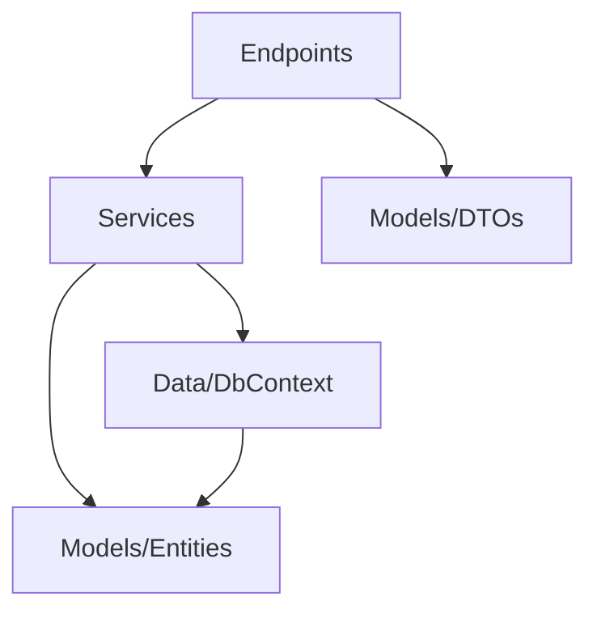

# Minimal API

> **Ref:** `STR009` | **Category:** Structural

Lightweight API architecture using .NET's Minimal API pipeline — no MVC controllers, no model binding pipeline, no action filters. Routes are registered explicitly via `MapGet`/`MapPost` and organised by route groups.

## When to Use

- **1–4 developers** building an API-first application
- You want a lightweight, low-ceremony API without the MVC pipeline
- Microservice internals where each service is small and focused
- You prefer explicit over convention-based routing
- Performance-sensitive APIs where the MVC middleware pipeline overhead matters
- New .NET projects (8+) — Minimal API is now the default project template

## When NOT to Use

- You need MVC features: custom output formatters, complex content negotiation, view rendering
- Large APIs (50+ endpoints) without a clear organisational strategy — controllers provide natural grouping that Minimal APIs need to create explicitly via `MapGroup`
- Teams that are deeply familiar with MVC and have no reason to switch
- If you're building a Razor Pages or Blazor Server app — those use MVC internally

## Solution Structure

```
MyApp/
├── MyApp.sln
└── src/
    └── MyApp/
        ├── MyApp.csproj
        ├── Program.cs
        ├── appsettings.json
        │
        ├── Endpoints/
        │   ├── OrderEndpoints.cs
        │   └── ProductEndpoints.cs
        │
        ├── Services/
        │   ├── IOrderService.cs
        │   ├── OrderService.cs
        │   ├── IProductService.cs
        │   └── ProductService.cs
        │
        ├── Models/
        │   ├── Entities/
        │   │   ├── Order.cs
        │   │   └── Product.cs
        │   └── DTOs/
        │       ├── CreateOrderRequest.cs
        │       ├── OrderResponse.cs
        │       └── ProductResponse.cs
        │
        ├── Data/
        │   ├── AppDbContext.cs
        │   └── Configurations/
        │       └── OrderConfiguration.cs
        │
        ├── Filters/
        │   └── ValidationFilter.cs
        │
        └── Infrastructure/
            └── GlobalExceptionHandler.cs
```

**Endpoints/** — One file per resource, each containing a static class with an extension method that registers all routes for that resource via `MapGroup`. This is the structural replacement for controllers.

**Services/** — Business logic, same as [STR001](STR001%20-%20n-tier.md). Endpoints are thin — they call services.

**Models/** — Entities and DTOs, same as N-Tier.

**Data/** — EF Core DbContext and configurations.

**Filters/** — Endpoint filters replace MVC action filters. Validation, logging, authorization checks.

**Infrastructure/** — Cross-cutting concerns like `IExceptionHandler` implementations, middleware configuration.

## Dependency Rules



- Endpoints depend on service interfaces and DTOs
- Services depend on data access and entities
- **Endpoints must not** access `AppDbContext` directly — go through services
- **Endpoints must not** contain business logic — they map HTTP to service calls

## Naming Conventions

| Element | Convention | Example |
|---------|-----------|---------|
| Endpoint file | `{Resource}Endpoints` | `OrderEndpoints` |
| Route group | plural, lowercase | `/api/orders` |
| Request DTO | `{Verb}{Entity}Request` | `CreateOrderRequest` |
| Response DTO | `{Entity}Response` | `OrderResponse` |
| Endpoint filter | `{Concern}Filter` | `ValidationFilter` |
| Exception handler | `{Scope}ExceptionHandler` | `GlobalExceptionHandler` |

## Key Abstractions

The primary unit of organisation is the **route group per resource**, defined in a static class with an extension method. Each resource gets one file. Use `TypedResults` instead of `Results` — the return type encodes the possible responses, enabling automatic OpenAPI metadata generation without manual `.Produces<T>()` calls:

```csharp
// Endpoints/OrderEndpoints.cs
public static class OrderEndpoints
{
    public static void Map(IEndpointRouteBuilder app)
    {
        var group = app.MapGroup("/orders")
            .WithTags("Orders");

        group.MapPost("/", CreateAsync).WithName("CreateOrder");
        group.MapGet("/{id:guid}", GetByIdAsync).WithName("GetOrderById");
        group.MapGet("/", ListAsync).WithName("ListOrders");
    }

    private static async Task<Results<Created<OrderResponse>, ValidationProblem>> CreateAsync(
        CreateOrderRequest request,
        IOrderService orderService,
        CancellationToken ct)
    {
        var order = await orderService.CreateAsync(request, ct);
        return TypedResults.Created($"/api/orders/{order.Id}", order);
    }

    private static async Task<Results<Ok<OrderResponse>, NotFound>> GetByIdAsync(
        Guid id,
        IOrderService orderService,
        CancellationToken ct)
    {
        var order = await orderService.GetByIdAsync(id, ct);
        return order is null
            ? TypedResults.NotFound()
            : TypedResults.Ok(order);
    }

    private static async Task<Ok<IReadOnlyList<OrderResponse>>> ListAsync(
        IOrderService orderService,
        CancellationToken ct)
    {
        var orders = await orderService.ListAsync(ct);
        return TypedResults.Ok(orders);
    }
}
```

`Program.cs` is minimal — register route groups, not individual routes:

```csharp
var app = builder.Build();

var api = app.MapGroup("/api");
OrderEndpoints.Map(api);
ProductEndpoints.Map(api);

app.Run();
```

This is structurally similar to a controller — one class groups related operations for a resource, with shared route prefix and tags. The difference is the pipeline: no MVC model binding, no action filters, no base class. The route group is explicit configuration rather than convention.

Endpoint filter (replaces MVC action filters). Note: endpoint filters using constructor injection must be added with `.AddEndpointFilter<T>()` which resolves `T` from DI, or alternatively use the factory overload for inline filters:

```csharp
public sealed class ValidationFilter<T>(IValidator<T> validator) : IEndpointFilter
    where T : class
{
    public async ValueTask<object?> InvokeAsync(
        EndpointFilterInvocationContext context, EndpointFilterDelegate next)
    {
        var request = context.Arguments.OfType<T>().FirstOrDefault();
        if (request is null)
            return Results.BadRequest();

        var result = await validator.ValidateAsync(request);
        if (!result.IsValid)
            return Results.ValidationProblem(result.ToDictionary());

        return await next(context);
    }
}
```

For simple cross-cutting concerns, the inline factory overload is often simpler:

```csharp
group.AddEndpointFilterFactory((factoryContext, next) =>
{
    return async (invocationContext) =>
    {
        var logger = invocationContext.HttpContext.RequestServices
            .GetRequiredService<ILogger<Program>>();

        var sw = Stopwatch.StartNew();
        var result = await next(invocationContext);
        logger.LogInformation("{Method} completed in {Elapsed}ms",
            factoryContext.MethodInfo.Name, sw.ElapsedMilliseconds);

        return result;
    };
});
```

## Data Flow

```
POST /api/orders
    │
    ▼
Minimal API route match → OrderEndpoints.CreateAsync
    │  DI injects IOrderService, deserialises CreateOrderRequest
    ▼
IOrderService.CreateAsync(request)
    │  validates, creates entity, persists
    ▼
AppDbContext.SaveChangesAsync()
    │
    ▼
OrderResponse returned → TypedResults.Created(url, response) → HTTP 201
```

Compared to MVC controllers:
- No model binding pipeline — parameters are bound from route/query/body/form via built-in binding, `[AsParameters]` for grouping, or `IBindableFromHttpContext<T>` for custom binding
- No action filter chain — endpoint filters are simpler and more explicit
- No controller base class overhead — endpoint methods are static
- No automatic content negotiation — responses are always JSON (unless you explicitly return a different `IResult`)

## Where Business Logic Lives

**In the service layer** — same as [STR001](STR001%20-%20n-tier.md).

Endpoints are the HTTP layer. They:
- Receive the request
- Call a service
- Return an `IResult`

If an endpoint method has more than 5–8 lines, it's probably doing too much. Business logic belongs in services, not in endpoint handlers.

When an endpoint needs many route/query/header parameters, group them with `[AsParameters]` instead of listing them individually:

```csharp
public sealed record ListOrdersParameters(
    [FromQuery] int Page,
    [FromQuery] int PageSize,
    [FromQuery] string? Status,
    IOrderService OrderService,
    CancellationToken Ct);

private static async Task<Ok<PagedResult<OrderResponse>>> HandleAsync(
    [AsParameters] ListOrdersParameters p)
{
    var result = await p.OrderService.ListAsync(p.Page, p.PageSize, p.Status, p.Ct);
    return TypedResults.Ok(result);
}
```

## Testing Strategy

```
MyApp/
├── src/
│   └── MyApp/
└── tests/
    ├── MyApp.UnitTests/
    │   └── Services/
    │       ├── OrderServiceTests.cs
    │       └── ProductServiceTests.cs
    └── MyApp.IntegrationTests/
        ├── CustomWebApplicationFactory.cs
        └── Endpoints/
            ├── CreateOrderTests.cs
            └── ListOrdersTests.cs
```

**Unit tests** — test service methods with mocked dependencies. Same as N-Tier.

**Integration tests** — test endpoints with `WebApplicationFactory`. Minimal APIs work seamlessly with `WebApplicationFactory<Program>`. You must expose the `Program` class — either add `public partial class Program { }` at the bottom of `Program.cs` or add `[assembly: InternalsVisibleTo("MyApp.IntegrationTests")]`:

```csharp
public sealed class CustomWebApplicationFactory : WebApplicationFactory<Program>
{
    protected override void ConfigureWebHost(IWebHostBuilder builder)
    {
        builder.ConfigureServices(services =>
        {
            services.RemoveAll<DbContextOptions<AppDbContext>>();
            services.AddDbContext<AppDbContext>(options =>
                options.UseInMemoryDatabase("TestDb"));
        });
    }
}

public sealed class CreateOrderTests(CustomWebApplicationFactory factory)
    : IClassFixture<CustomWebApplicationFactory>
{
    private readonly HttpClient _client = factory.CreateClient();

    [Fact]
    public async Task ValidOrder_Returns201WithLocation()
    {
        var request = new CreateOrderRequest
        {
            ProductId = seededProductId,
            Quantity = 2,
            ShippingAddress = "123 Main St"
        };

        var response = await _client.PostAsJsonAsync("/api/orders", request);

        response.StatusCode.Should().Be(HttpStatusCode.Created);
        response.Headers.Location.Should().NotBeNull();

        var order = await response.Content.ReadFromJsonAsync<OrderResponse>();
        order.Should().NotBeNull();
    }
}
```

## Common Mistakes

1. **All endpoints in `Program.cs`.** A `Program.cs` with 200 lines of `app.MapGet`/`app.MapPost` calls. Extract into route group classes — one per resource. `Program.cs` should register groups, not individual routes.

2. **Business logic in endpoint handlers.** The handler validates stock, calculates totals, sends emails. Move this to a service. The endpoint handler calls one service method and returns the result.

3. **No route grouping.** Every endpoint repeats `.WithTags("Orders")` and the route prefix. Use `MapGroup` to share configuration across related endpoints — tags, authorization policies, rate limiting, and route prefixes go on the group.

4. **Missing OpenAPI metadata.** Minimal APIs don't auto-generate Swagger schemas like MVC does. The fix is to use `TypedResults` with union return types (`Task<Results<Ok<T>, NotFound>>`) — the framework infers `.Produces<T>()` automatically from the return type. If you use plain `IResult` as the return type, you must add `.Produces<T>()` manually or your API documentation will be empty. Always add `.WithName()` — it's required for link generation and OpenAPI operation IDs.

5. **Injecting too many dependencies into endpoint methods.** An endpoint method with 8 parameters. This signals the endpoint is doing too much. It should take a request DTO and one service.

6. **Not using TypedResults for compile-time safety.** `Results.Ok(dto)` returns `IResult` — the compiler can't check the response type and OpenAPI metadata can't be inferred. Use `TypedResults.Ok(dto)` which returns `Ok<T>`, and declare the handler return type as `Results<Ok<OrderResponse>, NotFound>` so the framework infers all possible responses for OpenAPI generation. This is not just a best practice — it eliminates an entire class of "my Swagger docs don't match my API" bugs.

7. **Mixing Minimal APIs and Controllers.** Pick one approach for the project. Mixing creates confusion about where to add new endpoints and how filters/middleware are applied. If migrating from MVC, convert all endpoints or none.

8. **No global exception handling.** MVC has middleware and exception filters by default. Minimal APIs need explicit exception handling — register `IExceptionHandler` and call `app.UseExceptionHandler()`, or add a `UseStatusCodePages` middleware. Prefer `IExceptionHandler` (.NET 8+) over a catch-all endpoint filter — it runs in the middleware pipeline where it can catch errors from model binding, authorization, and other middleware, not just the handler itself.

9. **Returning `Task<IResult>` when TypedResults are available.** Handler returns `Task<IResult>` with `TypedResults` calls inside. The compiler and OpenAPI generator cannot see the actual response types. Change the return type to `Task<Results<Ok<OrderResponse>, NotFound>>` — the union type makes every possible response explicit.

10. **Not exposing `Program` for integration tests.** `WebApplicationFactory<Program>` needs the `Program` class to be accessible. Add `public partial class Program { }` at the bottom of `Program.cs` or use `InternalsVisibleTo`. Without this, integration tests won't compile.

## Related Packages

- **Validation:** [FluentValidation](https://github.com/FluentValidation/FluentValidation) · [MiniValidation](https://github.com/DamianEdwards/MiniValidation)
- **OpenAPI:** [Swashbuckle](https://github.com/domaindrivendev/Swashbuckle.AspNetCore) · [NSwag](https://github.com/RicoSuter/NSwag) · [Microsoft.AspNetCore.OpenApi](https://www.nuget.org/packages/Microsoft.AspNetCore.OpenApi)
- **Testing:** [xUnit](https://github.com/xunit/xunit), [NUnit](https://github.com/nunit/nunit) · [FluentAssertions](https://github.com/fluentassertions/fluentassertions) · [Testcontainers](https://github.com/testcontainers/testcontainers-dotnet) · [Bogus](https://github.com/bchavez/Bogus)
