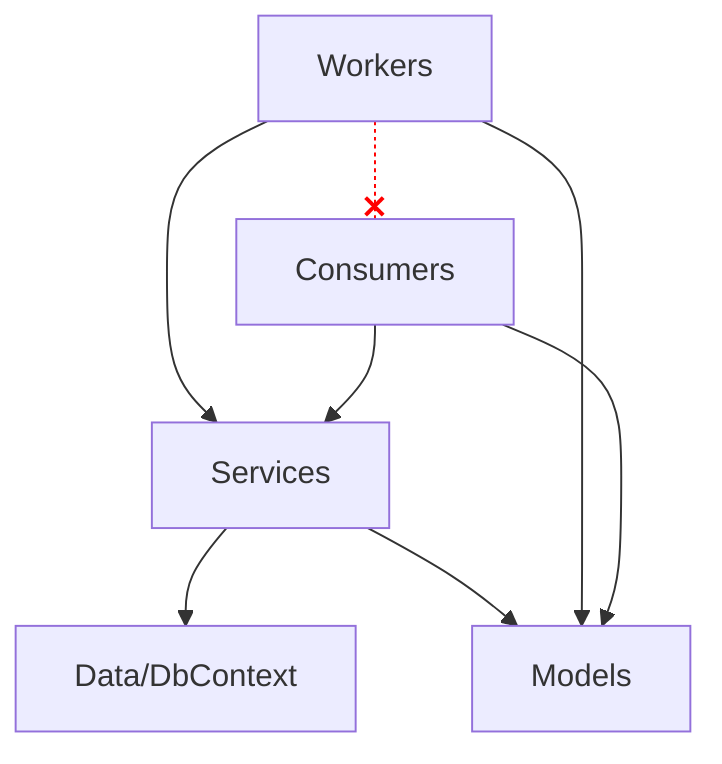

# Worker Service

> **Ref:** `STR010` | **Category:** Structural

Background processing architecture for queue consumers, scheduled jobs, and long-running services — no HTTP pipeline, hosted as a Windows Service, Linux daemon, or container.

## When to Use

- **Queue consumers** — processing messages from RabbitMQ, Azure Service Bus, SQS, Kafka
- **Scheduled jobs** — recurring tasks like report generation, data cleanup, email digests
- **Long-running processes** — file watchers, data synchronisation, polling external systems
- **Event handlers** in a microservices architecture — a service that only reacts to events and never exposes an HTTP API
- Any workload that runs continuously or on a schedule, without serving HTTP requests

## When NOT to Use

- You also need HTTP endpoints — use an API pattern ([STR001](STR001%20-%20n-tier.md), [STR009](STR009%20-%20minimal-api.md)) with `IHostedService` for background work within the same process
- The job is a one-off or ad-hoc task — use a console app
- The job runs on a cron schedule and exits — use a console app triggered by OS scheduler, Kubernetes CronJob, or Azure Container Apps Jobs. A worker service that sleeps 23 hours between runs is wasting resources
- You need a UI — this is a headless service

## Solution Structure

```
MyApp/
├── MyApp.sln
└── src/
    └── MyApp.Worker/
        ├── MyApp.Worker.csproj
        ├── Program.cs
        ├── appsettings.json
        │
        ├── Workers/
        │   ├── OrderProcessingWorker.cs
        │   ├── ReportGenerationWorker.cs
        │   └── DataCleanupWorker.cs
        │
        ├── Consumers/
        │   ├── OrderPlacedConsumer.cs
        │   └── PaymentCompletedConsumer.cs
        │
        ├── Services/
        │   ├── IOrderProcessor.cs
        │   ├── OrderProcessor.cs
        │   ├── IReportGenerator.cs
        │   └── ReportGenerator.cs
        │
        ├── Models/
        │   ├── Order.cs
        │   └── ReportConfig.cs
        │
        ├── Data/
        │   ├── WorkerDbContext.cs
        │   └── Configurations/
        │       └── OrderConfiguration.cs
        │
        └── Infrastructure/
            ├── DependencyInjection.cs
            └── HealthChecks/
                └── WorkerHealthCheck.cs
```

**Workers/** — `BackgroundService` implementations. Each worker is a long-running loop or scheduled task. One class per logical workload.

**Consumers/** — Message queue consumers. Each consumer handles one event/message type. The messaging library determines the base class.

**Services/** — Business logic. Workers and consumers are thin — they receive a trigger (timer tick, message) and delegate to a service.

**Models/** — Domain entities and message contracts. If this worker is part of a microservices system, message contracts come from a shared `Contracts` package.

**Data/** — EF Core DbContext for data access, if needed.

**Infrastructure/** — DI registration, health checks, telemetry configuration.

The worker project should reference `Microsoft.Extensions.Hosting`. For OS service integration, add `Microsoft.Extensions.Hosting.WindowsServices` and/or `Microsoft.Extensions.Hosting.Systemd`. These are lightweight packages — not the full ASP.NET Core stack.

## Dependency Rules



- Workers and consumers depend on service interfaces and models (for message contracts / DTOs)
- Services depend on data access and models
- **Workers do not call consumers and vice versa** — they are independent entry points
- **Workers and consumers must not contain business logic** — they are trigger mechanisms

## Naming Conventions

| Element | Convention | Example |
|---------|-----------|---------|
| Worker | `{Purpose}Worker` | `OrderProcessingWorker` |
| Consumer | `{EventName}Consumer` | `OrderPlacedConsumer` |
| Service interface | `I{Name}` | `IOrderProcessor` |
| Service implementation | `{Name}` | `OrderProcessor` |
| Health check | `{Concern}HealthCheck` | `WorkerHealthCheck` |

## Key Abstractions

A `BackgroundService` worker with a timed loop using `PeriodicTimer` (.NET 6+):

```csharp
public sealed class DataCleanupWorker(
    IServiceScopeFactory scopeFactory,
    ILogger<DataCleanupWorker> logger) : BackgroundService
{
    private static readonly TimeSpan Interval = TimeSpan.FromHours(1);

    protected override async Task ExecuteAsync(CancellationToken stoppingToken)
    {
        using var timer = new PeriodicTimer(Interval);

        while (await timer.WaitForNextTickAsync(stoppingToken))
        {
            try
            {
                await using var scope = scopeFactory.CreateAsyncScope();
                var cleaner = scope.ServiceProvider.GetRequiredService<IDataCleaner>();
                var deleted = await cleaner.CleanExpiredRecordsAsync(stoppingToken);
                logger.LogInformation("Cleaned {Count} expired records", deleted);
            }
            catch (Exception ex) when (ex is not OperationCanceledException)
            {
                logger.LogError(ex, "Data cleanup failed");
            }
        }
    }
}
```

Prefer `PeriodicTimer` over `while (!token.IsCancellationRequested) { ... await Task.Delay(...) }`. `PeriodicTimer` handles cancellation cleanly (returns `false` instead of throwing), avoids timer drift, and produces cleaner code. Use `CreateAsyncScope()` over `CreateScope()` when the resolved services implement `IAsyncDisposable`.

**Important:** If `ExecuteAsync` returns (either normally or via an unhandled exception), the host will shut down in .NET 8+. This is a change from earlier versions where a completed `ExecuteAsync` was silently ignored. A timed worker should never exit its loop unless cancellation is requested.

A queue consumer (using a messaging library as an example — adapt for yours):

```csharp
public sealed class OrderPlacedConsumer(
    IOrderProcessor processor,
    ILogger<OrderPlacedConsumer> logger) : IConsumer<OrderPlacedEvent>
{
    public async Task Consume(ConsumeContext<OrderPlacedEvent> context)
    {
        logger.LogInformation("Processing order {OrderId}", context.Message.OrderId);
        await processor.ProcessAsync(context.Message.OrderId, context.CancellationToken);
    }
}
```

`Program.cs` registration:

```csharp
var builder = Host.CreateApplicationBuilder(args);

builder.Services.AddWindowsService();
builder.Services.AddSystemd();

builder.Services.AddHostedService<DataCleanupWorker>();
builder.Services.AddHostedService<OrderProcessingWorker>();

builder.Services.AddScoped<IOrderProcessor, OrderProcessor>();
builder.Services.AddScoped<IDataCleaner, DataCleaner>();

builder.Services.AddDbContext<WorkerDbContext>(options =>
    options.UseSqlServer(builder.Configuration.GetConnectionString("Default")));

builder.Services.AddHealthChecks()
    .AddCheck<WorkerHealthCheck>("worker");

var host = builder.Build();
host.Run();
```

`AddWindowsService()` (from `Microsoft.Extensions.Hosting.WindowsServices`) and `AddSystemd()` (from `Microsoft.Extensions.Hosting.Systemd`) are safe to call unconditionally — they only activate when actually running as a Windows Service or under systemd respectively. They set the content root correctly and hook into OS lifecycle events.

**Critical: scoped services in workers.** `BackgroundService` is a singleton. EF Core's `DbContext` is scoped by default. You **must** create a scope manually using `IServiceScopeFactory` inside the worker loop. Injecting `DbContext` directly into a `BackgroundService` constructor will silently reuse a single instance for the entire application lifetime — accumulating tracked entities, leaking memory, and returning stale data.

## Data Flow

**Queue consumer flow:**

```
Message arrives on queue
    │
    ▼
Messaging library deserialises → OrderPlacedEvent
    │
    ▼
OrderPlacedConsumer.Consume(context)
    │  extracts data from message
    ▼
IOrderProcessor.ProcessAsync(orderId)
    │  loads order from DB
    │  applies business logic
    │  saves result
    │  optionally publishes new events
    ▼
Message acknowledged → next message
```

**Scheduled worker flow:**

```
PeriodicTimer tick (every N minutes/hours)
    │
    ▼
DataCleanupWorker.ExecuteAsync loop iteration
    │  creates DI scope
    ▼
IDataCleaner.CleanExpiredRecordsAsync()
    │  queries for expired records
    │  deletes them
    │  returns count
    ▼
Log result → await next tick → loop
```

## Health Checks

Worker services have no HTTP pipeline, so health checks need a different exposure strategy than APIs. Two options:

**Option 1: TCP health check endpoint** — add a minimal TCP listener. Useful for container orchestrators (Kubernetes liveness/readiness probes).

```csharp
builder.Services
    .AddHealthChecks()
    .AddCheck<WorkerHealthCheck>("worker");

builder.Services.Configure<HealthCheckPublisherOptions>(options =>
{
    options.Delay = TimeSpan.FromSeconds(5);
    options.Period = TimeSpan.FromSeconds(30);
});
```

For Kubernetes, the simplest approach is to add `AspNetCore.HealthChecks.Publisher.Prometheus` or write health status to a file that a `livenessProbe.exec` command can check.

**Option 2: Minimal health endpoint** — add a single `/healthz` endpoint. This requires adding `WebApplication` instead of the generic host, which adds HTTP overhead but gives you a standard health URL.

**Implementing the health check itself:** Track the last successful execution time in the worker and check it in the health check.

```csharp
public sealed class WorkerHealthCheck(
    TimeProvider timeProvider) : IHealthCheck
{
    private long _lastHeartbeatTicks;
    private readonly TimeSpan _maxSilence = TimeSpan.FromMinutes(10);

    public void RecordHeartbeat() =>
        Interlocked.Exchange(ref _lastHeartbeatTicks, timeProvider.GetUtcNow().UtcTicks);

    public Task<HealthCheckResult> CheckHealthAsync(
        HealthCheckContext context,
        CancellationToken cancellationToken = default)
    {
        var lastTicks = Interlocked.Read(ref _lastHeartbeatTicks);
        var elapsed = timeProvider.GetUtcNow() - new DateTimeOffset(lastTicks, TimeSpan.Zero);
        return Task.FromResult(elapsed > _maxSilence
            ? HealthCheckResult.Unhealthy($"No heartbeat for {elapsed}")
            : HealthCheckResult.Healthy());
    }
}
```

Register the health check as a singleton so the worker and the health check infrastructure share the same instance. The worker calls `RecordHeartbeat()` after each successful iteration.

## Where Business Logic Lives

**In the service layer.** Workers and consumers are triggers — they don't contain logic.

- Workers know **when** to run (timer, condition). They don't know **what** to do — they call a service.
- Consumers know **which message** arrived. They don't know **how** to process it — they call a service.
- Services contain all business logic and are independently testable without timers or message queues.

## Testing Strategy

```
MyApp/
├── src/
│   └── MyApp.Worker/
└── tests/
    ├── MyApp.Worker.UnitTests/
    │   └── Services/
    │       ├── OrderProcessorTests.cs
    │       └── DataCleanerTests.cs
    └── MyApp.Worker.IntegrationTests/
        └── Consumers/
            └── OrderPlacedConsumerTests.cs
```

**Unit tests** — test service classes with mocked dependencies. This is where you test business logic. Don't test the `BackgroundService` directly — test the service it calls.

```csharp
[Fact]
public async Task ProcessAsync_CompletesOrder_WhenPaymentConfirmed()
{
    var order = new Order { Id = Guid.NewGuid(), Status = OrderStatus.PaymentPending };
    _orderRepo.GetByIdAsync(order.Id).Returns(order);

    await _processor.ProcessAsync(order.Id, CancellationToken.None);

    order.Status.Should().Be(OrderStatus.Processing);
    await _orderRepo.Received(1).SaveChangesAsync(Arg.Any<CancellationToken>());
}
```

**Integration tests for consumers** — test message handling end-to-end. Some messaging libraries provide in-memory test harnesses. Alternatively, use a test container library with a real broker (RabbitMQ, Redis). Publish a message, assert the consumer processed it and the expected side effects occurred.

**Don't unit test `BackgroundService` timing logic.** The loop, the timer, the scope creation — these are infrastructure concerns. Test the services they call. If you find yourself wanting to test that the worker "runs every hour," you're testing the framework, not your code.

**If you must test a worker directly** — for example, to verify it handles exceptions without crashing — inject `TimeProvider.System` via DI and use `FakeTimeProvider` in tests to control time without real delays.

## Common Mistakes

1. **Business logic in workers.** A `BackgroundService.ExecuteAsync` method with 100 lines of business logic. Extract it into a service. The worker should be 10–15 lines: create scope, get service, call method, log, delay.

2. **Not creating a DI scope.** Injecting `DbContext` or other scoped services directly into a `BackgroundService` constructor. The `DbContext` will be reused across all iterations, accumulating tracked entities and eventually failing. Always use `IServiceScopeFactory.CreateScope()`.

3. **Swallowing exceptions silently.** A `catch (Exception) { }` in the worker loop. If the worker fails silently, you won't know until data stops being processed. Log the exception, increment a metric, and decide whether to retry or skip.

4. **No health checks.** The worker is running but stuck — a consumer's connection died, a timer stopped firing. Add health checks that verify the worker is actively processing. Expose them on a minimal HTTP endpoint or through the health check publisher pattern.

5. **No graceful shutdown.** Ignoring the `CancellationToken`. When the host shuts down, in-progress work should complete or be abandoned cleanly. Always pass `stoppingToken` to async methods and check `stoppingToken.IsCancellationRequested` in loops.

6. **Unbounded parallelism.** Processing messages as fast as possible without rate limiting. If the consumer processes faster than downstream systems can handle, you'll overwhelm databases or external APIs. Use concurrency limits in your messaging library.

7. **No idempotency.** A message is delivered twice (at-least-once delivery is the norm) and the consumer creates duplicate records. Consumers must be idempotent. Strategies: use a unique constraint on a natural key so duplicates are rejected by the database; store processed message IDs in an idempotency table and skip known IDs; use upserts instead of inserts. The right strategy depends on your domain — but "hope it doesn't happen" is never the right one.

8. **Mixing HTTP and background work without clear separation.** A worker service that also exposes a few HTTP endpoints for monitoring, with business logic shared between the API handlers and the workers in an ad-hoc way. If you need both HTTP and background processing, either use a proper API pattern with `IHostedService` for the background work, or keep them as separate deployables.

9. **Blocking host startup in `ExecuteAsync`.** `ExecuteAsync` is called during host startup. If it does synchronous work or a long-running operation before its first `await`, it blocks all subsequent hosted services from starting. The first thing `ExecuteAsync` does should be an `await` — the `PeriodicTimer.WaitForNextTickAsync()` pattern handles this naturally.

10. **Using `Task.Delay` instead of `PeriodicTimer`.** The `while + Task.Delay` loop has two problems: `Task.Delay` throws `OperationCanceledException` on cancellation (requiring extra handling), and it causes timer drift because the delay starts *after* the work completes rather than on a fixed schedule. Use `PeriodicTimer` for fixed-interval work.

## Related Packages

- **Hosting:** [Microsoft.Extensions.Hosting.WindowsServices](https://www.nuget.org/packages/Microsoft.Extensions.Hosting.WindowsServices) · [Microsoft.Extensions.Hosting.Systemd](https://www.nuget.org/packages/Microsoft.Extensions.Hosting.Systemd)
- **Messaging:** [MassTransit](https://github.com/MassTransit/MassTransit) · [NServiceBus](https://github.com/Particular/NServiceBus) · [Wolverine](https://github.com/JasperFx/wolverine) · [Brighter](https://github.com/BrighterCommand/Brighter)
- **Scheduling:** [Quartz.NET](https://github.com/quartznet/quartznet) · [Hangfire](https://github.com/HangfireIO/Hangfire) · [Cronos](https://github.com/HangfireIO/Cronos)
- **Health checks:** AspNetCore.HealthChecks.*
- **Testing:** [xUnit](https://github.com/xunit/xunit), [NUnit](https://github.com/nunit/nunit) · [NSubstitute](https://github.com/nsubstitute/NSubstitute), [Moq](https://github.com/devlooped/moq) · [Testcontainers](https://github.com/testcontainers/testcontainers-dotnet) · [Microsoft.Extensions.TimeProvider.Testing](https://www.nuget.org/packages/Microsoft.Extensions.TimeProvider.Testing)
