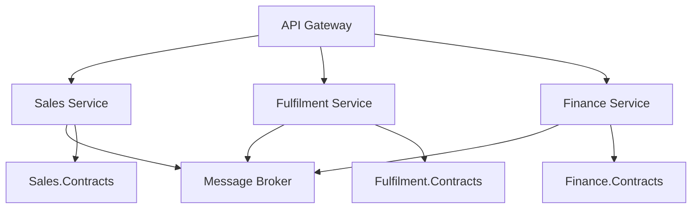

# Service-Oriented Architecture

> **Ref:** `TOP002` | **Category:** Topology

A small number of coarse-grained services organised around business capabilities, communicating through well-defined contracts. Services are larger than microservices, may share a database, and are typically coordinated through an enterprise service bus or API gateway.

## When to Use

- **5–15+ developers** across a few teams, each owning a broad business area (e.g., "sales," "fulfilment," "finance")
- The system has 3–10 distinct business capabilities that benefit from separate deployment but don't need the granularity of microservices
- Teams want independent deployment cadences without the operational overhead of dozens of services
- Integration with enterprise systems (ERP, CRM, legacy) where coarse-grained contracts are a natural fit
- Organisations with existing ESB or API management infrastructure

## When NOT to Use

- Small teams (under ~5 developers) — a monolith ([TOP001](TOP001%20-%20monolith.md)) is simpler
- You need independent scaling at a fine-grained level — microservices ([TOP003](TOP003%20-%20microservices.md)) handle this better
- The team doesn't have the infrastructure maturity for multi-service deployment but isn't at microservices scale either — a modular monolith ([STR005](../structural/STR005%20-%20modular-monolith.md)) gives you similar boundaries without the operational cost
- "SOA" is being used to justify an enterprise service bus that becomes a centralised bottleneck

## How It Differs from Other Topologies

| | Monolith (TOP001) | SOA (TOP002) | Microservices (TOP003) |
|:---|:---|:---|:---|
| Service count | 1 | Few (3–10) | Many (10+) |
| Service granularity | N/A | Coarse (broad business capability) | Fine (single bounded context) |
| Database | One | Shared or per-service | Always per-service |
| Communication | In-process | Synchronous contracts (REST/SOAP) + messaging | Async-first, lightweight HTTP/gRPC |
| Coordination | N/A | Enterprise service bus or API gateway | Choreography or lightweight orchestration |
| Data ownership | Single owner | Negotiated between services | Strict per-service ownership |
| Team model | One team | Teams per service area | Team per service |
| Deploy independence | None | Moderate (coordinated releases common) | Full |
| Operational overhead | Low | Medium | High |

## Solution Structure

```
CompanyPlatform/
├── Services/
│   ├── Sales.Api/                    ← 1 service = 1 broad business area
│   │   ├── Sales.Api.csproj
│   │   ├── Program.cs
│   │   └── (internal structure: any STR pattern)
│   │
│   ├── Fulfilment.Api/
│   │   └── ...
│   │
│   └── Finance.Api/
│       └── ...
│
├── Shared/
│   ├── Contracts/                    ← shared DTOs and service interfaces
│   │   ├── Sales.Contracts.csproj
│   │   ├── Fulfilment.Contracts.csproj
│   │   └── Finance.Contracts.csproj
│   │
│   └── Platform.Common/             ← shared infrastructure (auth, logging, health)
│       └── Platform.Common.csproj
│
└── Gateway/                          ← API gateway or BFF
    └── Gateway.Api/
        └── Gateway.Api.csproj
```

Each service is a full ASP.NET Core application. Internally, each service uses whatever structural pattern fits its complexity — a simple reference data service might use [STR001](../structural/STR001%20-%20n-tier.md), while a complex domain service uses [STR003](../structural/STR003%20-%20full-clean-architecture.md).

## Service Design Principles

### Right-Size the Services

SOA services are **coarse-grained**. A "Sales" service handles quotes, orders, pricing, and customer management — not one service per entity. The goal is 3–10 services for the entire platform, not 50.

If you find yourself with more than ~10 services, you're drifting toward microservices ([TOP003](TOP003%20-%20microservices.md)). That's fine if intentional, but it comes with different operational requirements.

### Contracts Are the Architecture

Services communicate through explicit contracts — request/response DTOs and event definitions. These contracts are the public API of each service. They live in shared contract projects (or versioned NuGet packages for multi-repo).

```csharp
// Sales.Contracts/Orders/CreateOrderRequest.cs
public sealed record CreateOrderRequest(
    Guid CustomerId,
    IReadOnlyList<CreateOrderRequest.LineItem> Items)
{
    public sealed record LineItem(Guid ProductId, int Quantity);
}

// Sales.Contracts/Events/OrderPlacedEvent.cs
public sealed record OrderPlacedEvent(
    Guid OrderId,
    Guid CustomerId,
    decimal Total,
    DateTimeOffset OccurredAt);
```

### Database Strategy

SOA is flexible on data ownership:

- **Shared database** — simplest operationally. Services access different schemas/tables. Works when services are deployed together and cross-service queries are common. Risk: hidden coupling through shared tables.
- **Database per service** — stronger boundaries. Services own their data completely. Cross-service data access happens through APIs. More operational overhead but cleaner ownership.

Start with a shared database and separate schemas. Move to per-service databases when you have evidence that a service needs independent scaling or different storage technology.

### Communication

**Synchronous (request/response):** REST or gRPC for queries and commands that need an immediate response. Use typed HTTP clients with resilience policies.

**Asynchronous (events):** A message broker for event-driven communication between services. Used for side effects that don't require an immediate response ("order placed" → fulfilment starts processing).

**API Gateway:** A single entry point for external clients. Routes requests to the appropriate service. Handles cross-cutting concerns: authentication, rate limiting, request aggregation. Use a reverse proxy — keep it logic-free.

## Dependency Rules



- Services communicate through contracts and messaging — never direct project references
- The gateway routes to services but contains no business logic
- Shared infrastructure (auth, logging) is in `Platform.Common`, referenced by all services
- Services may share a database but should not share tables without explicit agreement

## Testing Strategy

- **Per-service tests:** Each service has its own unit and integration tests, following its internal structural pattern
- **Contract tests:** Verify that services honour their published contracts. When a contract changes, consumer tests catch incompatibilities
- **End-to-end tests:** Test critical cross-service workflows. Keep these minimal — they're slow and require all services running

## Common Mistakes

1. **Enterprise service bus becomes a God object.** The ESB accumulates routing logic, transformations, and business rules. It becomes the most complex and fragile component in the system. Keep the bus as a dumb pipe — routing and delivery only, no business logic.

2. **Too many services too early.** Starting with 15 fine-grained services when 4 coarse-grained ones would suffice. SOA services are broad. "Order Service," "Order Item Service," and "Order Status Service" should be one "Sales Service."

3. **Shared database without boundaries.** Two services reading and writing the same tables with no schema separation. This creates hidden coupling that makes independent deployment impossible. At minimum, use separate schemas and agree on ownership.

4. **Synchronous chains.** Service A calls Service B calls Service C, all synchronous. If any service is down, the whole chain fails. Use async messaging for side effects. Synchronous calls are for queries where the caller genuinely needs data before proceeding.

5. **Contracts that expose internal models.** A service contract that returns its internal entity classes. Contracts are a public API — they should be stable, versioned, and independent of internal implementation. Changes to internal models should not break consumers.

6. **No versioning strategy.** Changing a contract field breaks all consumers. Treat contracts as public APIs: add fields (never remove), version breaking changes, maintain backward compatibility.

## Related Packages

- **API Gateway:** YARP (reverse proxy)
- **Messaging:** MassTransit · NServiceBus · Wolverine · Brighter
- **Resilience:** Microsoft.Extensions.Http.Resilience · Polly
- **Service discovery / orchestration:** .NET Aspire
- **Testing:** xUnit, NUnit · Testcontainers
