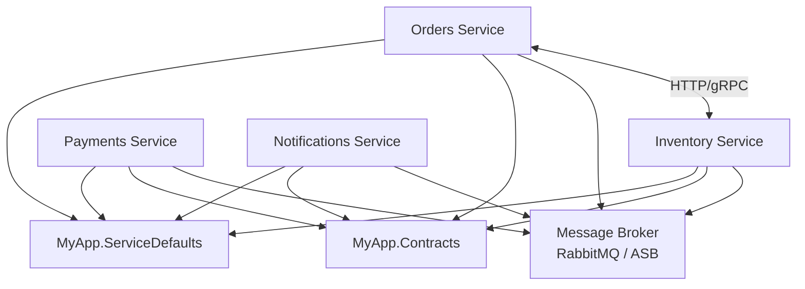

# Microservices

> **Ref:** `TOP003` | **Category:** Topology

Independently deployable services, each owning its data and communicating through well-defined APIs and asynchronous messaging.

## How It Differs from Other Topologies

| | Monolith ([TOP001](TOP001%20-%20monolith.md)) | SOA ([TOP002](TOP002%20-%20service-oriented-architecture.md)) | Microservices (TOP003) |
|:---|:---|:---|:---|
| Service count | 1 | Few (3–10) | Many (10+) |
| Service granularity | N/A | Coarse (broad business capability) | Fine (single bounded context) |
| Database | One | Shared or per-service | Always per-service |
| Communication | In-process | Synchronous + ESB/messaging | Async-first, lightweight HTTP/gRPC |
| Data ownership | Single owner | Negotiated | Strict per-service |
| Deploy independence | None | Moderate | Full |
| Operational overhead | Low | Medium | High |

The key difference from SOA ([TOP002](TOP002%20-%20service-oriented-architecture.md)): microservices are **fine-grained** (one bounded context per service), **always own their data** (no shared databases), and **prefer asynchronous communication** (events over request/response). SOA services are coarser, may share databases, and often coordinate through a centralised bus.

## When to Use

- **15+ developers** across multiple teams, each needing to deploy independently on their own cadence
- Distinct bounded contexts with genuinely different scaling requirements (orders: high write volume; product catalogue: high read volume, rare writes)
- Organisational structure demands service ownership — Conway's Law is in full effect and you're leaning into it
- You've already built a modular monolith ([STR005](../structural/STR005%20-%20modular-monolith.md)) and have evidence that specific modules need independent deployment, scaling, or technology choices. The modular monolith gave you well-defined module boundaries — each module is now a candidate for extraction into a service
- You can invest in the infrastructure: CI/CD per service, centralised logging, distributed tracing, container orchestration
- You're extracting incrementally. The ideal path is: monolith → modular monolith ([STR005](../structural/STR005%20-%20modular-monolith.md)) → extract modules to services one at a time as justified. This gives you proven boundaries before you pay the distributed systems tax

## When NOT to Use

- **Under ~15 developers.** The coordination overhead of microservices will outrun your team's capacity. Use a modular monolith ([STR005](../structural/STR005%20-%20modular-monolith.md)) instead.
- You can't invest in infrastructure. Without proper CI/CD, observability, and orchestration, microservices become a liability.
- You're searching for product-market fit. Microservices slow down pivoting — you'll spend time re-wiring service boundaries instead of iterating on features.
- The domains aren't actually independent. If every user request touches 5 services in a synchronous chain, you have a distributed monolith with network latency.
- "Because Netflix does it" is not a reason. Netflix has thousands of engineers. You probably don't.

## Solution Structure

Use a **mono-repo** for most teams. It simplifies dependency management, cross-service refactoring, and shared CI configuration. You get atomic commits across services and contracts, making breaking changes visible at PR time rather than in production.

**Multi-repo** is justified when: services are maintained by truly independent organisations, different services have fundamentally different CI/CD pipelines (e.g., one team deploys to Azure, another to AWS), or the mono-repo has grown to a size where build times are untenable despite selective builds. If you go multi-repo, `MyApp.Contracts` must become a versioned NuGet package with a strict backward-compatibility policy.

```
MyApp/
├── MyApp.sln
│
├── src/
│   ├── Services/
│   │   ├── MyApp.Services.Orders/
│   │   │   ├── MyApp.Services.Orders.csproj
│   │   │   ├── Program.cs
│   │   │   ├── appsettings.json
│   │   │   ├── Dockerfile
│   │   │   ├── Features/
│   │   │   │   ├── PlaceOrder.cs
│   │   │   │   ├── CancelOrder.cs
│   │   │   │   ├── GetOrderById.cs
│   │   │   │   └── ListOrders.cs
│   │   │   ├── Domain/
│   │   │   │   ├── Order.cs
│   │   │   │   └── OrderItem.cs
│   │   │   ├── Infrastructure/
│   │   │   │   ├── OrdersDbContext.cs
│   │   │   │   └── Configurations/
│   │   │   │       └── OrderConfiguration.cs
│   │   │   ├── IntegrationEvents/
│   │   │   │   └── Handlers/
│   │   │   │       └── PaymentCompletedHandler.cs
│   │   │   └── Clients/
│   │   │       └── InventoryClient.cs
│   │   │
│   │   ├── MyApp.Services.Inventory/
│   │   │   ├── MyApp.Services.Inventory.csproj
│   │   │   ├── Program.cs
│   │   │   ├── Dockerfile
│   │   │   ├── Features/
│   │   │   ├── Domain/
│   │   │   ├── Infrastructure/
│   │   │   └── IntegrationEvents/
│   │   │
│   │   ├── MyApp.Services.Payments/
│   │   │   └── ...
│   │   │
│   │   └── MyApp.Services.Notifications/
│   │       └── ...
│   │
│   ├── Shared/
│   │   ├── MyApp.Contracts/
│   │   │   ├── MyApp.Contracts.csproj
│   │   │   ├── Events/
│   │   │   │   ├── OrderPlacedEvent.cs
│   │   │   │   ├── PaymentCompletedEvent.cs
│   │   │   │   └── StockReservedEvent.cs
│   │   │   └── DTOs/
│   │   │       ├── OrderSummaryDto.cs
│   │   │       └── ProductAvailabilityDto.cs
│   │   │
│   │   └── MyApp.ServiceDefaults/
│   │       ├── MyApp.ServiceDefaults.csproj
│   │       └── Extensions.cs
│   │
│   └── MyApp.AppHost/
│       ├── MyApp.AppHost.csproj              ← .NET Aspire orchestrator
│       └── Program.cs
│
└── tests/
    ├── MyApp.Services.Orders.Tests/
    ├── MyApp.Services.Inventory.Tests/
    ├── MyApp.Services.Payments.Tests/
    └── MyApp.EndToEnd.Tests/
```

**Each service** is an independently deployable ASP.NET Core application with its own `Program.cs`, `Dockerfile`, and database context. Internally, each service can use any pattern — the Orders service above uses Vertical Slices ([STR004](../structural/STR004%20-%20vertical-slice.md)) because it's feature-heavy. A simpler service might use N-Tier ([STR001](../structural/STR001%20-%20n-tier.md)). A complex domain service might use Hexagonal ([STR006](../structural/STR006%20-%20hexagonal.md)).

**MyApp.Contracts** — shared event definitions and API DTOs. This is a NuGet package (or project reference in mono-repo). Keep it thin — only types that cross service boundaries.

**MyApp.ServiceDefaults** — shared configuration for observability, health checks, resilience. The .NET Aspire service defaults project.

**MyApp.AppHost** — .NET Aspire orchestrator for local development. Defines the service topology, dependencies (databases, message brokers), and runs everything with `dotnet run`.

## Dependency Rules



Each service owns its own database, references `MyApp.Contracts` and `MyApp.ServiceDefaults`, and **NEVER** references another service's code.

**The iron rules:**

- Services **NEVER share a database**. Each service has its own database (or at minimum its own schema with no cross-schema queries). This is non-negotiable — shared databases create hidden coupling.
- Services **NEVER reference another service's project directly**. They communicate through HTTP/gRPC (synchronous) or message broker (asynchronous).
- **Prefer asynchronous communication.** Synchronous calls between services create temporal coupling and cascading failures. Use events for side effects, HTTP/gRPC only for queries where the caller genuinely needs data before proceeding.
- **Shared contracts are thin.** `MyApp.Contracts` contains event records and API DTOs — not business logic, not entity classes, not validation rules.
- **Each service can use a different internal architecture.** A simple CRUD service doesn't need Clean Architecture just because the Orders service uses it.

## Naming Conventions

| Element | Convention | Example |
|---------|-----------|---------|
| Service project | `MyApp.Services.{Domain}` | `MyApp.Services.Orders` |
| Contracts project | `MyApp.Contracts` | `MyApp.Contracts` |
| Integration event | `{Entity}{PastVerb}Event` | `OrderPlacedEvent` |
| Typed HTTP client | `{Service}Client` | `InventoryClient` |
| Event handler | `{EventName}Handler` | `PaymentCompletedHandler` |
| Service defaults | `MyApp.ServiceDefaults` | `MyApp.ServiceDefaults` |
| Aspire host | `MyApp.AppHost` | `MyApp.AppHost` |
| Dockerfile | per service root | `Services/MyApp.Services.Orders/Dockerfile` |
| Database | per service | `orders_db`, `inventory_db` |

## Key Abstractions

Shared integration event:

```csharp
// Contracts/Events/OrderPlacedEvent.cs
public sealed record OrderPlacedEvent(
    Guid EventId,
    DateTimeOffset OccurredAt,
    Guid OrderId,
    Guid CustomerId,
    decimal TotalAmount,
    IReadOnlyList<OrderPlacedEvent.LineItem> Items)
{
    public sealed record LineItem(Guid ProductId, int Quantity, decimal UnitPrice);
}
```

Publishing an event:

```csharp
// Services/Orders — inside PlaceOrder handler
public sealed class Handler(OrdersDbContext db, IEventPublisher publisher)
{
    public async Task<PlaceOrderResult> Handle(PlaceOrderCommand command, CancellationToken ct)
    {
        var order = new Order { /* ... */ };
        db.Orders.Add(order);

        await publisher.PublishAsync(new OrderPlacedEvent(
            Guid.NewGuid(),
            DateTimeOffset.UtcNow,
            order.Id,
            order.CustomerId,
            order.Total,
            order.Items.Select(i => new OrderPlacedEvent.LineItem(
                i.ProductId, i.Quantity, i.UnitPrice)).ToList()),
            ct);

        await db.SaveChangesAsync(ct);

        return new PlaceOrderResult(order.Id);
    }
}
```

**Use a transactional outbox.** The `PublishAsync` call should not send to the broker immediately. A transactional outbox writes the message to the database inside the same transaction as `SaveChangesAsync`. A background delivery service then forwards messages to the broker. This eliminates the dual-write problem (save succeeds, publish fails = lost event). Most messaging libraries support this pattern natively.

Consuming an event in another service:

```csharp
// Services/Inventory/IntegrationEvents/Handlers/OrderPlacedHandler.cs
public sealed class OrderPlacedHandler(InventoryDbContext db)
    : IConsumer<OrderPlacedEvent>
{
    public async Task Consume(ConsumeContext<OrderPlacedEvent> context)
    {
        foreach (var item in context.Message.Items)
        {
            var product = await db.Products.FindAsync(
                [item.ProductId], context.CancellationToken);
            if (product is null) continue;

            product.ReserveStock(item.Quantity);
        }

        await db.SaveChangesAsync(context.CancellationToken);
    }
}
```

Typed HTTP client for synchronous queries:

```csharp
// Services/Orders/Clients/InventoryClient.cs
public sealed class InventoryClient(HttpClient http)
{
    public async Task<ProductAvailabilityDto?> GetAvailabilityAsync(
        Guid productId, CancellationToken ct = default)
    {
        return await http.GetFromJsonAsync<ProductAvailabilityDto>(
            $"/api/products/{productId}/availability", ct);
    }
}
```

Registered with resilience (requires `Microsoft.Extensions.Http.Resilience` package):

```csharp
builder.Services.AddHttpClient<InventoryClient>(client =>
    client.BaseAddress = new Uri("https+http://inventory"))
    .AddStandardResilienceHandler();
```

The `https+http://inventory` URI uses .NET Aspire's service discovery — `inventory` resolves to whatever the AppHost configured for that resource name. The `https+http` scheme tries HTTPS first and falls back to HTTP. `AddStandardResilienceHandler` adds retries, circuit breaker, and timeout policies from `Microsoft.Extensions.Resilience`.

.NET Aspire orchestration:

```csharp
// AppHost/Program.cs
var builder = DistributedApplication.CreateBuilder(args);

var messaging = builder.AddRabbitMQ("messaging");
var sql = builder.AddSqlServer("sql");
var ordersDb = sql.AddDatabase("orders-db");
var inventoryDb = sql.AddDatabase("inventory-db");

var orders = builder.AddProject<Projects.MyApp_Services_Orders>("orders")
    .WithReference(ordersDb)
    .WaitFor(ordersDb)
    .WithReference(messaging)
    .WaitFor(messaging);

var inventory = builder.AddProject<Projects.MyApp_Services_Inventory>("inventory")
    .WithReference(inventoryDb)
    .WaitFor(inventoryDb)
    .WithReference(messaging)
    .WaitFor(messaging);

builder.AddProject<Projects.MyApp_Services_Payments>("payments")
    .WithReference(messaging)
    .WaitFor(messaging);

builder.AddProject<Projects.MyApp_Services_Notifications>("notifications")
    .WithReference(messaging)
    .WaitFor(messaging);

builder.Build().Run();
```

## Data Flow

**Synchronous query — Orders needs Inventory data:**

```
Orders Service                              Inventory Service
     │                                            │
     │  GET /api/products/{id}/availability       │
     │ ──────────────────────────────────────────► │
     │                                            │
     │         ProductAvailabilityDto              │
     │ ◄────────────────────────────────────────── │
     │                                            │
     ▼                                            │
 Use availability data in order logic             │
```

**Asynchronous event — Order placed, multiple services react:**

```
Orders Service          Message Broker        Inventory Service
     │                       │                      │
     │  OrderPlacedEvent     │                      │
     │ ─────────────────►    │                      │
     │                       │   OrderPlacedEvent   │
     │                       │ ────────────────►    │
     │                       │                      │ reserve stock
     │                       │                      │
     │                       │                Payments Service
     │                       │                      │
     │                       │   OrderPlacedEvent   │
     │                       │ ────────────────►    │
     │                       │                      │ initiate payment
     │                       │                      │
     │                       │             Notifications Service
     │                       │                      │
     │                       │   OrderPlacedEvent   │
     │                       │ ────────────────►    │
     │                       │                      │ send confirmation
```

**Saga — multi-service transaction (order fulfilment):**

```
OrderPlacedEvent
    │
    ▼
Inventory reserves stock → StockReservedEvent
    │
    ▼
Payments charges card → PaymentCompletedEvent
    │
    ▼
Orders confirms order → OrderConfirmedEvent
    │
    ▼
Notifications sends email

If payment fails:
    PaymentFailedEvent → Inventory releases stock → Orders cancels order
```

**Choreography vs orchestration:**

- **Choreography** (events only, no central coordinator) works for simple 2–3 step flows. Each service reacts to events and publishes its own. Downside: the workflow is implicit — you can't look at one place to understand the full process. Debugging failures requires reading logs across multiple services.
- **Orchestration** (a central saga/state machine coordinates the steps) works for workflows with 4+ steps, compensation logic, or timeouts. The saga state machine is the single source of truth for workflow state. Use a saga library that persists saga state to a database and handles retries, timeouts, and compensating events.

**Rule of thumb:** if you need to draw a diagram to explain the workflow, you need an orchestrator. If the compensating actions are non-trivial (reverse a payment, release reserved stock, send a cancellation email), use orchestration — choreography makes compensation paths invisible and error-prone.

## Where Business Logic Lives

**Inside each service**, following that service's internal architecture.

- Each service is a bounded context. It owns its domain model, its data, and its business rules. The Orders service knows everything about order lifecycle. The Inventory service knows everything about stock management.
- **Cross-service business processes** use sagas or choreography. No service contains rules about another service's domain.
- **If you find business logic in the gateway, contracts, or shared libraries, you have a problem.** Business logic belongs in the service that owns that domain concept.
- **Each service picks its own internal pattern.** A simple CRUD notification service might use [STR001](../structural/STR001%20-%20n-tier.md). An order processing service with complex rules might use [STR006](../structural/STR006%20-%20hexagonal.md). Don't force a single internal architecture across all services.

## API Gateway / BFF

Clients should not call individual services directly. Use an API gateway or Backend-for-Frontend (BFF) pattern to provide a single entry point.

- **YARP (Yet Another Reverse Proxy)** — the .NET-native choice. Configure routing, load balancing, and rate limiting in an ASP.NET Core app. Appropriate when you need custom logic in the gateway (authentication, request aggregation).
- **BFF per client type** — a mobile BFF, a web BFF, and an admin BFF. Each tailors the API surface and response shape to its client's needs. Prevents the "one API fits all" problem where every client gets too much or too little data.
- **No business logic in the gateway.** The gateway routes, authenticates, rate-limits, and aggregates. If it's making business decisions, that logic belongs in a service.

## Testing Strategy

```
tests/
├── MyApp.Services.Orders.Tests/
│   ├── MyApp.Services.Orders.Tests.csproj
│   ├── Features/
│   │   ├── PlaceOrderTests.cs
│   │   └── CancelOrderTests.cs
│   └── IntegrationEvents/
│       └── PaymentCompletedHandlerTests.cs
│
├── MyApp.Services.Inventory.Tests/
│   └── ...
│
├── MyApp.Services.Payments.Tests/
│   └── ...
│
└── MyApp.EndToEnd.Tests/
    ├── MyApp.EndToEnd.Tests.csproj
    └── Workflows/
        └── OrderFulfilmentTests.cs
```

**Per-service tests:** Each service has its own test project. Unit tests + integration tests follow the service's internal architecture. Use `WebApplicationFactory` per service with a test container library for the service's own database.

**Contract tests:** Verify that services honour their published contracts. When the Orders service publishes `OrderPlacedEvent`, the contract test verifies the event schema matches what consumers expect. In a mono-repo this is largely handled by the compiler (shared project reference to `MyApp.Contracts`). In multi-repo, use Pact or serialisation round-trip tests that deserialise a known JSON payload into the event type and verify all fields are populated — this catches breaking changes when the NuGet package version bumps.

**Event handler tests:** Test consumers in isolation — given this event, verify this state change. Mock the database or use a test container library.

**End-to-end tests:** Minimal. Test critical business workflows across services. Use docker-compose or .NET Aspire's test infrastructure to spin up all services, databases, and message brokers. Keep these to 5–10 critical paths — they're slow and brittle.

```csharp
// EndToEnd test example with Aspire
public sealed class OrderFulfilmentTests : IAsyncLifetime
{
    private DistributedApplication _app = null!;

    public async Task InitializeAsync()
    {
        var builder = await DistributedApplicationTestingBuilder
            .CreateAsync<Projects.MyApp_AppHost>();

        _app = await builder.BuildAsync();
        var cts = new CancellationTokenSource(TimeSpan.FromMinutes(5));
        await _app.StartAsync(cts.Token);
    }

    public async Task DisposeAsync() => await _app.DisposeAsync();

    [Fact]
    public async Task PlaceOrder_ReservesStock_ProcessesPayment_SendsNotification()
    {
        var ordersClient = _app.CreateHttpClient("orders");

        var response = await ordersClient.PostAsJsonAsync("/api/orders", new
        {
            CustomerId = Guid.NewGuid(),
            Items = new[] { new { ProductId = seededProductId, Quantity = 2 } }
        });

        response.StatusCode.Should().Be(HttpStatusCode.Created);

        var inventoryClient = _app.CreateHttpClient("inventory");

        await WaitForEventualConsistencyAsync(async () =>
        {
            var availability = await inventoryClient
                .GetFromJsonAsync<ProductAvailabilityDto>(
                    $"/api/products/{seededProductId}/availability");
            return availability!.AvailableStock == initialStock - 2;
        });
    }

    private static async Task WaitForEventualConsistencyAsync(
        Func<Task<bool>> condition,
        TimeSpan? timeout = null,
        TimeSpan? interval = null)
    {
        var deadline = DateTime.UtcNow + (timeout ?? TimeSpan.FromSeconds(30));
        var delay = interval ?? TimeSpan.FromMilliseconds(500);

        while (DateTime.UtcNow < deadline)
        {
            if (await condition()) return;
            await Task.Delay(delay);
        }

        throw new TimeoutException("Condition not met within timeout.");
    }
}
```

## Common Mistakes

1. **Distributed monolith.** Services that must be deployed together, share a database, or require synchronous calls through 5 services to complete one request. If every change requires updating 3 services simultaneously, you don't have microservices — you have a monolith with network latency.

2. **Shared database.** Two services reading and writing the same tables. This creates hidden coupling — a schema change in one service breaks the other. Each service owns its data completely. If another service needs that data, expose it through an API or publish events.

3. **Synchronous chains.** Orders calls Inventory, which calls Pricing, which calls Promotions, which calls Customer — all synchronous. If any service is down, the whole chain fails. Use asynchronous events for side effects. Only use synchronous calls when you genuinely can't proceed without the response.

4. **No contract testing.** The Orders service changes `OrderPlacedEvent` and breaks 3 consumers. Without contract tests, you find out in production. Add contract tests to CI — they're cheap and catch breaking changes early.

5. **Premature microservices.** Starting with microservices on day one. Build a modular monolith ([STR005](../structural/STR005%20-%20modular-monolith.md)) first. Extract services only when you have evidence: a module needs independent scaling, independent deployment, or a different technology choice.

6. **Too-fine-grained services.** A service per entity: `OrderService`, `OrderItemService`, `OrderStatusService`. Services should align with bounded contexts — cohesive business capabilities — not database tables. A "service" with one endpoint is probably just a function.

7. **Business logic in shared contracts.** `MyApp.Contracts` contains validation logic, business rules, or domain models. Contracts contain only data shapes (events, DTOs) and nothing else. They're a communication protocol, not a business logic library.

8. **No observability.** Without centralised logging, distributed tracing, and health checks, debugging a distributed system is guesswork. Use OpenTelemetry, structured logging with correlation IDs, and health check endpoints from day one. .NET Aspire's service defaults provide this out of the box.

9. **Ignoring eventual consistency.** Expecting immediate consistency across services. When Orders publishes `OrderPlacedEvent`, the Inventory service might not process it for seconds (or minutes during high load). Design the UI and business logic to handle this — show "processing" states, use read models, and build compensating actions for failures.

10. **No local development story.** Developers need to run 8 services, 3 databases, and a message broker locally. Use .NET Aspire's `AppHost` to orchestrate everything with `dotnet run`. If a developer can't start the full system in one command, adoption will suffer.

11. **Non-idempotent consumers.** Message brokers guarantee at-least-once delivery, not exactly-once. If your `OrderPlacedHandler` reserves stock twice because the message was redelivered, you have a bug. Every consumer must be idempotent — use the `EventId` to deduplicate, or design operations to be naturally idempotent (set stock to X, not decrement by Y).

12. **No event versioning strategy.** You added a field to `OrderPlacedEvent` and broke every consumer. Events are a public contract — they need backward-compatible evolution. Add optional fields with defaults, never remove or rename fields, and consider a schema registry or explicit version numbers (e.g., `OrderPlacedEventV2`) for breaking changes.

## Related Packages

- **Messaging:** [MassTransit](https://github.com/MassTransit/MassTransit) · [NServiceBus](https://github.com/Particular/NServiceBus) · [Wolverine](https://github.com/JasperFx/wolverine) · [Brighter](https://github.com/BrighterCommand/Brighter)
- **Service discovery / orchestration:** [.NET Aspire](https://github.com/dotnet/aspire)
- **API gateway:** [YARP](https://github.com/microsoft/reverse-proxy) (reverse proxy)
- **Resilience:** [Microsoft.Extensions.Http.Resilience](https://www.nuget.org/packages/Microsoft.Extensions.Http.Resilience) · [Polly](https://github.com/App-vNext/Polly)
- **Contracts / serialisation:** [System.Text.Json](https://www.nuget.org/packages/System.Text.Json) · MessagePack · Protobuf
- **Testing:** [xUnit](https://github.com/xunit/xunit), [NUnit](https://github.com/nunit/nunit) · [Testcontainers](https://github.com/testcontainers/testcontainers-dotnet) · [Aspire.Hosting.Testing](https://www.nuget.org/packages/Aspire.Hosting.Testing)
