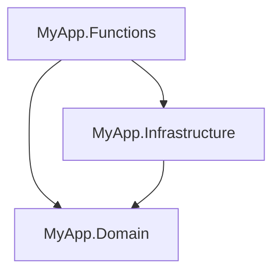

# Serverless

> **Ref:** `TOP004` | **Category:** Topology

No long-running processes. Each function is triggered by an event (HTTP request, queue message, timer, blob upload), executes, and shuts down. The platform handles scaling, infrastructure, and availability. You write functions, not services.

## When to Use

- **Event-driven workloads** — processing queue messages, reacting to blob uploads, handling webhooks
- **Variable or spiky traffic** — auto-scales to zero when idle, scales out under load without capacity planning
- **Small, focused APIs** — especially when combined with an API gateway for routing
- **Cost-sensitive workloads** — pay per execution, not per hour. Ideal when the function runs infrequently
- **Glue logic** — connecting cloud services together (blob uploaded → resize → store → notify)
- **Teams that want to avoid infrastructure management** entirely

## When NOT to Use

- **Long-running processes** — most platforms enforce execution time limits (Azure Functions consumption plan: 5–10 minutes). Use a worker service ([STR010](../structural/STR010%20-%20worker-service.md)) instead
- **Low-latency requirements** — cold starts add hundreds of milliseconds to first invocation. Unacceptable for real-time systems
- **Complex domain logic** — rich domain models with many interacting aggregates don't fit naturally into isolated function boundaries
- **High sustained throughput** — at constant high volume, a dedicated service is cheaper than per-execution billing
- **Stateful workflows** — functions are stateless by design. Durable Functions / Step Functions add state but increase complexity significantly
- **When you need full control over the runtime** — framework versions, OS config, installed dependencies

## How It Differs from Other Topologies

| | Monolith ([TOP001](TOP001%20-%20monolith.md)) | SOA ([TOP002](TOP002%20-%20service-oriented-architecture.md)) | Microservices ([TOP003](TOP003%20-%20microservices.md)) | Serverless (TOP004) |
|:---|:---|:---|:---|:---|
| Deployable unit | 1 application | Few services | Many services | Individual functions |
| Granularity | N/A | Business capability | Bounded context | Single operation |
| Scaling | Vertical / horizontal | Per-service | Per-service | Per-function, automatic |
| Infrastructure | You manage | You manage | You manage (or K8s) | Platform manages |
| Cold starts | N/A | N/A | N/A | Yes — latency cost |
| Billing | Per-hour/instance | Per-hour/instance | Per-hour/instance | Per-execution |
| State | In-process | In-process | In-process | Stateless (external state only) |

## Solution Structure

```
MyApp/
├── MyApp.sln
│
├── src/
│   ├── MyApp.Functions/
│   │   ├── MyApp.Functions.csproj
│   │   ├── Program.cs
│   │   ├── host.json
│   │   ├── local.settings.json
│   │   │
│   │   ├── Orders/
│   │   │   ├── CreateOrderFunction.cs
│   │   │   ├── GetOrderByIdFunction.cs
│   │   │   └── OrderPlacedHandler.cs
│   │   │
│   │   ├── Products/
│   │   │   ├── GetProductByIdFunction.cs
│   │   │   └── ListProductsFunction.cs
│   │   │
│   │   └── Shared/
│   │       ├── ExceptionHandlingMiddleware.cs
│   │       └── AuthMiddleware.cs
│   │
│   ├── MyApp.Domain/
│   │   ├── Entities/
│   │   ├── Interfaces/
│   │   └── Services/
│   │
│   └── MyApp.Infrastructure/
│       ├── Repositories/
│       ├── Data/
│       └── DependencyInjection.cs
│
└── tests/
    ├── MyApp.Functions.Tests/
    └── MyApp.Domain.Tests/
```

**MyApp.Functions** — the function app. One class per function, grouped by resource. Each function is a trigger handler — it receives an event and delegates to domain/infrastructure. The function itself is thin.

**MyApp.Domain** and **MyApp.Infrastructure** — shared business logic and data access. These are the same projects you'd use in any structural pattern. Functions reference them the same way a controller or endpoint would.

Functions can live in a single function app (one deployable with many functions) or be split across multiple function apps for independent scaling. Start with one app; split when you have evidence of different scaling needs.

## Key Abstractions

HTTP-triggered function (.NET 8+ isolated worker model):

```csharp
public sealed class CreateOrderFunction(IOrderService orderService)
{
    [Function("CreateOrder")]
    public async Task<HttpResponseData> Run(
        [HttpTrigger(AuthorizationLevel.Anonymous, "post", Route = "orders")]
        HttpRequestData req,
        CancellationToken ct)
    {
        var request = await req.ReadFromJsonAsync<CreateOrderRequest>(ct)
            ?? throw new BadRequestException("Invalid request body");

        var result = await orderService.CreateAsync(request, ct);

        var response = req.CreateResponse(HttpStatusCode.Created);
        await response.WriteAsJsonAsync(result, ct);
        return response;
    }
}
```

Queue-triggered function:

```csharp
public sealed class OrderPlacedHandler(IInventoryService inventoryService)
{
    [Function("HandleOrderPlaced")]
    public async Task Run(
        [ServiceBusTrigger("order-placed", Connection = "ServiceBus")]
        OrderPlacedEvent message,
        CancellationToken ct)
    {
        await inventoryService.ReserveStockAsync(message.OrderId, message.Items, ct);
    }
}
```

Timer-triggered function:

```csharp
public sealed class DailyCleanupFunction(IDataCleaner cleaner)
{
    [Function("DailyCleanup")]
    public async Task Run(
        [TimerTrigger("0 0 2 * * *")] TimerInfo timer,
        CancellationToken ct)
    {
        await cleaner.CleanExpiredRecordsAsync(ct);
    }
}
```

DI registration in `Program.cs`:

```csharp
var host = new HostBuilder()
    .ConfigureFunctionsWebApplication(worker =>
    {
        worker.UseMiddleware<ExceptionHandlingMiddleware>();
    })
    .ConfigureServices((context, services) =>
    {
        services.AddInfrastructure(context.Configuration);
        services.AddScoped<IOrderService, OrderService>();
        services.AddScoped<IInventoryService, InventoryService>();
    })
    .Build();

host.Run();
```

## Dependency Rules



Same as any structural pattern. Functions are the entry point (like controllers or endpoints). Domain and Infrastructure are shared libraries. The function app references both; Infrastructure references Domain.

## Data Flow

**HTTP function:**

```
HTTP POST /api/orders
    │
    ▼
Platform routes to CreateOrderFunction.Run()
    │  DI injects IOrderService
    │  deserialises request body
    ▼
IOrderService.CreateAsync(request)
    │  business logic, persistence
    ▼
HTTP 201 Created with response body
```

**Queue function:**

```
Message arrives on "order-placed" queue
    │
    ▼
Platform triggers OrderPlacedHandler.Run()
    │  DI injects IInventoryService
    │  deserialises message
    ▼
IInventoryService.ReserveStockAsync()
    │  business logic, persistence
    ▼
Message acknowledged (auto-complete or manual)
```

## Where Business Logic Lives

**In the Domain project** — same as any other topology. Functions are thin triggers. They receive an event, call a service, and return a result. No business logic in the function class.

## Testing Strategy

**Domain/service tests** — unit tests with mocked dependencies. These are identical to any structural pattern.

**Function tests** — integration tests that invoke the function handler directly. Instantiate the function class with real or mocked services, call the method, assert the response:

```csharp
[Fact]
public async Task CreateOrder_ValidRequest_Returns201()
{
    var orderService = Substitute.For<IOrderService>();
    orderService.CreateAsync(Arg.Any<CreateOrderRequest>(), Arg.Any<CancellationToken>())
        .Returns(new OrderResponse(Guid.NewGuid(), 59.98m));

    var function = new CreateOrderFunction(orderService);

    var request = CreateMockHttpRequest(new CreateOrderRequest { /* ... */ });
    var response = await function.Run(request, CancellationToken.None);

    response.StatusCode.Should().Be(HttpStatusCode.Created);
}
```

**End-to-end tests** — run the function app locally and test against real triggers. Use the Functions host for local development.

## Common Mistakes

1. **Fat functions.** A function with 100 lines of business logic, database calls, and external API calls. Functions should be 5–10 lines: deserialise input, call a service, return output. Extract logic into domain/service classes that are testable independently.

2. **Ignoring cold starts.** The first invocation after idle time adds latency. For user-facing APIs, consider a premium/dedicated plan or a keep-warm strategy. For queue processors, cold starts are usually acceptable.

3. **Treating functions as microservices.** A function app with 50 functions, its own database, and complex inter-function communication. If you need that level of complexity, you need a service, not a function app.

4. **Shared mutable state.** Static variables or in-memory caches that assume a long-lived process. Function instances can be recycled at any time. Use external state (database, cache, blob storage).

5. **Not using the isolated worker model.** The in-process model is being deprecated. Use the isolated worker model (.NET 8+) which runs functions in a separate process, giving you full control over dependencies and middleware.

6. **Synchronous chains between functions.** Function A HTTP-calls Function B which HTTP-calls Function C. This creates the same coupling and latency problems as synchronous microservice chains. Use queues for async communication between functions.

7. **No timeout handling.** Functions have execution time limits. Long-running operations should use durable functions or be split into multiple steps with queue-based handoff.

## Related Packages

- **Azure Functions:** Microsoft.Azure.Functions.Worker · Microsoft.Azure.Functions.Worker.Extensions.*
- **AWS Lambda:** Amazon.Lambda.AspNetCoreServer · Amazon.Lambda.RuntimeSupport
- **Durable workflows:** Microsoft.Azure.Functions.Worker.Extensions.DurableTask
- **Testing:** xUnit, NUnit · NSubstitute, Moq · FluentAssertions
